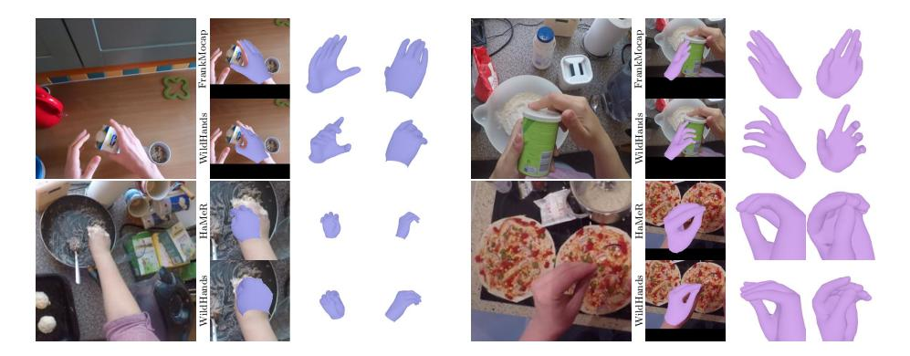
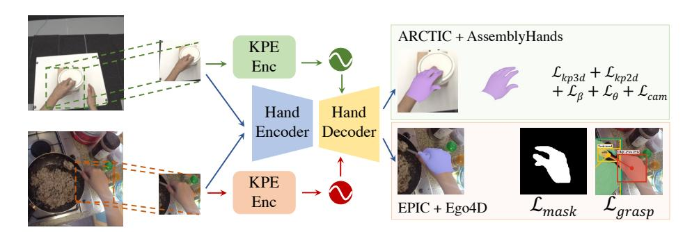
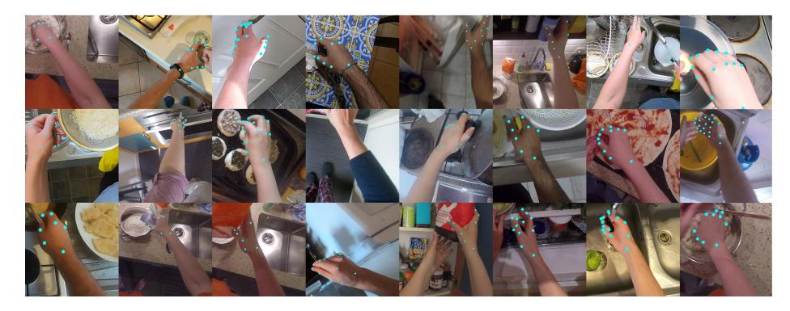
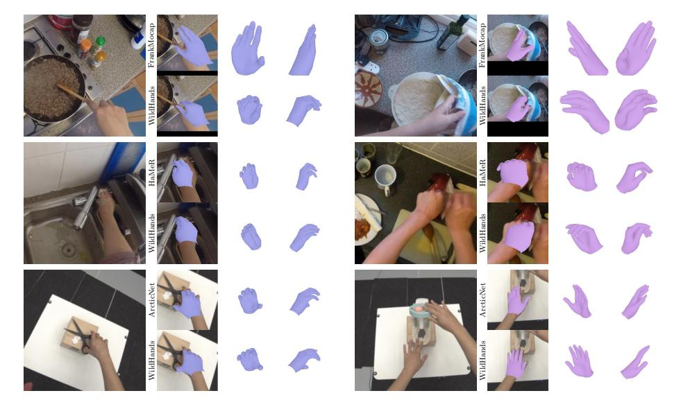
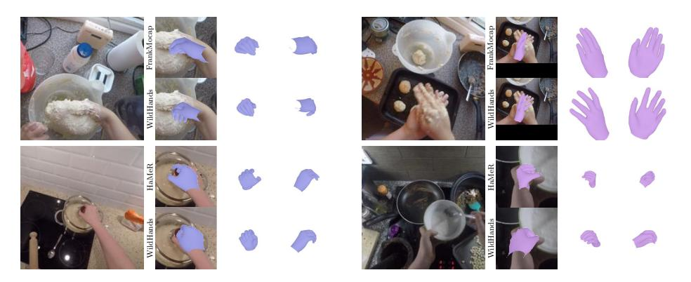

# 3D Hand Pose Estimation in Everyday Egocentric Images

Aditya Prakash, Ruisen Tu, Matthew Chang, and Saurabh Gupta

University of Illinois Urbana-Champaign {adityap9,ruisent2,mc48,saurabhg}@illinois.edu <https://bit.ly/WildHands>

Abstract. 3D hand pose estimation in everyday egocentric images is challenging for several reasons: poor visual signal (occlusion from the object of interaction, low resolution & motion blur), large perspective distortion (hands are close to the camera), and lack of 3D annotations outside of controlled settings. While existing methods often use hand crops as input to focus on fine-grained visual information to deal with poor visual signal, the challenges arising from perspective distortion and lack of 3D annotations in the wild have not been systematically studied. We focus on this gap and explore the impact of different practices, i.e . crops as input, incorporating camera information, auxiliary supervision, scaling up datasets. We provide several insights that are applicable to both convolutional and transformer models, leading to better performance. Based on our findings, we also present WildHands, a system for 3D hand pose estimation in everyday egocentric images. Zero-shot evaluation on 4 diverse datasets (H2O, AssemblyHands, Epic-Kitchens, Ego-Exo4D) demonstrate the effectiveness of our approach across 2D and 3D metrics, where we beat past methods by 7.4% – 66%. In system level comparisons, WildHands achieves the best 3D hand pose on ARCTIC egocentric split, outperforms FrankMocap across all metrics and HaMeR on 3 out of 6 metrics while being 10 × smaller and trained on 5 × less data.

Keywords: 3D Hand Pose · Egocentric Vision · 3D from single image

# 1 Introduction

Understanding egocentric hands in 3D enables applications in AR/VR, robotics. While several works have studied exocentric hands [\[52,](#page-17-0) [59\]](#page-17-1), no existing approach performs well in diverse egocentric settings outside of lab setups. We focus on this gap & study the impact of common practices, i.e. crops as input, camera information, auxiliary supervision, scaling up datasets, for predicting absolute 3D hand pose from a single egocentric image. We identify 2 important factors: a) modeling the 3D to 2D projection during imaging of the hand in egocentric views, b) scaling up training to diverse datasets by leveraging auxiliary supervision.

Let's unpack each component. Existing methods often operate on image crops, assume that the image crop is located at the center of the camera's field of view

Fig. 1: WildHands predicts the 3D shape, 3D articulation and 3D placement of the hand in the camera frame from a single in-the-wild egocentric RGB image and camera intrinsics. It produces better 3D output compared to FrankMocap [\[59\]](#page-17-1) in occlusion scenarios and is more adept at dealing with perspective distortion than HaMeR [\[52\]](#page-17-0), in challenging egocentric hand-object interactions from Epic-Kitchens [\[9\]](#page-14-0) dataset.

with a made-up focal length. These choices are reasonable for exocentric settings where the location of the hand in the image does not provide any signal for the hand articulation; and perspective distortion effects are minimal as the hand is far away & occupies a relatively small part of the camera's field of view. However, these assumptions are sub-optimal for processing egocentric images.

Due to the biomechanics of the hand, its location in egocentric images carries information about its pose. Also, as the hand is closer to the camera in egocentric settings, it undergoes a lot more perspective distortion than in exocentric images. 3D hand pose that correctly explains the 2D hand appearance in one part of an egocentric image, may not be accurate for another part of the image. Thus, the location of the hand in the image must be taken into account while making 3D predictions. This suggests feeding the 2D location of the hand in the image to the network. However, the notion of 2D location in the image frame is camera specific. The more fundamental quantity that generalizes across cameras, is the angular location in the camera's field of view. We thus adopt the recent KPE embedding [\[54\]](#page-17-2) to augment hand crop features with sinusoidal encodings of its location in the camera's field of view & find this to improve performance.

However, just processing image crops the right way is not sufficient for generalization. The model also needs to be trained on broad & diverse datasets outside of lab settings. This is not easy as 3D hand pose is difficult to directly annotate in images. We thus turn to joint training on 3D supervision from lab datasets and 2D auxiliary supervision on in-the-wild data in the form of 2D hand masks [\[6,](#page-14-1) [10\]](#page-14-2) & grasp labels [\[6\]](#page-14-1). To absorb supervision from segmentation labels, we differentiably render [\[42\]](#page-16-0) the predicted 3D hand into images and back-propagate the loss through the rendering. For grasp supervision, we note that hand pose is indicative of the grasp type and use supervision from a grasp classifier that takes the predicted 3D hand pose as input.

Lack of accurate 3D annotations outside of lab settings makes it challenging to assess the generalization capabilities. To this end, we adopt a zero-shot evaluation strategy. Even though a single lab dataset has limited diversity, a model that performs well on a lab dataset without having seen any images from it likely generalizes well. Furthermore, we collect Epic-HandKps, containing 2D hand joint annotations on 5K images from the VISOR [\[10\]](#page-14-2) split of in-the-wild Epic-Kitchens [\[7\]](#page-14-3) to evaluate the 2D projections of the predicted 3D hand pose on everyday images. We also consider the 3D hand poses provided evaluate on the concurrent Ego-Exo4D [\[18\]](#page-15-0). We believe that these evaluations together comprehensively test the generalization capabilities of different models.

Our experiments (Sec. [4\)](#page-6-0) show the utility of (1) using crops (vs. full images), (2) inputting 2D crop location (vs. not), (3) encoding the crop's location in camera's field of view (vs. in the image frame), and (4) 2D mask & grasp supervision. We apply these insights to both convolutional and transformer models, leading to better performance. We also present WildHands (Fig. [1\)](#page-1-0) which outperforms FrankMocap [\[59\]](#page-17-1) on egocentric images and is competitive to concurrent HaMeR [\[52\]](#page-17-0) while being 10× smaller & trained with 5× less data.

# 2 Related Work

Hand pose estimation & reconstruction: Several decades of work [\[15,](#page-15-1)[28,](#page-15-2)[56\]](#page-17-3) have studied different aspects: 2D pose [\[4,](#page-14-4)[63\]](#page-18-0) vs. 3D pose [\[40,](#page-16-1)[50,](#page-17-4)[68,](#page-18-1)[72\]](#page-18-2) vs. mesh [\[1,](#page-14-5) [25,](#page-15-3) [65\]](#page-18-3), RGB [\[14,](#page-14-6) [22,](#page-15-4) [25\]](#page-15-3) vs. RGBD [\[57,](#page-17-5) [62](#page-17-6)[–64,](#page-18-4) [66,](#page-18-5) [68\]](#page-18-1) inputs, egocentric [\[14,](#page-14-6) [50\]](#page-17-4) vs. allocentric [\[14,](#page-14-6) [21,](#page-15-5) [22\]](#page-15-4), hands in isolation [\[48,](#page-17-7) [79\]](#page-18-6) vs. interaction with objects [\[21,](#page-15-5) [44,](#page-16-2) [73\]](#page-18-7), feed-forward prediction [\[14,](#page-14-6) [22,](#page-15-4) [25,](#page-15-3) [60\]](#page-17-8) vs. test-time optimization [\[3,](#page-14-7) [24\]](#page-15-6). Driven by the advances in parametric hand models [\[53,](#page-17-9)[58\]](#page-17-10), recent work has moved past 3D joint estimation towards 3D mesh recovery [\[14,](#page-14-6) [22,](#page-15-4) [25,](#page-15-3) [52,](#page-17-0) [59,](#page-17-1) [77\]](#page-18-8) in 3 contexts: single hands in isolation [\[78\]](#page-18-9), hands interacting with objects [\[14,](#page-14-6)[70\]](#page-18-10) and two hands interacting with one another [\[22,](#page-15-4)[48\]](#page-17-7). Jointly reasoning about hands & objects has proved fruitful to improve both hand & object reconstruction [\[25,](#page-15-3) [36,](#page-16-3) [74\]](#page-18-11). While several expressive models focus on 3D hand pose estimation in lab settings [\[22,](#page-15-4) [31–](#page-16-4)[33,](#page-16-5) [60\]](#page-17-8), only a very few works [\[52\]](#page-17-0) tackle the problem in everyday egocentric images as in Ego4D [\[17\]](#page-15-7), Epic-Kitchen [\[7\]](#page-14-3). We focus on this setting due to challenges involving perspective distortion, dynamic interactions & heavy occlusions. We explore both convolutional [\[14,](#page-14-6)[59\]](#page-17-1) and transformer models [\[51,](#page-17-11)[52\]](#page-17-0) to study the impact of using crops, location of the crop in camera's field of view & auxiliary supervison in zero-shot generalization to diverse egocentric settings. Hand datasets: Since 3D hand annotations from single images is difficult to get, most datasets are collected in controlled settings to get 3D ground truth using MoCap [\[14,](#page-14-6) [67\]](#page-18-12), multi-camera setups [\[21,](#page-15-5) [22,](#page-15-4) [40,](#page-16-1) [44,](#page-16-2) [50\]](#page-17-4), or magnetic sensors [\[16\]](#page-15-8). They often include single hands in isolation [\[79\]](#page-18-6), hand-object interactions [\[14,](#page-14-6) [21,](#page-15-5) [22,](#page-15-4) [40\]](#page-16-1) & hand-hand interactions [\[48\]](#page-17-7). Different from these datasets with 3D poses, [\[6,](#page-14-1)[10,](#page-14-2)[61\]](#page-17-12) provide annotations for segmentation masks [\[6,](#page-14-1)[10\]](#page-14-2), 2D bounding

#### 4 A. Prakash et al.

Fig. 2: Model Overview. We crop the input images around the hand and process them using a convolutional backbone. The hand features along with the global image features (not shown above for clarity) and intrinsics-aware positional encoding (KPE [\[54\]](#page-17-2)) for each crop are fed to the decoder to predict the 3D hand. The hand decoders predict MANO parameters β, θlocal, θglobal and camera translation which are converted to 3D keypoints & 2D keypoints and trained using 3D supervision on lab datasets, e.g. ARCTIC [\[14\]](#page-14-6), AssemblyHands [\[50\]](#page-17-4). We also use auxiliary supervision from in-the-wild Epic-Kitchens [\[10\]](#page-14-2) dataset via hand segmentation masks and grasp labels. The hand masks are available with the VISOR dataset [\[10\]](#page-14-2) whereas grasp labels are estimated using off-the-shelf model from [\[6\]](#page-14-1).

boxes [\[61\]](#page-17-12) and grasp labels [\[6\]](#page-14-1) on internet videos [\[61\]](#page-17-12) and egocentric images in the wild [\[9,](#page-14-0) [17\]](#page-15-7). Our work combines 3D supervision from datasets [\[14,](#page-14-6) [50\]](#page-17-4) captured in controlled settings with 2D auxiliary supervision, i.e. segmentation masks & grasp labels, from datasets outside the lab [\[6,](#page-14-1) [10\]](#page-14-2) to learn models that perform well in challenging everyday images. We collect Epic-HandKps dataset with 2D hand keypoints on 5K images from Epic-Kitchens for evaluation in everyday images outside of lab settings. We also use concurrent Ego-Exo4D [\[18\]](#page-15-0) that annotates 2D keypoints in paired ego & exo views to get 3D hand annotations.

Auxiliary supervision: Several works on 3D shape prediction from a single image [\[34,](#page-16-6) [69\]](#page-18-13) often use auxiliary supervision to deal with lack of 3D annotations. [\[34\]](#page-16-6) uses keypoint supervision for 3D human mesh recovery, while [\[69\]](#page-18-13) uses multi-view consistency cues for 3D object reconstruction. Aided by differentiable rendering [\[37,](#page-16-7) [43\]](#page-16-8), segmentation and depth prediction have been used to provide supervision for 3D reconstruction [\[3,](#page-14-7)[24,](#page-15-6)[35\]](#page-16-9). We adopt this use of segmentation as an auxiliary cue for 3D poses. In addition, we use supervision from hand grasp labels based on the insight that hand grasp is indicative of the hand pose.

Ambiguity: 3D estimation from a single image is ill-posed due to ambiguities arising from scale-depth confusion [\[23\]](#page-15-9) and cropping [\[54\]](#page-17-2). Recent work [\[54\]](#page-17-2) points out the presence of perspective distortion-induced shape ambiguity in image crops and uses camera intrinsic-based location encodings to mitigate it. We investigate the presence of this ambiguity for hand crops in egocentric images and adopt the proposed embedding to mitigate it. Similar embeddings have been used before in literature, primarily from the point of view of training models on images from different cameras [\[12,](#page-14-8) [19\]](#page-15-10), to encode extrinsic information [\[20,](#page-15-11) [47,](#page-17-13) [75\]](#page-18-14).

# 3 Method

We present WildHands, a new system for 3D hand pose estimation from egocentric images in the wild. We build on top of ArcticNet-SF [\[14\]](#page-14-6) and FrankMocap [\[59\]](#page-17-1). Given a crop around a hand and associated camera intrinsics, WildHands predicts the 3D hand shape as MANO [\[58\]](#page-17-10) parameters, shape β and pose θ. θ consists of angles of articulation θlocal for 15 hand joints and the global pose θglobal of the root joint in the camera coordinate system. WildHands is trained using both lab (ARCTIC, AssemblyHands) and in-the-wild (Epic-Kitchens, Ego4D) datasets with different sources of supervision. Fig. [2](#page-3-0) provides an overview of our model. Next, we describe each component of WildHands in detail.

#### 3.1 Architecture

Hand encoder: Our models uses hand crops as input (resized to 224 × 224 resolution), which are processed by a ResNet50 [\[27\]](#page-15-12) backbone to get 7 × 7 × 2048 feature maps. The left and right hand crops are processed separately but the parameters are shared. We also use global image features in our model, computed by average pooling the 7 × 7 × 2048 feature map to get a 2048-dimensional vector. Incorporating KPE: Recent work [\[54\]](#page-17-2) has shown that estimating 3D quantities from image crops suffers from perspective distortion-induced shape ambiguity [\[54\]](#page-17-2). This raises concerns about whether this ambiguity is also present when using hand crops for predicting 3D pose and how to deal with it. Following the study in [\[54\]](#page-17-2), we analyze the hands in the ARCTIC dataset (details in the supplementary) and find evidence of this ambiguity in hand crops as well. Thus, we adopt the intrinsics-aware positional encoding (KPE) proposed in [\[54\]](#page-17-2) to mitigate this ambiguity. Specifically, we provide the network with information about the location of the hand crop in the field of view of the camera. Consider the principal point as (px, py) & focal length as (fx, fy). For each pixel (x, y), we compute θx = tan−1 x−px fx , θy = tan−1 y−py fy & convert them into sinusoidal encoding [\[46\]](#page-17-14).

We add KPE to the 7 × 7 × 2048 feature map. KPE comprises sinusoidal encoding of the angles θx and θy (Sec. 4.1 in the main paper), resulting in 5 ∗ 4 ∗ K dimensional sparse encoding (4 for corners and 1 for center pixel) and H × W × 4 ∗ K resolution dense encoding, where K is the number of frequency components (set to 4). For the sparse KPE variant, we broadcast it to 7 × 7 resolution whereas for the dense KPE variant, we interpolate it to 7×7 resolution and concatenate to the feature map. This concatenated feature is passed to a 3 convolutional layers (with 1024, 512, 256 channels respectively, each with kernel size of 3 × 3 and ReLU [\[49\]](#page-17-15) non-linearity) to get a 3 × 3 × 256 feature map. This is flattened to 2304-dimensional vector and passed through a 1-layer MLP to get a 2048-dimensional feature vector. We do not use batchnorm [\[30\]](#page-16-10) here since we want to preserve the spatial information in KPE.

Hand decoder: It consists of an iterative architecture, similar to decoder in HMR [\[34\]](#page-16-6). The inputs are the 2048-dimensional feature vector and initial MANO [\[58\]](#page-17-10) (shape β, articulation θlocal and global pose θglobal, all initialized as 0-vectors) & weak perspective camera parameters (initialized from the 2048 dimensional feature vector). Each of these parameters are predicted using a separate decoder head. The rotation parameters θlocal, θglobal are predicted in matrix form and converted to axis-angle representation to feed to MANO model. Each decoder is a 3-layer MLP with the 2 intermediate layers having 1024 channels and the output layer having the same number of channels as the predicted parameter. The output of each decoder is added to the initial parameters to get the updated parameters. This process is repeated for 3 iterations. The output of the last iteration is used for the final prediction.

Differentiable rendering for mask prediction: The outputs from the decoder, β, θlocal, and θglobal for the predicted hand, are passed to a differentiable MANO layer [\[25,](#page-15-3) [58\]](#page-17-10) to get the hand mesh. This is used to differentiably render a soft segmentation mask, M, using SoftRasterizer [\[43,](#page-16-8) [55\]](#page-17-16). Using a differentiable hand model (MANO) and differentiable rendering lets us train our model end-to-end. Grasp classifier: We use the insight that grasp type during interaction with objects is indicative of hand pose. We train a grasp prediction head on θlocal, θglobal & β (predicted by WildHands) via a 4-layer MLP (with 1024, 1024, 512, 128 nodes & ReLU non-linearity after each). The MLP predicts logits for the 8 grasp classes defined in [\[6\]](#page-14-1) which are converted into probabilities, G via softmax.

### 3.2 Training supervision

We train WildHands using: (1) 3D supervision on β, θlocal, θglobal, 3D hand keypoints & 2D projections of 3D keypoints in the image on lab datasets, and (2) hand masks and grasp labels on in-the-wild datasets.

$$\mathcal{L}_{\theta} = \|\theta - \theta^{gt}\|_{2}^{2} \qquad \mathcal{L}_{\beta} = \|\beta - \beta^{gt}\|_{2}^{2} \qquad \mathcal{L}_{cam} = \|(s, T) - (s, T)^{gt}\|_{2}^{2} \quad (1)$$

$$\mathcal{L}_{kp3d} = \|J_{3D} - J_{3D}^{gt}\|_{2}^{2} \qquad \mathcal{L}_{kp2d} = \|J_{2D} - J_{2D}^{gt}\|_{2}^{2}$$
 (2)

$$\mathcal{L}_{mask} = ||M - M^{gt}|| \qquad \mathcal{L}_{grasp} = CE(G, G^{gt})$$
(3)

Here, Lθ is used for both θlocal & θglobal, (s, T) are the weak perspective camera parameters and CE represents cross-entropy loss. J2D = K[J3D +(T, f /s)], where J3D is the 3D hand keypoints in the MANO coordinate frame, K is the camera intrinsics, f is the focal length, and s is the scale factor of the weak perspective camera. Note that (.) gt represents the ground truth quantities. The total loss is:

$$\mathcal{L} = \lambda_{\theta} \mathcal{L}_{\theta} + \lambda_{\beta} \mathcal{L}_{\beta} + \lambda_{cam} \mathcal{L}_{cam} + \lambda_{kp3d} \mathcal{L}_{kp3d} + \lambda_{kp2d} \mathcal{L}_{kp2d} + \lambda_{mask} \mathcal{L}_{mask} + \lambda_{grasp} \mathcal{L}_{grasp}$$

$$(4)$$

Lab datasets: For ARCTIC, we use λθ = 10.0, λβ = 0.001, λkp3d = 5.0, λkp2d = 5.0,Lcam = 1.0 & set other loss weights to 0. AssemblyHands does not use MANO representation for hands, instead provides labels for 3D & 2D keypoints of 21 hand joints. So, we use λkp3d = 5, λkp2d = 5 & set other loss weights to 0.

In-the-wild data: For Epic-Kitchens & Ego4D, we use hand masks & grasp labels as auxiliary supervision. While VISOR contains hand masks, grasp labels are not available. Ego4D does not contain either hand masks or grasp labels. To extract these labels, we use predictions from off-the-shelf model [\[6\]](#page-14-1) as pseudo ground truth. We use λmask = 10.0, λgrasp = 0.1 & set other loss weights to 0.

# 3.3 Implementation Details

Our model takes hand crops as input. During training, we use the ground truth bounding box for the hand crop (with small perturbation), estimated using the 2D keypoints & scaled by a fixed value of 1.5 to provide additional context around the hand. At test time, we need to predict the bounding box of the hand in the image. On ARCTIC, we train a bounding box predictor on by finetuning MaskRCNN [\[26\]](#page-15-13). This is also used for submitting the model to the ARCTIC leaderboard. For Epic-HandKps, we use the recently released hand detector from [\[5\]](#page-14-9). All the ablations use ground truth bounding box for the hand crop.

We use the training sets of ARCTIC (187K images) & AssemblyHands (360K), VISOR split (30K) of EPIC and 45K images from Ego4D kitchen videos to train our model. WildHands is trained jointly on different datasets with the input batch containing images from multiple datasets. All models are initialized from the ArcticNet-SF model trained on the allocentric split of the ARCTIC dataset [\[14\]](#page-14-6). All models are trained for 100 epochs with a learning rate of 1e − 5. The multidataset training is done on 2 A40 GPUs with a batch size of 144 and Adam optimizer [\[39\]](#page-16-11). More details are provided in the supplementary.

# 4 Experiments

We adopt a zero-shot evaluation strategy: 3D evaluation on lab datasets (H2O, AssemblyHands), evaluation of 2D projections of 3D hand predictions on Epic-HandKps & 3D evaluation on EgoExo4D [\[18\]](#page-15-0). We systematically analyze the effectiveness of design choices (using crops, KPE), different terms in the loss function and different datasets used for training. We also report a system-level comparison on ARCTIC leaderboard and with FrankMocap [\[59\]](#page-17-1) & HaMeR [\[52\]](#page-17-0).

#### 4.1 Protocols

Training datasets: We consider 4 datasets for training: 2 lab datasets (ARCTIC & AssemblyHands) and 2 in-the-wild datasets (Epic-Kitchens & Ego4D).

We select ARCTIC since it contains the largest range of hand pose variation [\[14\]](#page-14-6) among existing datasets [\[4,](#page-14-4) [21,](#page-15-5) [22,](#page-15-4) [44,](#page-16-2) [67\]](#page-18-12). We use the egocentric split with more than 187K images in the train set. We also use AssemblyHands since it is a large-scale dataset with more than 360K egocentric images in the train split. Different combinations of these datasets are used for different experiments.

We use egocentric images from Epic-Kitchens & Ego4D as in-the-wild data for training our model using auxiliary supervision. We use 30K training images

Fig. 3: Epic-HandKps annotations. We collect 2D joint annotations (shown in blue) for 5K in-the-wild egocentric images from Epic-Kitchens [\[8\]](#page-14-10). We show few annotations here with images cropped around the hand. We also have the label for the joint corresponding to each keypoint. Note the heavy occlusion & large variation in dexterous poses of hands interactiong with objects. More visualizations in supplementary.

available in the VISOR split of Epic-Kitchens and 45K images from Ego4D. To extract hand masks and grasp labels, we use off-the-shelf model from [\[6\]](#page-14-1).

Evaluation datasets: We consider 4 datasets for zero-shot generalization experiments: H2O [\[40\]](#page-16-1), AssemblyHands, Epic-HandKps, and Ego-Exo4D. Note that these datasets cover large variation in inputs, H2O contains RGB images in lab settings, AssemblyHands consists of grayscale images and Epic-HandKps and Ego-Exo4D images show hands performing everyday activities in the wild.

We use the validation splits of H2O and AssemblyHands with 29K and 32K images respectively. Since 3D hand annotations are difficult to collect for in-thewild images, we instead collect 2D hand keypoints annotations on 5K egocentric images from validation set of VISOR split of Epic-Kitchens. We refer to this dataset as Epic-HandKps. See sample images from the dataset in Fig. [3.](#page-7-0) We also evaluate on the validation split of Ego-Exo4D hand pose dataset.

Epic-HandKps: Epic-HandKps contains 2D annotations for the 21 hand joints to facilitate evaluation of 2D projections of the predicted 3D keypoints. We sample 5K images from the validation set of VISOR split of Epic-Kitchens and get the 21 joints annotated via Scale AI. We use the same joint convention as ARCTIC [\[14\]](#page-14-6). We crop the images around the hand using the segmentation masks in VISOR and provide the crops to annotators for labeling. Note that most of these images do not have all the 21 keypoints visible. Following ARCTIC, we only consider images with atleast 3 visible joints for evaluation. Moreover, since the models in our experiments required hand crops as input, we only evaluate on those images for which hand bounding box is predicted by the recently released hand detector model from [\[6\]](#page-14-1). This leaves us with 4724 hand annotations, with 2697 right hands and 2027 left hands. We show some annotations in Fig. [3.](#page-7-0)

Metrics: For 3D hand pose evaluation, we consider 2 metrics: (1) Mean Per-Joint Position Error (MPJPE): L2 distance (mm) between the 21 predicted

Table 1: Benefits of using crops and KPE. Zero shot generalization performance improves through the use of crops as input (HandNet uses crops vs. ArcticNet-SF uses full image) and KPE helps (WildHands uses KPE with crops vs. HandNet only uses crops). All models use the same backbone and are trained on the same data in each setting for fair comparisons. D : {ARCTIC, AssemblyHands, EPIC}.

|               | H2O   |        | Assembly     |        | Ego-Exo4D | Epic-HandKps |  |
|---------------|-------|--------|--------------|--------|-----------|--------------|--|
|               | MPJPE | MRRPE  | MPJPE        | MRRPE  | MPJPE     | L2 Error     |  |
| Training data | D     |        | D - Assembly |        | D         | D - EPIC     |  |
| ArcticNet-SF  | 83.84 | 325.55 | 110.76       | 326.94 | 114.24    | 35.02        |  |
| HandNet       | 38.06 | 141.06 | 109.88       | 317.49 | 89.72     | 31.62        |  |
| WildHands     | 31.08 | 49.49  | 84.91        | 164.90 | 55.84     | 11.05        |  |

& ground truth joints for each hand after subtracting the root joint (this captures the relative pose). (2) Mean Relative-Root Position Error (MRRPE): the metric distance between the root joints of left hand and right hand, following [\[13,](#page-14-11) [14,](#page-14-6) [48\]](#page-17-7) (this takes the absolute pose into account). (3) For 2D evaluation on Epic-HandKps, we measure the L2 Error (in pixels for 224x224 image input) between ground truth keypoints & 2D projections of predicted 3D keypoints. Baselines: (1) ArcticNet-SF [\[14\]](#page-14-6) is the single-image model released with the ARCTIC benchmark. It consists of a convolutional backbone (ResNet50 [\[27\]](#page-15-12)) to process the input image, followed by a HMR [\[35\]](#page-16-9)-style decoder to predict the hand and object poses. The predicted hand is represented using MANO [\[58\]](#page-17-10) parameterization. (2) FrankMocap [\[59\]](#page-17-1) is trained on multiple datasets collected in controlled settings and is a popular choice to apply in in-the-wild setting [\[3,](#page-14-7)[24,](#page-15-6)[74\]](#page-18-11). It uses hand crops as input instead of the entire image, which is then processed by a convolutional backbone. The decoder is similar to HMR [\[35\]](#page-16-9) which outputs MANO parameters for hand and training is done using 3D pose & 2D keypoints supervision. (3) HandNet: Since the training code is not available for FrankMocap, we are unable to train it in our setting. So, we implement a version of ArcticNet-SF which uses crops as input along with HMR-style decoder and train it in our setting using 3D & 2D supervision. This baseline is equivalent to WildHands without KPE and ArcticNet-SF with crops. (4) HandOccNet [\[51\]](#page-17-11): It takes crops as input and encodes them using a FPN [\[41\]](#page-16-12) backbone. These are passed to transformer [\[71\]](#page-18-15) modules to get a heatmap-based intermediate representation which is then decoded to MANO parameters. (5) HaMeR [\[52\]](#page-17-0): It also takes crops as input and processes them using a ViT [\[11\]](#page-14-12) backbone. The features are then passed to a transformer decoder to predict the MANO parameters. Note that adversarial loss is not used for training any model in our setting.

### 4.2 Results

We systematically study the impact of several factors: use of crops (Tab. [1\)](#page-8-0) & KPE (Tab. [1,](#page-8-0) Tab. [5\)](#page-10-0), perspective distortion(Tab. [4\)](#page-10-1), auxiliary supervision (Tab. [3\)](#page-9-0), training datasets (Tab. [6\)](#page-11-0) on both convolutional (Tab. [1\)](#page-8-0) & transformer

**Table 2: Impact on transformer models.** We investigate if our insights are useful for transformer models as well, *i.e.* if KPE helps on top of positional encodings used in transformers & if auxiliary supervision leads to better generalization for large capacity models. All models are trained on the same data in each setting for fair comparisons.

|                  | H2O   |        | Assembly |         | Ego-Exo4D     | ${\bf Epic\text{-}HandKps}$ |  |
|------------------|-------|--------|----------|---------|---------------|-----------------------------|--|
|                  | MPJPE | MRRPE  | MPJPE    | MRRPE   | MPJPE         | L2 Error                    |  |
| Training data    |       | D      | D - As   | ssembly | $\mathcal{D}$ | $\mathcal{D}$ - EPIC        |  |
| HandOccNet [51]  | 60.58 | 187.24 | 110.28   | 293.92  | 80.96         | 32.77                       |  |
| HandOccNet + KPE | 47.57 | 72.25  | 103.30   | 232.83  | 78.64         | 13.54                       |  |
| HaMeR [52] (ViT) | 30.57 | 113.26 | 79.48    | 227.59  | 55.36         | 25.48                       |  |
| HaMeR(ViT) + KPE | 24.15 | 62.99  | 71.64    | 184.55  | 47.02         | 9.77                        |  |

Table 3: Role of auxiliary supervision. We consider grasp and mask supervision from both Epic-Kitchens & Ego4D to train WildHands and show results in zero-shot generalization settings. Both grasp & mask supervision lead to improvements in 3D & 2D metrics, with hand masks providing larger gain compared to grasp labels. Even though auxiliary supervision is on Epic/Ego4D, it leads to improvements in all settings, *i.e.* benefits from training on broad data extend beyond datasets with auxiliary supervision.

|                                                             | H2O                            |                                 | Asse                           | Assembly                          |                                | Epic-HandKps                |
|-------------------------------------------------------------|--------------------------------|---------------------------------|--------------------------------|-----------------------------------|--------------------------------|-----------------------------|
|                                                             | MPJPE                          | MRRPE                           | MPJPE                          | MRRPE                             | MPJPE                          | L2 Error                    |
| Wildhands (no aux)                                          | 39.52                          | 77.07                           | 93.44                          | 208.32                            | 70.39                          | 17.07                       |
| + EPIC grasp + EPIC mask + EPIC grasp + EPIC mask     | 38.34 34.29 <b>31.08</b> | 76.04 60.23 <b>49.49</b>  | 90.23 87.94 <b>84.91</b> | 180.85 175.31 <b>164.90</b> | 63.30 56.41 <b>55.84</b> | - - -                 |
| + Ego4D grasp + Ego4D mask + Ego4D grasp + Ego4D mask | 41.06 38.17 <b>35.62</b> | 111.47 <b>57.93</b> 62.10 | 86.44 82.55 <b>79.08</b> | 222.23 <b>145.78</b> 148.12 | 69.73 63.43 <b>60.80</b> | 8.22 7.87 <b>7.20</b> |

models (Tab. 2) through *controlled experiments*, *i.e.* all factors outside of what we want to check the affect of, are kept constant. All the results are reported in a *zero-shot setting i.e.* models are not trained on the evaluation dataset.

Impact of crops: To understand the benefits due to using crops as input instead of full images, we compare ArcticNet-SF and HandNet in Tab. 1. The only difference between these two models is: ArcticNet-SF uses full image as input whereas HandNet uses crops as input. We see gains of 27.7% in MPJPE, 29.7% in MRRPE, 10.7% in PA-MPJPE, and 9.7% in 2D pose across different settings. This provides evidence for the utility of using crops as inputs [50,59].

Benefits of KPE: In Tab. 1, HandNet & WildHands differ only in the use of KPE. This leads go improvements of 20.5% in MPJPE, 56.4% in MRRPE & 65.1% in 2D pose. Compared to impact of crops, the gains are significantly higher in MRRPE (indicating better absolute pose) and on Epic-HandKps (leading to better generalization in the wild).

Role of auxiliary supervision: We extract hand masks & grasp labels from Epic-Kitchens & Ego4D and show their benefits in Tab. 3 in zero-shot evaluation settings. Mask supervision leads to gains of 8.5% in MPJPE, 21.5% in MRRPE and 55.5% in 2D pose. Grasp labels improve MPJPE by 2.5%, MRRPE by 7.3%

Table 4: Comparison of KPE with relevant approaches. KPE is more effective than other methods for dealing with perspective distortion, e.g. Perspective Correction [45], Perspective Crop Layers (PCL [76]), or other encodings, e.g. CamConv [12]

|                   | H2O   |        | Assembly |        | Ego-Exo4D | Epic-HandKps |  |
|-------------------|-------|--------|----------|--------|-----------|--------------|--|
|                   | MPJPE | MRRPE  | MPJPE    | MRRPE  | MPJPE     | L2 Error     |  |
| HandNet +         |       |        |          |        |           |              |  |
| CamConv           | 36.86 | 67.62  | 96.72    | 180.73 | 60.69     | 17.35        |  |
| Perspective Corr. | 39.95 | 159.13 | 59.10    | 637.32 | 67.45     | 28.68        |  |
| PCL [76]          | 36.82 | 158.88 | 45.18    | 483.92 | 63.65     | 28.21        |  |
| KPE (WildHands)   | 31.08 | 49.49  | 84.91    | 164.90 | 55.84     | 11.05        |  |

Table 5: KPE Design Choices. We study the impact of different design choices of KPE on WildHands: adding KPE with the input instead of latent features (w/ input), removing intrinsics from KPE (no intrx), dense variant of KPE from [54]. WildHands uses sparse variant of KPE. We observe that all variants of KPE provide significant benefits compared to the model without KPE and the sparse variant performs the best.

|              | H2O   |        | Assembly |        | Ego-Exo4D | ${\bf Epic\text{-}HandKps}$ |  |
|--------------|-------|--------|----------|--------|-----------|-----------------------------|--|
|              | MPJPE | MRRPE  | MPJPE    | MRRPE  | MPJPE     | L2 Error                    |  |
| no KPE       | 38.06 | 141.06 | 109.88   | 317.49 | 89.72     | 31.62                       |  |
| KPE w/ input | 45.51 | 80.96  | 94.45    | 252.34 | 93.56     | 17.30                       |  |
| KPE no intrx | 36.97 | 61.98  | 92.12    | 246.45 | 60.80     | 11.63                       |  |
| KPE dense    | 36.86 | 80.54  | 95.34    | 201.33 | 69.11     | 11.24                       |  |
| KPE sparse   | 31.08 | 49.49  | 84.91    | 55.84  | 55.84     | 11.05                       |  |

and 2D pose by 4.3%. While both sources of supervision are effective, hand masks lead to larger gains. Combining both mask and grasp supervision leads to further improvements in both 3D & 2D poses across most settings. Moreover, auxiliary supervision on in-the-wild data also aids performance on lab datasets, suggesting that generalization gains from training on broad data are not dataset specific.

Comparison of KPE with relevant approaches: In Tab. 4, we find KPE to be more effective than other methods for dealing with perspective distortion, e.g. Perspective Correction [45], Perspective Crop Layers (PCL [76]), or different forms of positional encoding, e.g. CamConv [12].

Impact on transformer models: We investigate if our insights are useful to transformer models as well, *i.e.* if KPE helps on top of positional encodings already used in transformers and if auxiliary supervision leads to better generalization for large capacity models. For this, we implement these components in HandOccNet [51] & HaMeR [52] and train these models in our settings. From the results in Tab. 2, we see consistent gains across all settings.

**KPE** design choice: We ablate different variants of KPE in Tab. 5: adding KPE with the input instead of latent features (w/ input), removing intrinsics from KPE (no intrx) and dense variant of KPE from [54]. Note that the sparse variant performs the best, so we use sparse KPE in WildHands.

**Table 6: Effect of scaling up data.** Training on more datasets leads to consistent improvements in models performance on held out datasets.

|                                 | H2O   |       | Ego-Exo4D | ${\bf Epic\text{-}HandKps}$ |  |
|---------------------------------|-------|-------|-----------|-----------------------------|--|
|                                 | MPJPE | MRRPE | MPJPE     | L2 Error                    |  |
| ARCTIC                          | 47.30 | 75.17 | 87.71     | 17.07                       |  |
| ARCTIC + Assembly               | 39.52 | 77.07 | 70.39     | 11.05                       |  |
| ARCTIC + Assembly + Ego4D (aux) | 35.62 | 62.10 | 60.80     | 7.20                        |  |

Intrinsics during training: Intrinsics may not always be available in in-the-wild data used to derive auxiliary supervision. To study this setting, we consider in-the-wild Ego4D data since it contains images from multiple cameras, and do not assume access to intrinsics. In this case, we replace the KPE with a sinusoidal positional encoding of normalized image coordinates w.r.t. center. The Ego4D results in Tab. 3 follow this setting and we observe that auxiliary supervision from Ego4D provides benefits even in the absence of camera information.

Scaling up training data: We ablate variants of WildHands trained with ARCTIC, ARCTIC + AssemblyHands, ARCTIC + Ego4D and ARCTIC + AssemblyHands + Ego4D in zero-shot settings on H2O, Ego-Exo4D, and Epic-HandKps. We use 3D supervision on ARCTIC & AssemblyHands and auxiliary supervision (hand masks, grasp labels) on Ego4D. Tab. 6 shows consistent improvements in 3D and 2D metrics from both AssemblyHands and Ego4D datasets, suggesting that further scaling can improve performance further.

#### 4.3 System-level Evaluation

While all of our earlier experiments are conducted in controlled settings, we also present a system-level comparison to other past methods, specifically to methods submitted to the ARC-TIC leaderboard (as of July 13, 2024), and with the publicly released models of FrankMocap [59] and HaMeR [52].

ARCTIC Leaderboard: Our method achieves the best 3D hand pose on the egocentric split, compared to recent state-of-theart convolutional (e.g. ArcticNet-SF, DIGIT-HRNet, HMR-ResNet50) and transformer (e.g.

Table 7: Leaderboard results. WildHands leads the 3D hand pose on the egocentric split of ARCTIC leaderboard (as of July 13, 2024).

| Method           | MPJPE | MRRPE |
|------------------|-------|-------|
| ArcticNet-SF     | 19.18 | 28.31 |
| ArcticOccNet     | 19.77 | 29.75 |
| DIGIT-HRNet      | 16.74 | 25.49 |
| HMR-ResNet50     | 20.32 | 32.32 |
| JointTransformer | 16.33 | 26.07 |
| WildHands        | 15.72 | 23.88 |

JointTransformer) models (as of July 13, 2024). However, it is not possible to do a detailed comparison since most of these models are not public.

Comparison with FrankMocap [59] and HaMeR [52]: We show results with the publicly released models in Tab. 8. Note that HaMeR uses a ViT-H backbone which is much larger and more performant than the ResNet50 backbone used in WildHands. WildHands outperforms FrankMocap across all metrics and HaMeR on 3 of 6 metrics while being  $10 \times$  smaller & trained on  $5 \times$  less data.

Fig. 4: Visualizations. We show projection of the predicted hand in the image & rendering of the hand mesh from 2 more views. WildHands predicts better hand poses from a single image than FrankMocap [\[59\]](#page-17-1), HaMeR [\[14\]](#page-14-6) and ArcticNet [\[14\]](#page-14-6) in challenging egocentric scenarios involving occlusions and perspective distortion.

#### 4.4 Visualizations

We show qualitative comparisons of the hand pose, predicted by WildHands, with FrankMocap on Epic-HandKps (Fig. [4](#page-12-0) a) and ArcticNet-SF on ARCTIC (Fig. [4](#page-12-0) b). Looking at the projection of the mesh in the camera view and rendering of the mesh from additional views, we observe that WildHands is able to predict hand pose better in images involving occlusion and interaction, e.g. fingers are curled around the object in contact (Fig. [4\)](#page-12-0) for our model but this is not the case for FrankMocap. We observe similar trends in ARCTIC (Fig. [4 b](#page-12-0)) where our model predicts better hands in contact scenarios. More results in supplementary.

Failure Cases: We observe that images in which the fingers are barely visible, e.g. when kneading a dough in top row (Fig. [5\)](#page-13-1), or containing extreme poses, e.g. grasps in bottom row (Fig. [5\)](#page-13-1), are quite challenging for all models.

Limitations: The KPE encoding requires camera intrinsics to be known, which may not be available in certain scenarios. However, in several in-the-wild images, the metadata often contains camera information. Also, we currently set the weights for different loss terms as hyperparameters which may not be ideal since the sources of supervision are quite different leading to different scales in loss values. It could be useful to use a learned weighing scheme, e.g. uncertainty-based loss weighting [\[2,](#page-14-13) [29,](#page-15-14) [38\]](#page-16-14).

Table 8: Systems comparison. We evaluate against publicly released models: FrankMocap [59] (a popular method for 3D hand pose estimation), and HaMeR [52]. FrankMocap uses a ResNet-50 backbone and is trained on 6 lab datasets. HaMeR uses a ViT-H [11] backbone and is trained on 7 lab + 3 in-the-wild + HInt datasets across nearly 3M frames. WildHands model uses a ResNet-50 backbone and is trained on 3 datasets. WildHands outperforms FrankMocap across all metrics and HaMeR on 3 of 6 metrics while being  $10\times$  smaller & trained on  $5\times$  less data. We expect scaling up the backbone and datasets used to train WildHands can lead to even stronger performance.

|                                                           | H2O   |        | Assembly |        | Ego-Exo4D | Epic-HandKps |
|-----------------------------------------------------------|-------|--------|----------|--------|-----------|--------------|
|                                                           | MPJPE | MRRPE  | MPJPE    | MRRPE  | MPJPE     | L2 Error     |
| FrankMocap [59] (ResNet-50, 6 lab)                        | 58.51 | -      | 97.59    | -      | 175.91    | 13.33        |
| HaMeR [52] (ViT-H, 7 lab+3 wild+HInt)                     | 23.82 | 147.87 | 45.49    | 334.52 | 116.46    | 4.56         |
| $WildHands \; (ResNet-50, \; 2 \; lab \; + \; 1 \; wild)$ | 31.08 | 49.49  | 80.40    | 148.12 | 55.84     | 7.20         |

**Fig. 5: Failure cases**. We observe that images with (top) barely visible fingers, *e.g.* kneading dough or (bottom) extreme grasp poses are challenging for all models.

#### 5 Conclusion

We present WildHands, a system that adapts best practices from the literature: using crops as input, intrinsics-aware positional encoding, auxiliary sources of supervision and multi-dataset training, for robust prediction of 3D hand poses on egocentric images in the wild. Experiments on both lab datasets and in-the-wild settings show the effectiveness of WildHands. As future direction, WildHands could be used to scale up learning robot policies from human interactions.

Acknowledgements: We thank Arjun Gupta, Shaowei Liu, Anand Bhattad & Kashyap Chitta for feedback on the draft, and David Forsyth for useful discussion. This material is based upon work supported by NSF (IIS2007035), NASA (80NSSC21K1030), DARPA (Machine Common Sense program), Amazon Research Award, NVIDIA Academic Hardware Grant, and the NCSA Delta System (supported by NSF OCI 2005572 and the State of Illinois).

# References

- 1. Ballan, L., Taneja, A., Gall, J., Gool, L.V., Pollefeys, M.: Motion capture of hands in action using discriminative salient points. In: Proceedings of the European Conference on Computer Vision (ECCV) (2012)
- 2. Brazil, G., Kumar, A., Straub, J., Ravi, N., Johnson, J., Gkioxari, G.: Omni3d: A large benchmark and model for 3d object detection in the wild. In: Proceedings of the IEEE Conference on Computer Vision and Pattern Recognition (CVPR). pp. 13154–13164 (2023)
- 3. Cao, Z., Radosavovic, I., Kanazawa, A., Malik, J.: Reconstructing hand-object interactions in the wild. In: Proceedings of the IEEE International Conference on Computer Vision (ICCV) (2021)
- 4. Chao, Y., Yang, W., Xiang, Y., Molchanov, P., Handa, A., Tremblay, J., Narang, Y.S., Wyk, K.V., Iqbal, U., Birchfield, S., Kautz, J., Fox, D.: Dexycb: A benchmark for capturing hand grasping of objects. In: Proceedings of the IEEE Conference on Computer Vision and Pattern Recognition (CVPR) (2021)
- 5. Chen, Z., Zhang, H.: Learning implicit fields for generative shape modeling. In: Proceedings of the IEEE Conference on Computer Vision and Pattern Recognition (CVPR) (2019)
- 6. Cheng, T., Shan, D., Hassen, A.S., Higgins, R.E.L., Fouhey, D.: Towards a richer 2d understanding of hands at scale. In: Advances in Neural Information Processing Systems (NeurIPS) (2023)
- 7. Damen, D., Doughty, H., Farinella, G.M., Fidler, S., Furnari, A., Kazakos, E., Moltisanti, D., Munro, J., Perrett, T., Price, W., Wray, M.: Scaling egocentric vision: The epic-kitchens dataset. Proceedings of the European Conference on Computer Vision (ECCV) (2018)
- 8. Damen, D., Doughty, H., Farinella, G.M., Fidler, S., Furnari, A., Kazakos, E., Moltisanti, D., Munro, J., Perrett, T., Price, W., Wray, M.: The epic-kitchens dataset: Collection, challenges and baselines. IEEE Transactions on Pattern Analysis and Machine Intelligence (TPAMI) (2020)
- 9. Damen, D., Doughty, H., Farinella, G.M., Fidler, S., Furnari, A., Kazakos, E., Moltisanti, D., Munro, J., Perrett, T., Price, W., et al.: Scaling egocentric vision: The epic-kitchens dataset. In: Proceedings of the European Conference on Computer Vision (ECCV) (2018)
- 10. Darkhalil, A., Shan, D., Zhu, B., Ma, J., Kar, A., Higgins, R., Fidler, S., Fouhey, D., Damen, D.: Epic-kitchens visor benchmark: Video segmentations and object relations. In: NeurIPS Track on Datasets and Benchmarks (2022)
- 11. Dosovitskiy, A., Beyer, L., Kolesnikov, A., Weissenborn, D., Zhai, X., Unterthiner, T., Dehghani, M., Minderer, M., Heigold, G., Gelly, S., et al.: An image is worth 16x16 words: Transformers for image recognition at scale. arXiv preprint arXiv:2010.11929 (2020)
- 12. Facil, J.M., Ummenhofer, B., Zhou, H., Montesano, L., Brox, T., Civera, J.: Camconvs: Camera-aware multi-scale convolutions for single-view depth. In: Proceedings of the IEEE Conference on Computer Vision and Pattern Recognition (CVPR). pp. 11826–11835 (2019)
- 13. Fan, Z., Spurr, A., Kocabas, M., Tang, S., Black, M.J., Hilliges, O.: Learning to disambiguate strongly interacting hands via probabilistic per-pixel part segmentation. In: Proceedings of the International Conference on 3D Vision (3DV) (2021)
- 14. Fan, Z., Taheri, O., Tzionas, D., Kocabas, M., Kaufmann, M., Black, M.J., Hilliges, O.: ARCTIC: A dataset for dexterous bimanual hand-object manipulation. In:

- Proceedings of the IEEE Conference on Computer Vision and Pattern Recognition (CVPR) (2023)
- 15. Freeman, W.T., Roth, M.: Orientation histograms for hand gesture recognition. In: International workshop on automatic face and gesture recognition. vol. 12, pp. 296–301. Citeseer (1995)
- 16. Garcia-Hernando, G., Yuan, S., Baek, S., Kim, T.K.: First-person hand action benchmark with rgb-d videos and 3d hand pose annotations. In: Proceedings of the IEEE Conference on Computer Vision and Pattern Recognition (CVPR) (2018)
- 17. Grauman, K., Westbury, A., Byrne, E., Chavis, Z., Furnari, A., Girdhar, R., Hamburger, J., Jiang, H., Liu, M., Liu, X., et al.: Ego4d: Around the world in 3,000 hours of egocentric video. In: Proceedings of the IEEE Conference on Computer Vision and Pattern Recognition (CVPR) (2022)
- 18. Grauman, K., Westbury, A., Torresani, L., Kitani, K., Malik, J., Afouras, T., Ashutosh, K., Baiyya, V., Bansal, S., Boote, B., et al.: Ego-exo4d: Understanding skilled human activity from first-and third-person perspectives. arXiv preprint arXiv:2311.18259 (2023)
- 19. Guizilini, V., Vasiljevic, I., Chen, D., Ambrus, , R., Gaidon, A.: Towards zero-shot scale-aware monocular depth estimation. In: Proceedings of the IEEE International Conference on Computer Vision (ICCV) (2023)
- 20. Guizilini, V., Vasiljevic, I., Fang, J., Ambru, R., Shakhnarovich, G., Walter, M.R., Gaidon, A.: Depth field networks for generalizable multi-view scene representation. In: Proceedings of the European Conference on Computer Vision (ECCV) (2022)
- 21. Hampali, S., Rad, M., Oberweger, M., Lepetit, V.: Honnotate: A method for 3d annotation of hand and object poses. In: Proceedings of the IEEE Conference on Computer Vision and Pattern Recognition (CVPR) (2020)
- 22. Hampali, S., Sarkar, S.D., Rad, M., Lepetit, V.: Keypoint transformer: Solving joint identification in challenging hands and object interactions for accurate 3d pose estimation. In: Proceedings of the IEEE Conference on Computer Vision and Pattern Recognition (CVPR) (2022)
- 23. Hartley, R., Zisserman, A.: Multiple view geometry in computer vision. Cambridge university press (2003)
- 24. Hasson, Y., Tekin, B., Bogo, F., Laptev, I., Pollefeys, M., Schmid, C.: Leveraging photometric consistency over time for sparsely supervised hand-object reconstruction. Proceedings of the IEEE Conference on Computer Vision and Pattern Recognition (CVPR) (2020)
- 25. Hasson, Y., Varol, G., Tzionas, D., Kalevatykh, I., Black, M.J., Laptev, I., Schmid, C.: Learning joint reconstruction of hands and manipulated objects. In: Proceedings of the IEEE Conference on Computer Vision and Pattern Recognition (CVPR) (2019)
- 26. He, K., Gkioxari, G., Dollár, P., Girshick, R.B.: Mask R-CNN. In: Proceedings of the IEEE International Conference on Computer Vision (ICCV) (2017)
- 27. He, K., Zhang, X., Ren, S., Sun, J.: Deep residual learning for image recognition. In: Proceedings of the IEEE Conference on Computer Vision and Pattern Recognition (CVPR) (2016)
- 28. Heap, T., Hogg, D.: Towards 3d hand tracking using a deformable model. In: Proceedings of the Second International Conference on Automatic Face and Gesture Recognition. pp. 140–145. Ieee (1996)
- 29. Hu, A., Murez, Z., Mohan, N., Dudas, S., Hawke, J., Badrinarayanan, V., Cipolla, R., Kendall, A.: FIERY: future instance prediction in bird's-eye view from surround monocular cameras. In: Proceedings of the IEEE International Conference on Computer Vision (ICCV) (2021)

- 30. Ioffe, S., Szegedy, C.: Batch normalization: Accelerating deep network training by reducing internal covariate shift. In: Bach, F.R., Blei, D.M. (eds.) Proceedings of the International Conference on Machine Learning (ICML) (2015)
- 31. Ivashechkin, M., Mendez, O., Bowden, R.: Denoising diffusion for 3d hand pose estimation from images. arXiv 2308.09523 (2023)
- 32. Jiang, C., Xiao, Y., Wu, C., Zhang, M., Zheng, J., Cao, Z., Zhou, J.T.: A2jtransformer: Anchor-to-joint transformer network for 3d interacting hand pose estimation from a single RGB image. In: Proceedings of the IEEE Conference on Computer Vision and Pattern Recognition (CVPR) (2023)
- 33. Jiang, Z., Rahmani, H., Black, S., Williams, B.M.: A probabilistic attention model with occlusion-aware texture regression for 3d hand reconstruction from a single RGB image. In: Proceedings of the IEEE Conference on Computer Vision and Pattern Recognition (CVPR) (2023)
- 34. Kanazawa, A., Black, M.J., Jacobs, D.W., Malik, J.: End-to-end recovery of human shape and pose. In: Proceedings of the IEEE Conference on Computer Vision and Pattern Recognition (CVPR) (2018)
- 35. Kanazawa, A., Tulsiani, S., Efros, A.A., Malik, J.: Learning category-specific mesh reconstruction from image collections. In: Proceedings of the European Conference on Computer Vision (ECCV) (2018)
- 36. Karunratanakul, K., Yang, J., Zhang, Y., Black, M.J., Muandet, K., Tang, S.: Grasping field: Learning implicit representations for human grasps. In: Proceedings of the International Conference on 3D Vision (3DV) (2020)
- 37. Kato, H., Ushiku, Y., Harada, T.: Neural 3d mesh renderer. In: Proceedings of the IEEE Conference on Computer Vision and Pattern Recognition (CVPR) (2018)
- 38. Kendall, A., Gal, Y., Cipolla, R.: Multi-task learning using uncertainty to weigh losses for scene geometry and semantics. In: Proceedings of the IEEE Conference on Computer Vision and Pattern Recognition (CVPR) (2018)
- 39. Kingma, D.P., Ba, J.: Adam: A method for stochastic optimization. In: Bengio, Y., LeCun, Y. (eds.) Proceedings of the International Conference on Learning Representations (ICLR) (2015)
- 40. Kwon, T., Tekin, B., Stühmer, J., Bogo, F., Pollefeys, M.: H2o: Two hands manipulating objects for first person interaction recognition. In: Proceedings of the IEEE International Conference on Computer Vision (ICCV) (2021)
- 41. Lin, T., Dollár, P., Girshick, R.B., He, K., Hariharan, B., Belongie, S.J.: Feature pyramid networks for object detection. In: Proceedings of the IEEE Conference on Computer Vision and Pattern Recognition (CVPR) (2017)
- 42. Liu, S., Chen, W., Li, T., Li, H.: Soft rasterizer: A differentiable renderer for image-based 3d reasoning. In: Proceedings of the IEEE International Conference on Computer Vision (ICCV) (2019)
- 43. Liu, S., Li, T., Chen, W., Li, H.: A general differentiable mesh renderer for imagebased 3d reasoning. IEEE Transactions on Pattern Analysis and Machine Intelligence (TPAMI) (2020)
- 44. Liu, Y., Liu, Y., Jiang, C., Lyu, K., Wan, W., Shen, H., Liang, B., Fu, Z., Wang, H., Yi, L.: HOI4D: A 4d egocentric dataset for category-level human-object interaction. In: Proceedings of the IEEE Conference on Computer Vision and Pattern Recognition (CVPR) (2022)
- 45. Mehta, D., Rhodin, H., Casas, D., Fua, P., Sotnychenko, O., Xu, W., Theobalt, C.: Monocular 3d human pose estimation in the wild using improved CNN supervision. In: Proceedings of the International Conference on 3D Vision (3DV) (2017)

- 46. Mildenhall, B., Srinivasan, P.P., Tancik, M., Barron, J.T., Ramamoorthi, R., Ng, R.: Nerf: Representing scenes as neural radiance fields for view synthesis. In: Proceedings of the European Conference on Computer Vision (ECCV) (2020)
- 47. Miyato, T., Jaeger, B., Welling, M., Geiger, A.: GTA: A geometry-aware attention mechanism for multi-view transformers. arXiv (2023)
- 48. Moon, G., Yu, S., Wen, H., Shiratori, T., Lee, K.M.: Interhand2.6m: A dataset and baseline for 3d interacting hand pose estimation from a single RGB image. In: Proceedings of the European Conference on Computer Vision (ECCV) (2020)
- 49. Nair, V., Hinton, G.E.: Rectified linear units improve restricted boltzmann machines. In: Proceedings of the International Conference on Machine Learning (ICML) (2010)
- 50. Ohkawa, T., He, K., Sener, F., Hodan, T., Tran, L., Keskin, C.: Assemblyhands: Towards egocentric activity understanding via 3d hand pose estimation. In: Proceedings of the IEEE Conference on Computer Vision and Pattern Recognition (CVPR). pp. 12999–13008 (2023)
- 51. Park, J., Oh, Y., Moon, G., Choi, H., Lee, K.M.: Handoccnet: Occlusion-robust 3d hand mesh estimation network. In: Proceedings of the IEEE Conference on Computer Vision and Pattern Recognition (CVPR) (2022)
- 52. Pavlakos, G., Shan, D., Radosavovic, I., Kanazawa, A., Fouhey, D., Malik, J.: Reconstructing hands in 3d with transformers. arXiv preprint arXiv:2312.05251 (2023)
- 53. Potamias, R.A., Ploumpis, S., Moschoglou, S., Triantafyllou, V., Zafeiriou, S.: Handy: Towards a high fidelity 3d hand shape and appearance model. In: Proceedings of the IEEE Conference on Computer Vision and Pattern Recognition (CVPR). pp. 4670–4680 (June 2023)
- 54. Prakash, A., Gupta, A., Gupta, S.: Mitigating perspective distortion-induced shape ambiguity in image crops. arXiv 2312.06594 (2023)
- 55. Ravi, N., Reizenstein, J., Novotny, D., Gordon, T., Lo, W.Y., Johnson, J., Gkioxari, G.: Accelerating 3d deep learning with pytorch3d. arXiv:2007.08501 (2020)
- 56. Rehg, J.M., Kanade, T.: Visual tracking of high dof articulated structures: an application to human hand tracking. In: Proceedings of the European Conference on Computer Vision (ECCV) (1994)
- 57. Rogez, G., Khademi, M., Supančič III, J., Montiel, J.M.M., Ramanan, D.: 3d hand pose detection in egocentric rgb-d images. In: Proceedings of the European Conference on Computer Vision (ECCV) (2014)
- 58. Romero, J., Tzionas, D., Black, M.J.: Embodied hands: Modeling and capturing hands and bodies together. ACM Transactions on Graphics (ToG) (2017)
- 59. Rong, Y., Shiratori, T., Joo, H.: Frankmocap: Fast monocular 3D hand and body motion capture by regression and integration. Proceedings of the IEEE International Conference on Computer Vision Workshops (ICCV Workshops) (2021)
- 60. Sener, F., Chatterjee, D., Shelepov, D., He, K., Singhania, D., Wang, R., Yao, A.: Assembly101: A large-scale multi-view video dataset for understanding procedural activities. In: Proceedings of the IEEE Conference on Computer Vision and Pattern Recognition (CVPR) (2022)
- 61. Shan, D., Geng, J., Shu, M., Fouhey, D.F.: Understanding human hands in contact at internet scale. In: Proceedings of the IEEE Conference on Computer Vision and Pattern Recognition (CVPR) (2020)
- 62. Sharp, T., Keskin, C., Robertson, D., Taylor, J., Shotton, J., Kim, D., Rhemann, C., Leichter, I., Vinnikov, A., Wei, Y., et al.: Accurate, robust, and flexible real-time hand tracking. In: Proceedings of the 33rd annual ACM conference on human factors in computing systems. pp. 3633–3642 (2015)

- 63. Simon, T., Joo, H., Matthews, I.A., Sheikh, Y.: Hand keypoint detection in single images using multiview bootstrapping. In: Proceedings of the IEEE Conference on Computer Vision and Pattern Recognition (CVPR) (2017)
- 64. Sridhar, S., Mueller, F., Zollhöfer, M., Casas, D., Oulasvirta, A., Theobalt, C.: Real-time joint tracking of a hand manipulating an object from rgb-d input. In: Proceedings of the European Conference on Computer Vision (ECCV) (2016)
- 65. Sridhar, S., Oulasvirta, A., Theobalt, C.: Interactive markerless articulated hand motion tracking using RGB and depth data. In: Proceedings of the IEEE International Conference on Computer Vision (ICCV) (2013)
- 66. Sun, X., Wei, Y., Liang, S., Tang, X., Sun, J.: Cascaded hand pose regression. In: Proceedings of the IEEE Conference on Computer Vision and Pattern Recognition (CVPR) (2015)
- 67. Taheri, O., Ghorbani, N., Black, M.J., Tzionas, D.: GRAB: A dataset of wholebody human grasping of objects. In: Proceedings of the European Conference on Computer Vision (ECCV) (2020)
- 68. Tompson, J., Stein, M., Lecun, Y., Perlin, K.: Real-time continuous pose recovery of human hands using convolutional networks. ACM Transactions on Graphics (ToG) 33(5), 1–10 (2014)
- 69. Tulsiani, S., Zhou, T., Efros, A.A., Malik, J.: Multi-view supervision for singleview reconstruction via differentiable ray consistency. In: Proceedings of the IEEE Conference on Computer Vision and Pattern Recognition (CVPR). pp. 2626–2634 (2017)
- 70. Tzionas, D., Gall, J.: 3d object reconstruction from hand-object interactions. In: Proceedings of the IEEE International Conference on Computer Vision (ICCV) (2015)
- 71. Vaswani, A., Shazeer, N.M., Parmar, N., Uszkoreit, J., Jones, L., Gomez, A.N., Kaiser, L., Polosukhin, I.: Attention is all you need. Advances in Neural Information Processing Systems (NeurIPS) (2017)
- 72. Wan, C., Yao, A., Gool, L.V.: Hand pose estimation from local surface normals. In: Proceedings of the European Conference on Computer Vision (ECCV) (2016)
- 73. Yang, L., Li, K., Zhan, X., Wu, F., Xu, A., Liu, L., Lu, C.: Oakink: A large-scale knowledge repository for understanding hand-object interaction. In: Proceedings of the IEEE Conference on Computer Vision and Pattern Recognition (CVPR) (2022)
- 74. Ye, Y., Gupta, A., Tulsiani, S.: What's in your hands? 3D reconstruction of generic objects in hands. In: Proceedings of the IEEE Conference on Computer Vision and Pattern Recognition (CVPR) (2022)
- 75. Yifan, W., Doersch, C., Arandjelović, R., Carreira, J., Zisserman, A.: Input-level inductive biases for 3d reconstruction. In: Proceedings of the IEEE Conference on Computer Vision and Pattern Recognition (CVPR) (2022)
- 76. Yu, F., Salzmann, M., Fua, P., Rhodin, H.: Pcls: Geometry-aware neural reconstruction of 3d pose with perspective crop layers. In: Proceedings of the IEEE Conference on Computer Vision and Pattern Recognition (CVPR) (2021)
- 77. Zhang, X., Li, Q., Mo, H., Zhang, W., Zheng, W.: End-to-end hand mesh recovery from a monocular rgb image. In: ICCV (2019)
- 78. Zimmermann, C., Brox, T.: Learning to estimate 3d hand pose from single rgb images. In: Proceedings of the IEEE International Conference on Computer Vision (ICCV) (2017)
- 79. Zimmermann, C., Ceylan, D., Yang, J., Russell, B.C., Argus, M.J., Brox, T.: Freihand: A dataset for markerless capture of hand pose and shape from single RGB images. In: Proceedings of the IEEE International Conference on Computer Vision (ICCV) (2019)