# A Dexterous Hand-Arm Teleoperation System Based on Hand Pose Estimation and Active Vision

Shuang Li®, Norman Hendrich®, Hongzhuo Liang®, Philipp Ruppel®, Changshui Zhang®, Fellow, IEEE, and Jianwei Zhang®, Member, IEEE

Abstract—Markerless vision-based teleoperation that leverages innovations in computer vision offers the advantages of allowing natural and noninvasive finger motions for multifingered robot hands. However, current pose estimation methods still face inaccuracy issues due to the self-occlusion of the fingers. Herein, we develop a novel vision-based hand-arm teleoperation system that captures the human hands from the best viewpoint and at a suitable distance. This teleoperation system consists of an end-toend hand pose regression network and a controlled active vision system. The end-to-end pose regression network (Transteleop), combined with an auxiliary reconstruction loss function, captures the human hand through a low-cost depth camera and predicts joint commands of the robot based on the image-toimage translation method. To obtain the optimal observation of the human hand, an active vision system is implemented by a robot arm at the local site that ensures the high accuracy of the proposed neural network. Human arm motions are simultaneously mapped to the slave robot arm under relative control. Quantitative network evaluation and a variety of complex manipulation tasks, for example, tower building, pouring, and multitable cup stacking, demonstrate the practicality and stability of the proposed teleoperation system.

Index Terms—Active vision, deep neural network, dexterous hand-arm system, hand pose estimation, vision-based teleoperation.

#### I. Introduction

TELEOPERATION plays an important role in many robotic areas, such as medical surgery, space discovery, and rescue operations [1], [2], [3]. Traditional teleoperation methods often rely on datagloves or wearable motion tracking devices, which are customized and may hinder dexterous human motion. With the rapid development of the human body

Manuscript received 7 February 2022; revised 27 April 2022 and 9 September 2022; accepted 11 September 2022. Date of publication 30 September 2022; date of current version 16 February 2024. This work was supported in part by the German Research Foundation (DFG) and the National Science Foundation of China (NSFC) through Project Crossmodal Learning under Grant DFG TRR-169/NSFC 62061136001, and in part by the European Project Ultracept under Grant 778062. This article was recommended by Associate Editor P. Shi. (Corresponding author: Shuang Li.)

Shuang Li, Norman Hendrich, Hongzhuo Liang, Philipp Ruppel, and Jianwei Zhang are with the Technical Aspects of Multimodal Systems Group, Department of Informatics, Universität Hamburg, 20146 Hamburg, Germany (e-mail: shuang.li@uni-hamburg.de).

Changshui Zhang is with the State Key Laboratory of Intelligent Technologies and Systems, Beijing National Research Center for Information Science and Technology, Department of Automation, Tsinghua University, Beijing 100190, China.

This article has supplementary material provided by the authors and color versions of one or more figures available at https://doi.org/10.1109/TCYB.2022.3207290.

Digital Object Identifier 10.1109/TCYB.2022.3207290

and hand pose estimation or gesture classification in computer vision, markerless vision-based teleoperation has gained great achievements in recent years [4], [5]. It provides a natural and efficient way for teleoperation, especially for anthropomorphic hands.

In prior methods for markerless vision-based teleoperation, the human hand pose estimation algorithms usually are carried out following a kinematic retargeting process. In contrast to these works, an end-to-end regression model that takes human hand images as inputs and predicts the robot joint commands bypasses the intermediate process and directly targets the robot system. Also, the end-to-end model is more intuitive for novice demonstrators and saves post-processing time in practice. A primary concern of the end-to-end approach is exploring the rich common features between two image domains (human and robot hands) to learn the kinematic mapping from the human hand to the robot hand. Recently, image-to-image translation has become a prevalent method for discovering the hidden mapping feature between two representations in robotic imitation learning and style transfer [6], [7]. Thus, it is promising to improve the cross-domain prediction accuracy by introducing an image-to-image translation mechanism into the hand pose estimation models.

However, these vision-based pose estimation algorithms still suffer inaccuracy issues due to the self-occlusion of the fingers, especially when the visual data is provided by a single and fixed camera. On average, the mean errors of the state-ofthe-art hand pose estimation algorithms by a single camera are less than 10 mm but only when the angle between the camera direction and the human hand is less than 30° [8], [9]. A wellcalibrated multicamera system is commonly used to perceive more information, but it cannot avoid extreme viewpoints for the target objects and always encounters issues like time synchronization and long processing time [10]. Another option is to ensure that the camera always captures the human hand from the best viewpoint and at an optimal distance, capitalizing on the more straightforward pose estimation due to the disocclusions of the fingers. Active vision systems update the viewpoints of the camera and to gain better information [11]. To thoroughly solve the limited viewpoint issues in visionbased teleoperation, developing an active vision system at the local site would be beneficial.

In this article, we devise a markerless vision-based handarm teleoperation system which consists of a hand pose estimation method, Transteleop, and a real-time active vision system (see Fig. 1). The initial results of the hand pose

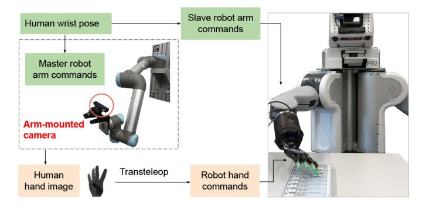

Fig. 1. Pipeline of our proposed vision-based hand-arm teleoperation system. The human demonstrator teleoperates the slave hand by an end-to-end hand pose estimation network, Transteleop, and controls the slave robot arm by relative trajectory control based on the operator's wrist motions. To solve inaccuracy issues of the hand pose estimation caused by the self-occlusion of the human fingers, we introduce a controlled active vision system to explore optimal hand observation. The active vision system consists of a depth camera mounted on a robot arm and a real-time trajectory generation method. This teleoperation system enables the slave robot to finish different types of manipulation tasks, such as pouring, sweeping, and multitable cup stacking.

estimation method have been partly reported in [\[12\]](#page-10-9). This work explains the Transteleop model in more detail and builds a new pairwise human–robot dataset in which both hands are in the same orientation. Furthermore, due to the augmentation of the active vision setup, the human-in-the-loop teleoperation system is capable of accomplishing more manipulation tasks by keeping the hand in the best field of view all the time.

To summarize, our primary contributions are as follows.

- 1) We develop an end-to-end robot hand pose estimation model (Transteleop) based on the image-to-image translation method. Trained on a self-built human–robot pairwise dataset, Transteleop predicts the joint commands of the robot and translates human hand images into synthesized robot images, promoting a better perception of pose features.
- 2) We set up an active vision system to thoroughly address the restricted field-of-view issue in vision-based teleoperation. This system ensures that the camera always captures the human hand from the best viewpoint and at an optimal distance.
- 3) We prove the reliability and practicality of the proposed teleoperation system by network evaluation, trajectory analysis, and nontrivial robot experiments, including pick and place, tower building, pouring, sweeping, midi mixer fader sliding, and multitable cup stacking, across two trained demonstrators.

## II. RELATED WORK

## *A. Robotic Teleoperation*

Robotic teleoperation systems conceptually consist of two sites: 1) the local and 2) the remote site. The local site locates the teleoperator and multiple devices used to measure or support the human's movements and to display the real-time status at the remote site. The remote site comprises robots, supporting sensors, and manipulated objects. Receiving the commands from the human and the sensor perception, the robots then perform the manipulation tasks.

The measuring devices at the local site fall into two main categories: 1) contacting/wearable devices and 2) markerless devices. Contacting/wearable devices, such as joysticks, marker-, inertial and magnetic measurement unit (IMU)-, or electromyography (EMG)-based data gloves or wearable suits, and haptic devices [\[13\]](#page-10-10), have long been used in robotic teleoperation. From simple joysticks to force-reflection joysticks, most are used for controlling robots that have limited motion types, such as unmanned aerial vehicles and mobile bases [\[14\]](#page-10-11). Marker-, IMU-, EMG-based wearable suits, such as gloves and clothes, usually require exact calibration and customization in order to achieve accurate control except for the band-type devices such as MYO armbands [\[15\]](#page-10-12). In practice, IMU- [\[16\]](#page-10-13) and EMG-based [\[17\]](#page-10-14) devices are convenient to set up and efficient in controlling the manipulators with multiple degrees of freedom (DoF). Zhang *et al.* [\[18\]](#page-10-15) presented an intuitive teleoperation system using an EMG armband for controlling a prosthetic hand while using IMU sensors for operating a Universal Robot UR10 arm. However, the forearm's EMG signals are decoded to classify only two hand motions (open and grasp), so the multifingered hand is merely capable of achieving simple grasping tasks. In terms of dexterous manipulation, the other obvious drawback of wearable devices, especially glove-based sensors, is the obstruction of natural human motions. With the rapid development of virtual/mixed/augmented reality (VR/MR/AR) devices, VR-/MRand AR-based teleoperation has been gaining considerable attention in robotics [\[19\]](#page-10-16), [\[20\]](#page-10-17), [\[21\]](#page-10-18). This is due to the benefits of immersive interaction and enhanced perceptual information.

Compared to wearable devices, contactless devices have the advantages of allowing for natural, unrestricted body motions and different teleoperators, and of being less invasive [\[22\]](#page-10-19), [\[23\]](#page-10-20). The most common contactless devices in teleoperation are low-cost RGB cameras. Making use of human body tracking and hand pose estimation algorithms, markerless vision-based teleoperation has been studied in controlling humanoid robots or dexterous robotic hands [\[24\]](#page-10-21). Many works separately research the visual perception of human bodies (e.g., human gesture classification or human hand pose estimation) and robot control (e.g., specific motions or kinematic retargeting) [\[25\]](#page-10-22), [\[26\]](#page-10-23). Kinematic retargeting takes the body detection results from visual perception algorithms and generates robot commands in joint space [\[27\]](#page-10-24). Recently, Handa *et al.* built a PointNet++ inspired hand pose estimation model and a fingertip-prioritized kinematic retargeting method for a 23 DoF hand-arm teleoperation system [\[5\]](#page-10-2). This system achieved impressive results in dexterous manipulation, for example, block stacking, and cup insertion, but the human workspace fully determines the robot workspace. To improve the efficiency and intuitiveness of the teleoperation system, instead of two-stage visual teleoperation, Fang *et al.* [\[28\]](#page-10-25) proposed a human–robot posture-consistent end-to-end neural network for teleoperating a 7 DoF Baxter arm. The network comprises skeleton point estimation, robot arm posture estimation, and robot joint angle generation. However, only some arm imitation experiments were demonstrated in simulation. In our previous work, Li *et al.* [\[29\]](#page-10-26) presented an end-to-end network, called TeachNet, which exploits the geometrical resemblance

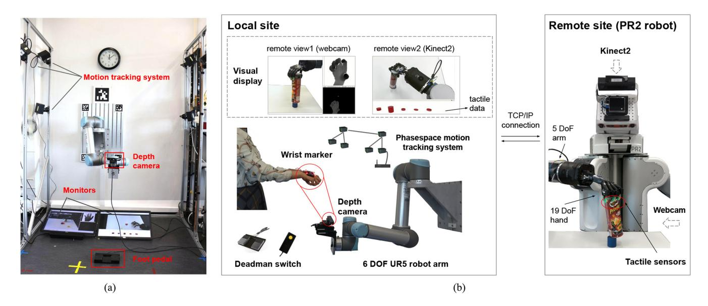

Fig. 2. Hardware setup of the proposed teleoperation system. (a) Front view of the local site. (b) Teleoperation hardware.

between human hands and the robot hand by a consistency loss. But only simplistic grasping experiments on the real robot are demonstrated. Later, we further discovered shared features between human hands and the robot hand based on the image-to-image translation method and built a mobile handarm robotic teleportation system by combining an IMU device and a 3-D-printed camera holder [\[12\]](#page-10-9). Nevertheless, the 248-g and 35-cm camera holder has to be worn on the human's forearm, undoubtedly bringing extra physical burden for the teleoperator.

## *B. Active Vision*

Active vision has been widely used in object tracking [\[30\]](#page-10-27), robotic grasping [\[31\]](#page-10-28), human–robot interaction [\[32\]](#page-10-29), and simultaneous localization and mapping (SLAM) [\[33\]](#page-10-30). It aims to select attention and image viewpoint by moving the vision sensor to an optimal pose for facilitating the associated applications. The common form of an active vision system is that the vision sensor is either mounted on the end effector of a manipulator as a hand-eye system or on Pan-Tilt robots. Calli *et al.* [\[34\]](#page-10-31) utilized the curvature information from the silhouette of unknown objects to update the robot pose using active vision for obtaining exemplary grasping configuration. Recently, some works optimized the camera viewpoint based on reinforcement learning techniques for grasping pose generation and robotic pushing tasks [\[35\]](#page-10-32), [\[36\]](#page-10-33). In the human– robot interaction scenario, active vision usually strengthens the robot's ability to detect the humans' presence and interpret their motion or emotions. Latif *et al.* [\[37\]](#page-10-34) proposed the eyegaze tracking interface TeleGaze to teleoperate mobile robots based on the visual information from the two Pan-Tilt-Zoom cameras on the robots. To improve the operational performance and increase the immersive feeling, Huang *et al.* [\[38\]](#page-10-35) established an active vision system based on a Pan-Tilt-Zoom video camera to track the target in the space robot teleoperation task automatically. Instead of applying active vision to observe the remote site, in this article, we investigate how to build a controlled active vision setup at the operator site to capture the human hand from favorable views.

### III. HARDWARE SETUP

Our goal is to build an agile vision-based teleoperation system in which the teleoperator performs natural finger motions and unrestricted arm actions for a series of manipulation tasks that can be performed in an unlimited workspace. The hardware setup is shown in Fig. [2.](#page-2-0)

The local site setup [see Fig. [2\(](#page-2-0)b)] consists of a 6 DoF UR5 collaborative robot arm with a RealSense SR300 depth sensor, a PhaseSpace motion tracking system, a 3-D-printed lightweight LED wrist marker, two monitors, and two deadman's switches. The human teleoperator stands in front of the UR5 robot and keeps a safe distance, while the UR5 robot arm, which possesses a certified safety system, is used to track the human's right hand autonomously. For finger tracking, the depth sensor is mounted on the end-effector of the robot arm for capturing depth images of the human hand. For wrist tracking, the PhaseSpace motion tracking system (320 Hz) estimates the right human hand's 6-D pose based on the wrist marker pasted to the back of the human hand.

Two monitors are used to visualize the real-time status of the remote site and the depth images of the human hand. In addition to the two visual streams of the robot state from the top view and the right view, real-time force feedback on the five robot fingertips is also represented by five cylinders, whose height changes along with the magnitude of the measured force.

At the remote site, the slave robot is a PR2 robot [\[39\]](#page-10-36) with a 19 DoF Shadow robot hand [\[40\]](#page-10-37) mounted on its 5 DoF right arm. A Kinect2 RGBD camera mounted on the PR2 head and a webcam located to the right of the PR2 capture the robot's performance from the top and side viewpoints. In addition to that, five Syntouch Biotac tactile sensors [\[41\]](#page-10-38) are retrofitted

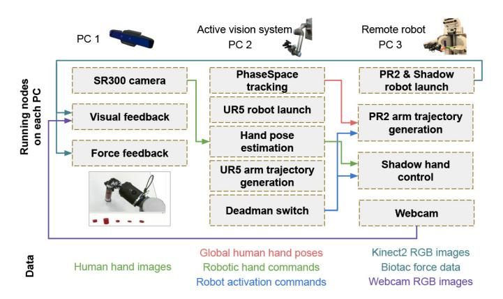

Fig. 3. Primary ROS nodes on each computer and data communication among three computers. The colored lines represent the data transfer between two nodes. The types of transferred data are listed in the corresponding colored texts. The two robots are running on two independent ROS masters but communicate via the master\_discovery\_fkie ROS package.

at the fingertips of the Shadow hand. In our setup, the human stands in front of the UR5 robot and can only see the PR2 from the visual displays.

This hardware setup works across three computers under the same local-area network, and the data is communicated between these computers via robot operating system (ROS). The primary ROS topics on each computer and data communication are depicted in Fig. [3.](#page-3-0) PC1 and PC2 belong to the local site, while PC3 is at the remote site. PC2 and PC3 control the UR5 robot and the PR2 robot, respectively. There is one ROS master each, running at both sites. PC2 publishes the 6-D global hand poses, and PC3 generates real-time trajectory commands for the right PR2 arm based on the global hand poses. Moreover, PC3 generates the Shadow hand's joint commands based on the human hand images, and then the Shadow hand imitates the human hand gestures at the remote site. PC1 is used for feedback visualization and to control the SR300 depth camera. Thanks to the master\_discovery\_fkie[1](#page-3-1) ROS package, selected essential ROS messages, such as the 6-D human hand pose, the robot hand commands, and the sensing feedback are synchronized at both sites.

## IV. VISION-BASED ROBOT HAND POSE ESTIMATION

## *A. Transteleop*

We expect to estimate the joint angles of the robot hand from the human hand depth image *IH* captured by the tracking system. Despite the Shadow hand being designed to match the mechanisms of an adult hand, dexterous teleoperation requires an accurate mapping from the operators' hand to the robot. Due to the cross-domain gap between the robot hand and the human hand, how to acquire instructive and shared hand features *H*share, such as the skeletal shape and the entire silhouette, from these two domains dominates this regression problem. We believe that it would be favorable to predict from the shared pose feature *H*share rather than the bare *IH*. In order to attain an instructive feature representation *Z*pose, we adopt a generative structure that maps from the human hand image *IH*

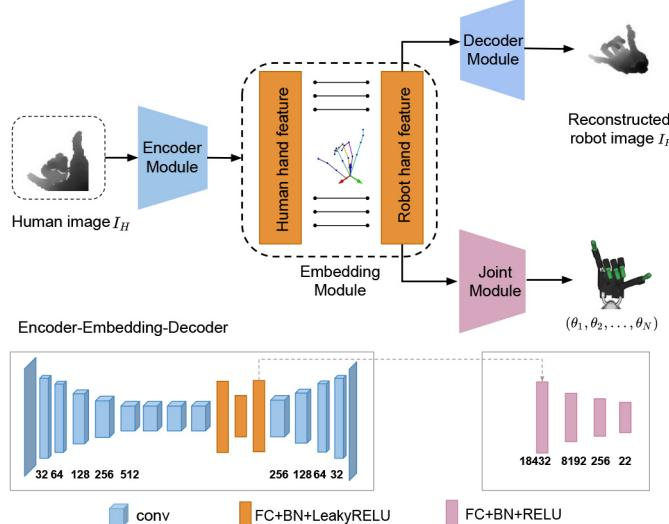

Fig. 4. Architecture of Transteleop. Given an input depth image from the human hand domain, Transteleop aims to reconstruct a robot hand image and predicts the joint commands of the robot hand in the robot domain.

to the robot hand image *IR* and retrieves the pose feature *H*share from the bottleneck layer. Although conditional GANs have led to a substantial boost in the quality of image generation, the discriminator only pursues the high realism of reconstructed images but does not fully concentrate on the pose feature of the input. Alternatively, the Autoencoders are known to learn efficient data codings in an unsupervised manner and are widely used in image-to-image translation applications as well. Therefore, we propose to use an encoder-decoder style imageto-image translation method (Transteleop)[2](#page-3-2) for hand feature *H*share extraction. This learning scheme is defined as

$$f_{\text{trans}}: I_H \in \mathbb{R}^2 \to H_{\text{share}} \to I_R \in \mathbb{R}^2$$
 (1)

$$f_{\text{joint}}: H_{\text{share}} \to \Theta.$$
 (2)

The deep network architecture of Transteleop is shown in Fig. [4.](#page-3-3) Transteleop boils down to four modules: 1) encoder module; 2) embedding module; 3) decoder module; and 4) joint module. The encoder–embedding–decoder association takes a depth image of a human hand *IH* and reconstructs a depth image of the robot hand ˆ*IR* at the same hand pose. The embedding layers connect the encoder and the decoder submodules and embody the shared pose features *H*share. Note that all layers in the embedding module are fully connected layers because a fully connected layer allows each unit to connect every activation unit of the previous layer, while a convolutional layer usually has a specific receptive field. In the image-to-image translation field, the L1 loss is found to produce a rough outline of the predicted image but keeps highresolution details, while the L2 loss tends to estimate the mean of the distribution leading to blurry images [\[42\]](#page-10-39).

In our case, the local features of the hand, such as the positions of the hand keypoints, are more important than the image resolution. Transteleop tackles this problem by introducing a keypoint-based L2 reconstruction loss [see [\(3\)\]](#page-4-0),

1http://wiki.ros.org/master\_discovery\_fkie

2https://github.com/Smilels/multimodal-translation-teleop

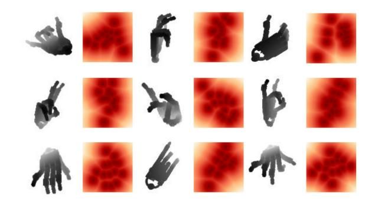

Fig. 5. Heatmap of weight factor  $\alpha$ . The darker color illustrates how important these pixels are.

which encourages the model to focus on the local features, such as the pixels around the hand joints. The weight factor of each pixel  $\alpha \in [0, 1]$  [see (4)] is the normalized distance between the pixel and the hand keypoints, shown in Fig. 5

$$L_{\text{recon}} = \frac{1}{M} \sum_{i=1}^{M} \alpha_{ij} \cdot \left( I_{R,ij} - \hat{I}_{R,ij} \right)^2$$
 (3)

where M is the number of pixels and  $\alpha_{ij}$  is the weighting factor of the pixel at [i,j].  $\hat{I}_R$  is the ground truth of the robot hand image

$$D_{ij} = \min \|P_{ij} - A\|^{2}$$

$$\alpha_{ij} = 1 - \frac{D_{ij}}{D_{\text{max}}}$$
(4)

where  $P_{ij}$  is the location of the pixel at [i, j] in the image coordinate, A is the location array of all 15 keypoints and their eight neighboring pixels, and  $\alpha_{ij}$  is the scaling factor of the pixel at [i,j].  $D_{\text{max}}$  is the maximum value of array D. The sizes of  $P_{ij}$ , A, and D are  $1 \times 2$ ,  $135 \times 2$ , and  $M \times 1$ , respectively.

The joint module of Transteleop employs fully connected layers to deduce 17-D joint angles  $\Theta$  from the latent feature embedding  $H_{\text{share}}$ . The joint loss  $L_{\text{joint}}$  is supervised with a mean squared error loss

$$L_{\text{joint}} = \frac{1}{N} \|\Theta - \Theta_{GT}\|_2^2 \tag{5}$$

where N is the number of joints and  $\Theta_{GT}$  denotes the ground truth joint angles.

During the training time, the complete training objective  $L_{\text{hand}}$  is the weighted sum of the reconstruction loss and the joint angles regression loss and is trained on a paired human-robot dataset (see Section IV-B)

$$L_{\text{hand}} = \lambda_{\text{recon}} \cdot L_{\text{recon}} + \lambda_{\text{joint}} \cdot L_{\text{joint}}$$
 (6)

where  $\lambda_{recon} = 1$  and  $\lambda_{joint} = 10$  are the scaling weights.

At inference time, the decoder module is not used. Accordingly, Transteleop takes a depth image of a human hand as input and then outputs joint commands for the robot.

#### B. Dataset

Considering that the inconsistent orientation and position of the input and reconstructed images admittedly yield more training challenges to Transteleop, it would be better to take the images of the human hand and the robot hand from the same viewpoint and at the same wrist poses. In [12] and [29], the robot images are recorded through the Gazebo simulator when the camera and the robot both are at a fixed global pose. In this article, we propose to collect a pairwise human–robot dataset from the same viewpoint. Given the human hand depth images and keypoint positions from Bighand2.0 [43], the robot images are collected through an OpenGL interface, and the robot joint angles are optimized by the bio-ik solver [44].

The Bighand2.0 dataset provides 960K human hand depth images, in which the global poses of the human hand vary considerably. The positions of 21 hand keypoints in relation to the camera frame are shown in Fig. 6(a). In order to obtain the wrist orientation, we build a local hand frame for each hand. The z-axis is the mean of the vector first finger (FF)palm, middle finger (MF)-palm, ring finger (RF)-palm, and little finger (LF)-palm. The y-axis is the cross product of the MF-palm and the RF-palm. Then, we obtain the x-axis for a right-handed coordinate system. The vectors FF-palm, MFpalm, RF-palm, and MF-palm represent the vectors from the wrist pointing to the metacarpal joints of the FF, MF, RF, and the LF. Once we have the wrist orientation, we obtain the transformations from the camera to the wrist regarding the human hand dataset. Next, we set up a camera in OpenGL at the same orientation and position with respect to the robot wrist. Taking advantage of the bio-ik solver, we developed an optimized retargeting method integrating a position mapping and an orientation mapping from the human hand keypoints to the corresponding robot hand keypoints. The kinematic chain of the Shadow hand is visualized in Fig. 6(b). Subsequently, joint angles of the robot, namely, the ground truth of Transteleop, are acquired. Finally, given the transformation between the camera and the robot wrist, we render the robot model and capture the depth images of the robot hand in OpenGL. The pairwise dataset consists of 400K synchronized human-robot depth images and corresponding robot joint angles. As demonstrated in Fig. 6(c), the robot hands are imitating the human hand and are at similar wrist poses.

#### V. ACTIVE VISION SYSTEM

Our real-time active vision system allows the camera to capture the right human hand at optimal viewpoints by involving a moving vision sensor. The vision sensor is mounted on the end-effector of the robot arm. In such a tracking system, three crucial issues should be considered: 1) whether the robot can smoothly follow the human hand in real time; 2) whether the robot keeps a safe distance from the human; and 3) whether the UR5 robot arm can satisfy the required workspace of the manipulation tasks.

Regarding the first issue, the frequency of the PhaseSpace motion tracking system ensures the fast and reliable identification of the human hand. Then, the goal pose of the UR5 robot, which carries the SR300 depth camera, is always updated to a position where the camera can optimally observe the human fingers, namely 40 cm in front of the human hand palm. In our hand coordinate system, this position is easily calculated by a 40-cm translation along the negative *y*-axis of the human hand, compare Fig. 6(a). Second, 30 Hz joint-space trajectory

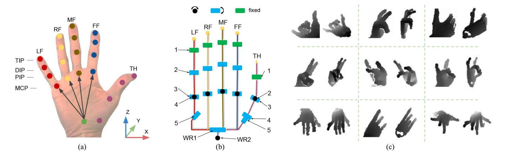

Fig. 6. (a) Human hand model in the Bighand2.0 dataset. The colored points show the 21 keypoints of a human hand in the dataset. The four black arrows represent the vectors from the wrist pointing to the metacarpal joints of the FF, MF, RF, and LF. TH refers to the thumb. (b) kinematic chain of the Shadow hand. The standard Shadow hand has 24 joints, but all joints 1 in our model are fixed at 20◦ because of the installation of Biotac tactile sensors. WR1, WR2 refer to wrist joints 1 and 2. The lengths of the four fingers are the same. (c) Examples of paired human–robot depth images at the same wrist pose in our dataset. The left and right images in each pair are the human hand and the robot hand, respectively.

generation is achieved by the inverse kinematics solver bio-ik. The real-time 6-D poses of the end-effector are online translated into joint-space robot commands, which are required to be as close as possible to the current robot configuration. In the Cartesian space, the translation and angular motions are constrained by velocity and acceleration limits. Besides that, a maximum velocity constraint in joint space is also employed.

On top of the certified safety system of UR5, the 40-cm distance between the human hand and the end-effector and the trajectory constraints also provide a strong safety guarantee. Furthermore, we add a collision object whose volume covers the area of the human hand into the planning scene, and update its pose in real-time. During the experiments, we check the collision of the target poses before the execution. Moreover, the human can always press the deadman switch (left foot pedal) to stop the UR5 robot immediately.

To identify the overall workspace of the system, we constructed the reachability map of the UR5 and the right arm of PR2 by creating grid-poses in the environment, and calculating valid IK solutions for the poses. In our setup, the UR5 robot is mounted on the wall near a corner and the PR2 is standing in an unconstrained space. The blue, green, yellow, and red spheres in Fig. [7](#page-5-1) represent that the robot end-effector can reach that position with more than 50, 20, 10, and equal to 1 orientation(-s). Compared to the UR5 workspace, apparently, only a few blue spheres scatter in the PR2 workspace due to the mechanism limitation. To utilize the most of the PR2 workspace, we implement relative control for the right PR2 arm and absolute control for the UR5 robot. Therefore, the right PR2 arm only performs the incremental motion of the human arm after the demonstrator presses the right foot pedal, and the UR5 robot will online track the human arm motion. In this way, the human demonstrator can always move their arm in a comfortable motion range. A block diagram of the overall hand pose tracking is shown in Fig. [8.](#page-5-2)

## VI. SLAVE ROBOT MOTION GENERATION

As discussed in Section [V,](#page-4-4) because of the limited workspace of the PR2 robot, we employ relative control for the slave robot

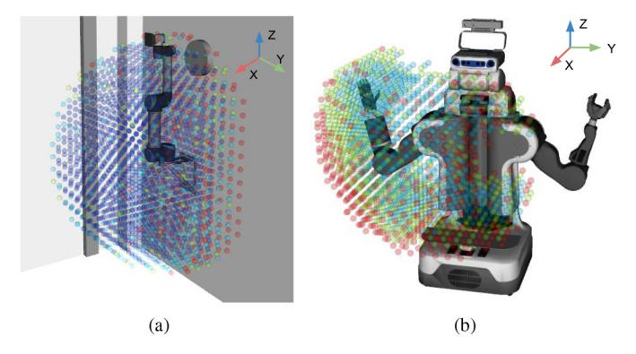

Fig. 7. Visualization of (a) UR5 workspace and (b) PR2 workspace in our setup from the third-person viewpoint. The blue, green, yellow, and red spheres indicate that the robot end-effector can reach that position with more than 50, 20, 10 and equal to 1 orientation(-s).

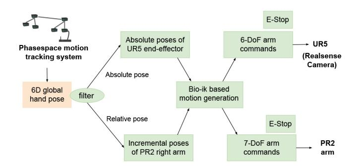

Fig. 8. Block diagram of the human hand pose tracking and generation of arm motions for the local and remote robot. Separate emergency-stop functions are used to protect operators and robots.

to achieve a fine coordination between two robots. Therefore, an initial registration of the human wrist pose with the slave wrist is not necessary, and the workspace of the slave robot is not constrained by the local site. The slave robot only moves when the human presses the foot pedal. This not only secures the robot but also facilitates the potential adjustments at the local site, for example, to avoid possible self-collision of the UR5 robot, or when close to the workspace boundary of the UR5 robot. Similar to the motion of the UR5 robot, given the human wrist pose acquired through the Phasespace system, the joint angles of the slave arm are also computed by the bio-ik solver under velocity and acceleration constraints in the Cartesian space and the joint space. A minor difference is that, in joint space, we consider the feedforward as well as the feedback joint angles difference to calculate the joint velocity.

## VII. NETWORK EVALUATION

In the preprocessing phase, we perform erosion followed by dilation to remove noise from the raw depth images and then extract a fixed-size cube around the hand. Then, the image is resized to 96×96 and normalized to [−1, 1]. During training, random in-plane rotation and random Gaussian noise are added for data augmentation. The average inference time of Transteleop is 0.027 s tested on a computer with Intel i9-7900X CPU with 3.30 GHz and 128 G of RAM, and a GeForce GTX 1080 Ti GPU.

This section examines the regression accuracy of Transteleop and four baseline models trained on the proposed paired human–robot dataset. The four baselines are as follows.

- 1) *Human-Only:* A model that removes the decoder module in Transteleop and is used to evaluate the effect of the reconstruction loss in Transteleop.
- 2) *Robot-Only:* A model that removes the decoder module in Transteleop and feeds the images of the robot hand. It is used to show the expert model with the matched domain.
- 3) *TeachNet:* A state-of-the-art end-to-end robot hand pose estimation model with an auxiliary consistency loss [\[29\]](#page-10-26).
- 4) *GANteleop:* A model that adds a PatchGAN discriminator in Transteleop and an adversarial loss based on the "pix2pix" framework [\[45\]](#page-10-42). This baseline is used to find a better image-to-image translation structure between the conditional GAN-based structure and the encoder–decoder structure chosen in Transteleop.

To find out whether the proposed human–robot dataset improves posture learning, we also train a model called TransteleopFix on the same joint labels, but the robot wrist is fixed in the robot depth images, see [\[12\]](#page-10-9). We compared the fraction of frames whose maximum angle errors are below the high-precision thresholds and also the average angle and distance error over all joints. The comparison results are shown in Fig. [9](#page-6-0) and Table [I.](#page-6-1)

We can observe that the Robot-only model significantly outperforms other baselines over all evaluation metrics because of the matched domain. Meanwhile, Transteleop shows an average 2.8% improvement of the accuracy compared to Humanonly in the high-precision condition. This result suggests the effectiveness of the reconstruction loss. Also, Transteleop performs better than TransteleopFix, indicating that the new pairwise human–robot dataset with the same wrist orientation enables the model to learn more indicative shared pose features. We note that the performance of GANteleop is much worse than Transteleop because the discriminator in

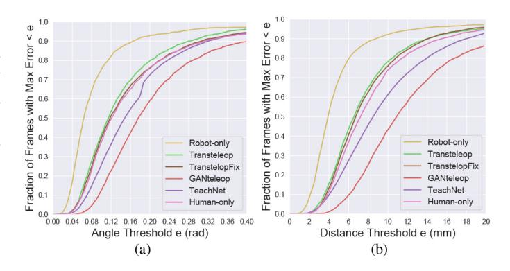

Fig. 9. Fraction of frames whose (a) absolute maximum angle error and (b) distance error over all joints are below a threshold between the Transteleop approach and four baselines on our test dataset.

TABLE I ANGLE/DISTANCE ACCURACY UNDER HIGH-PRECISION CONDITIONS AND AVERAGE ANGLE/DISTANCE ERROR

| Angle (rad) |          | Transtalaan      | Transteleop- Human-     |                          | GAN-                     | TeachNet                |  |
|-------------|----------|------------------|-------------------------|--------------------------|--------------------------|-------------------------|--|
|             |          | Transteleop      | Fix                     | only                     | teleop                   | [29]                    |  |
| Max Err.    | 0.1      | 41.15%           | 39.88%                  | 37.51%                   | 12.60%                   | 24.63%                  |  |
|             | 0.15     | 66.77%           | 63.51%                  | 61.87%                   | 37.82%                   | 50.11%                  |  |
| <=          | 0.2      | 79.82%           | 75.92%                  | 76.40%                   | 59.10%                   | 72.04%                  |  |
|             | 0.25     | 86.98%           | 84.19%                  | 84.06%                   | 73.42%                   | 81.94%                  |  |
| Ave Er      | Ave Err. |                  | 0.034                   | 0.033                    | 0.063                    | 0.046                   |  |
|             |          |                  |                         |                          |                          |                         |  |
|             |          |                  |                         |                          |                          |                         |  |
| Distance (  |          | Tuonotaloon      | Transteleop-            | Human-                   | GAN-                     | TeachNet                |  |
| Distance (1 | nm)      | Transteleop      | Transteleop- Fix     | Human- only           | GAN- teleop           | TeachNet [29]           |  |
| `           | nm)      | Transteleop      |                         |                          |                          |                         |  |
| Max Dis.    | _ ′      | •                | Fix                     | only                     | teleop                   | [29]                    |  |
| `           | 4        | 15.83%           | Fix 13.50%              | only 11.50%           | teleop 1.21%          | 9.98%                   |  |
| Max Dis.    | 4 6      | 15.83% 43.82% | Fix 13.50% 40.77% | only 11.50% 36.91% | teleop 1.21% 9.78% | [29] 9.98% 27.53% |  |

GANteleop focuses on pursuing realistic images and weakens the supervision of *L*joint. Comparing two image-to-image translation-based models (Transteleop and TransteleopFix) and TeachNet, the TeachNet model obtains at least 15% lower accuracy below a maximum joint angle error threshold. We infer that the image translation structure seizes more valuable pose features than the alignment mechanism between two layers in TeachNet.

In addition, we analyzed the influence of the camera viewpoint. We divided the test dataset into 12 portions based on the angle between the camera direction and the *y*-axis of the hand. Fig. [10\(](#page-7-0)a) exhibits the average absolute angle error on the individual joint (except for joints LF5, LF4, MF4, RF4, and TH3, which have a relatively smaller mean error than other joints) tested on the 12 subdatasets. The mean errors of all joints manifest a noticeable rise when the viewpoints are in the [75◦, 150◦] range due to the amount of self-occlusion. Especially, the mean errors of thumb joint 5, which is one of the essential joints for manipulation, is 0.096 rad in the [165◦, 180◦] range. Surprisingly, most joints perform well at [150◦, 180◦] range. To figure out this phenomenon, we analyze the average number of occluded joints for each subdataset, which can indicate the posture complexity. A joint occlusion is defined by thresholding the distance between the joint's depth annotation value and its reprojected depth value. The average number of occluded joints is shown in Table [II.](#page-7-1) Apparently, there are some straightforward human hand images with lower posture complexity at [150◦, 180◦] viewpoint range in our test

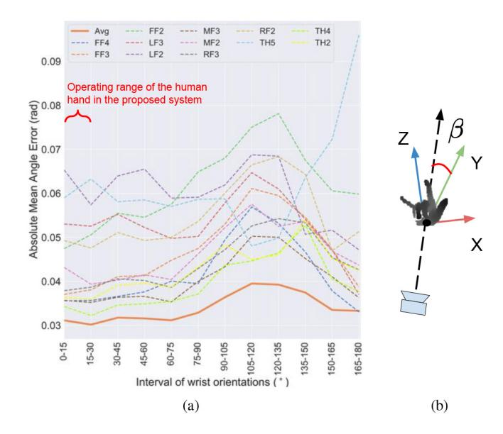

Fig. 10. (a) Absolute average angle error on the individual joint tested on twelve intervals of viewpoint. (b) β is used to indicate the camera viewpoint, which is the angle between the camera direction and the *y*-axis of the hand.

TABLE II AVERAGE NUMBER OF OCCLUDED JOINTS

| Ori. | 0-15   | 15-30   | 30-45   | 45-60   | 60-75   | 75-90   |
|------|--------|---------|---------|---------|---------|---------|
| Num  | 4.43   | 4.61    | 4.99    | 5.44    | 5.94    | 6.43    |
| Ori. | 90-105 | 105-120 | 120-135 | 135-150 | 150-165 | 165-180 |
| Num  | 6.38   | 5.91    | 5.64    | 5.32    | 3.75    | 3.65    |

dataset, therefore the mean error at this range is lower than expected. If we only focus on the [0◦, 150◦] viewpoint range, this result reveals that it is easier to determine hand poses in a good camera viewpoint. Therefore, it is beneficial to keep the operating range of the human hand in the [0◦, 30◦] viewpoint range by employing the proposed active vision setup.

## VIII. ROBOT EXPERIMENTS

In this section, we rigorously examine the proposed teleoperation system by precision analysis of robot trajectories and five elaborate experiments (pick and place, tower building, pouring, sweeping, and pushing) that test precision and power grasp, prehensile, and nonprehensile manipulation. In Cartesian space, the maximum linear velocity, angular velocity and linear acceleration are 0.2 m/s, 2 rad/s, and 2.0 m/s2 for both robots. The maximum velocity in the joint space of UR5 is 3 rad/s. The velocity limits of five joints on the right PR2 arm are the default values from PR2 manual [\[39\]](#page-10-36). The control frequencies of the UR5 robot, the Shadow hand, and the slave arm are all 30 Hz.

#### *A. Trajectory Analysis*

To check if the robot could track human hands in real time, it is essential to evaluate the precision of this teleoperation system quantitatively. We recorded the end-effector trajectories of both the UR5 and the PR2 while the right human hand performed specific motions.

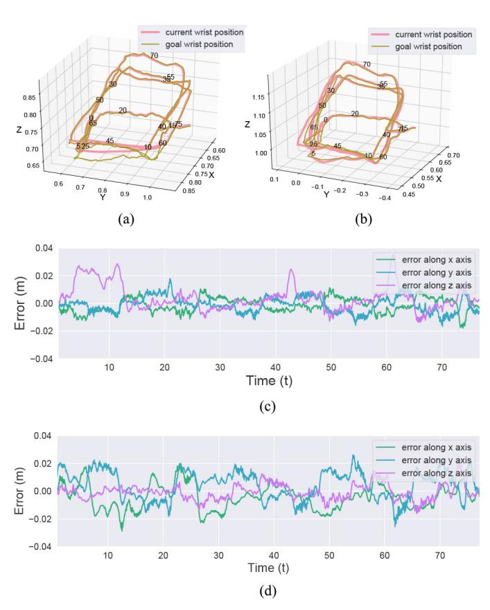

Fig. 11. Trajectory analysis of the UR5 and the right PR2 arm. The overlapping numbers on the trajectories in (a) and (b) mean the corresponding execution time (s). (a) UR5 tracking trajectories. (b) PR2 trajectories. (c) Position error along *x*-, *y*-, and *z*-axes of the UR5 tracking. (d) Position error along *x*-, *y*-, and *z*-axes of the PR2 motion.

Fig. [11\(](#page-7-2)a) and (b) presents the example end-effector trajectories of the UR5 and the PR2 while a human moves the hand on the local side. The frame coordinate of these trajectories is parallel to the base frame of UR5. The goal wrist positions in both figures are the smoothed goals after filtering the Cartesian constraints. From Fig. [11\(](#page-7-2)a) and (c), we can see that in most cases, UR5 follows the human hand well. During around 3–12, 41–43, and 60–62 s, where the human hand is moving through a sharp corner and the UR5 robot is stretching a bit, the tracking error is over 3 cm. The probable reasons are that: 1) the regularization goal, which tries to keep the joint-space solutions as close as possible to the current robot configuration, in our trajectory generation method and the servoj parameter set in the UR5 driver are acting together to smoothen the trajectory and 2) the closer the robot is to its workspace boundary along the *x*-axis, the greater the trajectory error. Note that the 3-cm position error does not affect the camera tracking the human hand at all because the camera is still near its optimal working pose (around 40-cm distance from the human hand, near a 0◦ view angle). The right PR2 arm starts from the center of its workspace and precisely conducts the motion commands as depicted in Fig. [11\(](#page-7-2)b) and (d). The average error of the right PR2 arm is 1.8 cm. These trajectory analyses indicate that the two robots are capable of following human motions and conducting most manipulation tasks, such as pick and place, and pouring.

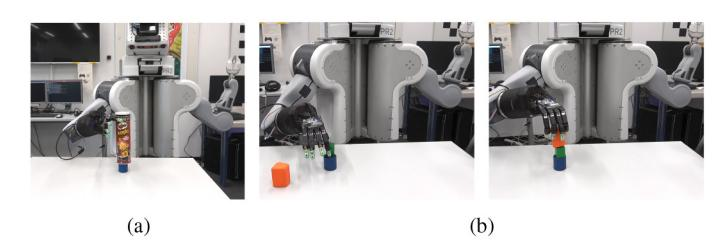

Fig. 12. (a) PR2 robot picks a Pringles can and places it on a blue cylinder. (b) PR2 robot stacks three different objects on top of each other.

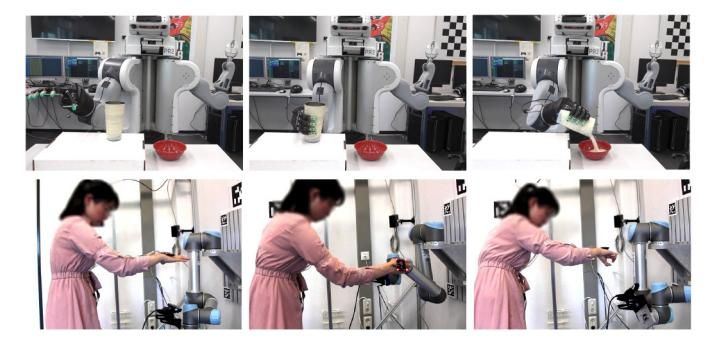

Fig. 13. Screenshots of the pouring task. From left to right, three images in the upper row show the PR2 robot grasping a cup filled with rice and pouring the rice into a bowl. The images in the lower row visualize the real-time human status at the local site.

#### *B. Teleoperation Experiments*

To verify the reliability of our method, real-world experiments across six types of physical tasks were performed by a female and a male adult. The operators need to get familiar with the active tracking system first and then take a warm-up phase for each task with ten nonconsecutive attempts before the real testing. As a matter of fact, one of the primary concerns of vision-based teleoperation systems is their lack of haptic feedback. Since the visual or auditory channels could be a low-cost alternative to haptic feedback [\[46\]](#page-10-43), we visualize the pressure values on each fingertip from the Biotac sensors during the manipulation process as a clue to force feedback.

- 1) *Pick and Place:* In this experiment, the robot grasps a Pringles can with a radius of 4 cm and then places it on a blue cylinder with a radius of 2.5 cm. We teleoperated the robot to grasp the Pringles can from the top and from the right side by power grasp, as shown in Figs. [2\(](#page-2-0)b) and [12\(](#page-8-0)a).
- 2) *Tower Building:* This experiment requires the robot to stack three different objects on top of each other, see Fig. [12\(](#page-8-0)b). In this experiment, the robot takes a precision grasp for the small green block and conducts a power grasp for the orange irregular block. Since larger objects are required to be placed on top of the smaller cylinder in experiments 1 and 2, these two tasks strictly inspect the grasping ability and stable release.
- 3) *Pouring:* In this task, the robot grasps a cup filled with rice, pours the rice into a bowl, and then places the empty cup on a box. Fig. [13](#page-8-1) visualizes the teleoperation process of this task. The human is supposed to turn the right hand 90◦ clockwise, move along the *y*-axis

TABLE III AVERAGE COMPLETION TIME AND SUCCESS RATE OF EACH TASK

|                 | task1 | task2 | task3 | task4 | task5 | task6 |
|-----------------|-------|-------|-------|-------|-------|-------|
| Time(s)         | 52.5  | 102.8 | 49.2  | 75.3  | 85.5  | 168   |
| Success rate(%) | 90    | 60    | 100   | 100   | 100   | 80    |

- of the UR5 robot, update the hand pose to a grasping pose, then slowly rotate the right wrist to the pouring pose. To fulfill this task, the UR5 robot needs to track the human hand simultaneously. Overall, this pouring task mainly examines the stability of the tracking system.
- 4) *Sweeping:* The robot grasps the brush and sweeps three small blocks to a specific place, see Fig. [14\(](#page-9-2)a). The contact force between the brush and the table surface should be mild. This task contains the challenges of pushing, sliding, and precision grasping.
- 5) *Midi Mixer Fader Sliding:* Figs. [1](#page-1-0) and [14\(](#page-9-2)b) and (c) illustrate the fader sliding task by the FF of the Shadow hand. Fig. [14\(](#page-9-2)c) displays the top visual scene of the remote site during the experiments and the visual haptic feedback of five robot fingertips. Obviously, in the top scene, the critical experimental area is easily occluded by the robot hand itself. Therefore, the remote manipulation states are heavily dependent on the side webcam and the haptic feedback. Besides that, humans hardly control their hands to move along an exact straight line. Hence, the robot usually cannot slide a fader from left to right at one time. To improve the success rate, we downscaled the human motions thrice.
- 6) *Multitable Cup Stacking:* Fig. [15](#page-9-3) illustrates the teleoperation process of this task. In this task, the robot first picks a blue cup on the table in front of it; then the robot rotates it 90◦ by a manual teleoperation command from the operator; then it inserts the blue cup into a green cup on the other table on its right. Afterward, the robot rotates back to its original pose and repeats the above procedure to insert another cup. In this task, the webcam is located right in front of the PR2 robot to provide a complete view of the two tables [see Fig. [15\(](#page-9-3)a)].

This task shows the potential of our current setup and the benefits of the mobile robot.

Table [III](#page-8-2) numerically shows the average completion time and success rate of all tasks. Each task was conducted five times by each operator. In the tower building task, the human needs to place the objects on a smaller surface with proper force, and the robot could accidentally ruin the tower. Therefore, this task took the longest time (except for the multitable task which contains three rotations of the mobile base) and achieved a relatively low success rate. For the fader sliding task, the average time refers to the time it takes to continuously slide the fader from left to right three times. The fact is that the time used to find the next fader occupies half of the completion time. The high success rate of most tasks indicates that our system can execute precision grasps, power grasps, placing, sliding, and robust tracking. These results verify the feasibility of the proposed dexterous hand-arm teleoperation system.

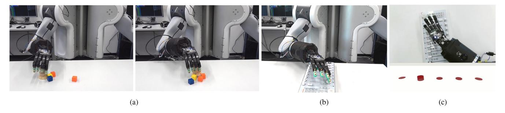

Fig. 14. (a) PR2 robot grasps a brush and sweeps three blocks to the orange block on the right side of the image. (b) PR2 robot slides the mixer fader from left to right using its FF. (c) Top scene from the Kinect2 on the head of PR2 and the visual haptic feedback. The five red cylinders from left to right qualitatively illustrate the pressure of the fingertip of thumb, FF, MF, RF, and LF.

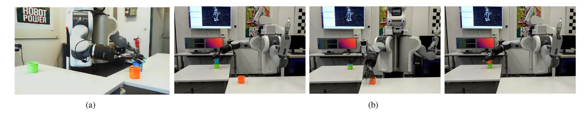

Fig. 15. Screenshots of the multitable cup stacking task. (a) Side scene from the webcam located right in front of the PR2 robot. (b) Teleoperation process is shown from left to right.

Refer to the experimental video for details of the manipulation tasks.

#### IX. CONCLUSION AND DISCUSSION

We developed a novel hand-arm teleoperation system incorporating the vision-based joint estimation approach, Transteleop, and a real-time active vision system. Transteleop predicts the robot joint angles from a depth image of the human hand in an end-to-end manner based on a human-torobot translation model. Through the comparison and ablation studies on the test dataset, it emerges that Transteleop performs better than other baselines. The viewpoint examination verifies the necessity of active perception. Then, trajectory analysis and systematic robotic experiments, including pick and place, tower building, pouring, sweeping, fader sliding, and multitable cup stacking, demonstrated the excellent efficacy of our proposed system. In practice, the UR5 robot used in the active vision system can be replaced by any kind of 6-DoF robot arm.

In the future, we would like to design a deep-learningbased 6-D global hand pose estimation algorithm to replace the motion tracking system, thus simplifying the hardware setup. In this system, we fully harness the cognition of humans and employ a direct control strategy for the robot. Even though direct control achieves seamless and continuous control, it transmits all control burden to the users. Shared control, which combines direct user commands and remote feedback or autonomy, is a better choice for long-term teleoperation tasks, such as user intention detection and task autocorrection. Furthermore, developing adaptive force control strategies into the current vision-based teleoperation system could allow the robot to deal with physical and dynamic interactions with the environment compliantly [\[47\]](#page-10-44), [\[48\]](#page-10-45).

The limitation of the current vision-based teleoperation system is the robot-motion feedback. The operator cannot directly see the robot and has to rely on the camera images and (visual) haptic feedback from the robot. This is of course a more realistic setting for remote teleoperation, but it is not intuitive for untrained humans, and therefore incurs a much higher mental load and much slower motions. Also, the robot hand often partially occludes the scene and objects during the manipulation tasks, so that the camera images become noninformative. A very recent study [\[49\]](#page-10-46) confirms that a VR interface allowed users to operate the robot more smoothly, resulting in a shorter trajectory of the robot to the target object and faster task completion compared to the camerabased teleoperation approach. Therefore, we proposed the use of virtual reality technology for immersive teleoperation in our future work. Though visual force feedback is a cheap and convenient substitute, it is revealed to be less efficient than haptic force feedback, especially when interacting with soft objects [\[46\]](#page-10-43). Slip detection during the manipulation tasks or using ultrasound-based haptic devices [\[22\]](#page-10-19) would be helpful in vision-based teleoperation. In addition, it is somehow exhausting to focus on multiple visual displays simultaneously, so using audio channels, such as auditory force feedback or a workspace boundary alarm, will be useful.

## REFERENCES

- [1] G. Niemeyer, C. Preusche, S. Stramigioli, and D. Lee, "Telerobotics," in *Springer Handbook of Robotics*. Heidelberg, Germany: Springer, 2016, pp. 1085–1108.
- [2] P. M. Kebria, A. Khosravi, S. Nahavandi, P. Shi, and R. Alizadehsani, "Robust adaptive control scheme for teleoperation systems with delay and uncertainties," *IEEE Trans. Cybern.*, vol. 50, no. 7, pp. 3243–3253, Jul. 2020.

- [3] B. Doroodgar, Y. Liu, and G. Nejat, "A learning-based semi-autonomous controller for robotic exploration of unknown disaster scenes while searching for victims," *IEEE Trans. Cybern.*, vol. 44, no. 12, pp. 2719–2732, Dec. 2014.
- [4] Y. Wu, W. Ji, X. Li, G. Wang, J. Yin, and F. Wu, "Context-aware deep spatiotemporal network for hand pose estimation from depth images," *IEEE Trans. Cybern.*, vol. 50, no. 2, pp. 787–797, Feb. 2020.
- [5] A. Handa *et al.*, "DexPilot: Vision-based teleoperation of dexterous robotic hand-arm system," in *Proc. IEEE Int. Conf. Robot. Autom. (ICRA)*, 2020, pp. 9164–9170.
- [6] L. Smith, N. Dhawan, M. Zhang, P. Abbeel, and S. Levine, "AVID: Learning multi-stage tasks via pixel-level translation of human videos," in *Proc. Robot. Sci. Syst.*, 2020, pp. 1–9.
- [7] P. Sharma, D. Pathak, and A. Gupta, "Third-person visual imitation learning via decoupled hierarchical controller," in *Proc. Adv. Neural Inf. Process. Syst. (NeurIPS)*, 2019, pp. 2593–2603.
- [8] S. Yuan *et al.*, "Depth-based 3D hand pose estimation: From current achievements to future goals," in *Proc. IEEE Conf. Comput. Vis. Pattern Recognit. (CVPR)*, 2018, pp. 2636–2645.
- [9] Y. Zhou, M. Habermann, W. Xu, I. Habibie, C. Theobalt, and F. Xu, "Monocular real-time hand shape and motion capture using multi-modal data," in *Proc. IEEE Conf. Comput. Vis. Pattern Recognit. (CVPR)*, 2020, pp. 5346–5355.
- [\[10\]](#page-0-0) T. Simon, H. Joo, I. Matthews, and Y. Sheikh, "Hand keypoint detection in single images using multiview bootstrapping," in *Proc. IEEE Conf. Comput. Vis. Pattern Recognit. (CVPR)*, 2017, pp. 1145–1153.
- [\[11\]](#page-0-1) J. Aloimonos, I. Weiss, and A. Bandyopadhyay, "Active vision," *Int. J. Comput. Vis.*, vol. 1, no. 4, pp. 333–356, 1988.
- [\[12\]](#page-1-1) S. Li *et al.*, "A mobile robot hand-arm teleoperation system by vision and IMU," in *Proc. IEEE Int. Conf. Intell. Robots Syst. (IROS)*, 2020, pp. 10900–10906.
- [\[13\]](#page-1-2) H. I. Son, A. Franchi, L. L. Chuang, J. Kim, H. H. Bulthoff, and P. R. Giordano, "Human-centered design and evaluation of haptic cueing for teleoperation of multiple mobile robots," *IEEE Trans. Cybern.*, vol. 43, no. 2, pp. 597–609, Apr. 2013.
- [\[14\]](#page-1-3) S. K. Cho, H. Z. Jin, J. M. Lee, and B. Yao, "Teleoperation of a mobile robot using a force-reflection joystick with sensing mechanism of rotating magnetic field," *IEEE Trans. Mechatronics*, vol. 15, no. 1, pp. 17–26, Feb. 2010.
- [\[15\]](#page-1-4) M. Sathiyanarayanan and S. Rajan, "MYO armband for physiotherapy healthcare: A case study using gesture recognition application," in *Proc. Int. Conf. Commun. Syst. Netw. (COMSNETS)*, 2016, pp. 1–6.
- [\[16\]](#page-1-5) B. Fang, F. Sun, H. Liu, and C. Liu, "3D human gesture capturing and recognition by the IMMU-based data glove," *Neurocomputing*, vol. 277, pp. 198–207, Feb. 2018.
- [\[17\]](#page-1-6) C. Meeker, M. Haas-Heger, and M. Ciocarlie, "A continuous teleoperation subspace with empirical and algorithmic mapping algorithms for nonanthropomorphic hands," *IEEE Trans. Autom. Sci. Eng.*, vol. 19, pp. 373–386, Jan. 2022.
- [\[18\]](#page-1-7) H. Zhang, Z. Zhao, Y. Yu, K. Gui, X. Sheng, and X. Zhu, "A feasibility study on an intuitive teleoperation system combining IMU with sEMG sensors," in *Proc. Int. Conf. Intell. Robot. Appl. (ICIRA)*, 2018, pp. 465–474.
- [\[19\]](#page-1-8) J. I. Lipton, A. J. Fay, and D. Rus, "Baxter's homunculus: Virtual reality spaces for teleoperation in manufacturing," *IEEE Robot. Autom. Lett.*, vol. 3, no. 1, pp. 179–186, Jan. 2018.
- [\[20\]](#page-1-8) D. Krupke, F. Steinicke, P. Lubos, Y. Jonetzko, M. Görner, and J. Zhang, "Comparison of multimodal heading and pointing gestures for co-located mixed reality human-robot interaction," in *Proc. IEEE Int. Conf. Intell. Robots Syst. (IROS)*, 2018, pp. 1–9.
- [\[21\]](#page-1-8) E. Rosen, D. Whitney, M. Fishman, D. Ullman, and S. Tellex, "Mixed reality as a bidirectional communication interface for human-robot interaction," in *Proc. IEEE Int. Conf. Intell. Robots Syst. (IROS)*, 2020, pp. 11431–11438.
- [\[22\]](#page-1-9) "Ultraleap." Accessed: Sep. 2022. [Online]. Available: https://www. ultraleap.com/
- [\[23\]](#page-1-9) J. Kofman, X. Wu, T. J. Luu, and S. Verma, "Teleoperation of a robot manipulator using a vision-based human-robot interface," *IEEE Trans. Ind. Electron.*, vol. 52, no. 5, pp. 1206–1219, Oct. 2005.
- [\[24\]](#page-1-10) X. Yu, B. Li, W. He, Y. Feng, L. Cheng, and C. Silvestre, "Adaptive-constrained impedance control for human-robot cotransportation," *IEEE Trans. Cybern.*, early access, Sep. 27, 2021, doi: [10.1109/TCYB.2021.3107357.](http://dx.doi.org/10.1109/TCYB.2021.3107357)
- [\[25\]](#page-1-11) I. Ajili, M. Mallem, and J.-Y. Didier, "Gesture recognition for humanoid robot teleoperation," in *Proc. IEEE Int. Symp. Robot Human Interactive Commun. (RO-MAN)*, 2017, pp. 1115–1120.

- [\[26\]](#page-1-11) F. Gomez-Donoso, S. Orts-Escolano, and M. Cazorla, "Accurate and efficient 3D hand pose regression for robot hand teleoperation using a monocular RGB camera," *Expert Syst. Appl.*, vol. 136, pp. 327–337, Dec. 2019.
- [\[27\]](#page-1-12) D. Antotsiou, G. Garcia-Hernando, and T.-K. Kim, "Task-oriented hand motion retargeting for dexterous manipulation imitation," in *Proc. Eur. Conf. Comput. Vis. (ECCV) Workshops*, 2018, pp. 287–301.
- [\[28\]](#page-1-13) B. Fang, X. Ma, J. Wang, and F. Sun, "Vision-based posture-consistent teleoperation of robotic arm using multi-stage deep neural network," *Robot. Auton. Syst.*, vol. 131, Sep. 2020, Art. no. 103592.
- [\[29\]](#page-1-14) S. Li *et al.*, "Vision-based teleoperation of shadow dexterous hand using end-to-end deep neural network," in *Proc. IEEE Int. Conf. Robot. Autom. (ICRA)*, 2019, pp. 416–422.
- [\[30\]](#page-2-1) W. Ye, Z. Li, C. Yang, J. Sun, C.-Y. Su, and R. Lu, "Vision-based human tracking control of a wheeled inverted pendulum robot," *IEEE Trans. Cybern.*, vol. 46, no. 11, pp. 2423–2434, Nov. 2016.
- [\[31\]](#page-2-2) P. K. Allen, A. Timcenko, B. Yoshimi, and P. Michelman, "Automated tracking and grasping of a moving object with a robotic hand-eye system," *IEEE Trans. Robot. Autom.*, vol. 9, no. 2, pp. 152–165, Apr. 1993.
- [\[32\]](#page-2-3) Y. Demiris and B. Khadhouri, "Hierarchical attentive multiple models for execution and recognition of actions," *Robot. Auton. Syst.*, vol. 54, no. 5, pp. 361–369, 2006.
- [\[33\]](#page-2-4) A. J. Davison and D. W. Murray, "Simultaneous localization and mapbuilding using active vision," *IEEE Trans. Pattern Anal. Mach. Intell.*, vol. 24, no. 7, pp. 865–880, Jul. 2002.
- [\[34\]](#page-2-5) B. Calli, M. Wisse, and P. Jonker, "Grasping of unknown objects via curvature maximization using active vision," in *Proc. IEEE Int. Conf. Intell. Robots Syst. (IROS)*, 2011, pp. 995–1001.
- [\[35\]](#page-2-6) B. Calli, W. Caarls, M. Wisse, and P. Jonker, "Viewpoint optimization for aiding grasp synthesis algorithms using reinforcement learning," *Adv. Robot.*, vol. 32, no. 20, pp. 1077–1089, 2018.
- [\[36\]](#page-2-6) R. Cheng, A. Agarwal, and K. Fragkiadaki, "Reinforcement learning of active vision for manipulating objects under occlusions," in *Proc. Conf. Robot Learn. (CoRL)*, 2018, pp. 422–431.
- [\[37\]](#page-2-7) H. O. Latif, N. Sherkat, and A. Lotf, "TeleGaze: Teleoperation through eye gaze," in *Proc. IEEE Int. Conf. Cybernetic Intell. Syst. (CIS)*, 2008, pp. 1–6.
- [\[38\]](#page-2-8) C. Huang, H. Liu, F. Sun, and Y. Sheng, "Space robot teleoperation based on active vision," in *Practical Applications of Intelligent Systems*. Heidelberg, Germany: Springer, 2014, pp. 229–240.
- [\[39\]](#page-2-9) "PR2 manual." Accessed: Sep. 2022. [Online]. Available: https://www. clearpathrobotics.com/assets/downloads/pr2/pr2\_manual\_r321.pdf
- [\[40\]](#page-2-10) "Shadow robot." Accessed: Sep. 2022. [Online]. Available: https://www. shadowrobot.com/dexterous-hand-series/
- [\[41\]](#page-2-11) "BioTac manual." Accessed: Sep. 2022. [Online]. Available: https:// syntouchinc.com/wp-content/uploads/2020/09/SynTouch-Product-Man ual-BioTac-2020-09-23.pdf
- [\[42\]](#page-3-4) D. Pathak, P. Krahenbuhl, J. Donahue, T. Darrell, and A. A. Efros, "Context encoders: Feature learning by inpainting," in *Proc. IEEE Conf. Comput. Vis. Pattern Recognit. (CVPR)*, 2016, pp. 2536–2544.
- [\[43\]](#page-4-5) S. Yuan, Q. Ye, B. Stenger, S. Jain, and T.-K. Kim, "BigHand2.2M benchmark: Hand pose dataset and state of the art analysis," in *Proc. IEEE Conf. Comput. Vis. Pattern Recognit. (CVPR)*, 2017, pp. 4866–4874.
- [\[44\]](#page-4-6) P. Ruppel, N. Hendrich, S. Starke, and J. Zhang, "Cost functions to specify full-body motion and multi-goal manipulation tasks," in *Proc. IEEE Int. Conf. Robot. Autom. (ICRA)*, 2018, pp. 3152–3159.
- [\[45\]](#page-6-2) P. Isola, J.-Y. Zhu, T. Zhou, and A. A. Efros, "Image-to-image translation with conditional adversarial networks," in *Proc. IEEE Conf. Comput. Vis. Pattern Recognit. (CVPR)*, 2017, pp. 1125–1134.
- [\[46\]](#page-8-3) P. Richard, G. Burdea, D. Gomez, and P. Coiffet, "A comparison of haptic, visual and auditive force feedback for deformable virtual objects," in *Proc. Int. Conf. Autom. Technol. (ICAT)*, vol. 49, 1994, p. 62.
- [\[47\]](#page-9-4) C. Yang, G. Peng, L. Cheng, J. Na, and Z. Li, "Force sensorless admittance control for teleoperation of uncertain robot manipulator using neural networks," *IEEE Trans. Syst., Man, Cybern., Syst.*, vol. 51, no. 5, pp. 3282–3292, May 2021.
- [\[48\]](#page-9-4) C. Zeng, H. Su, Y. Li, J. Guo, and C. Yang, "An approach for robotic leaning inspired by biomimetic adaptive control," *IEEE Trans. Ind. Informat.*, vol. 18, no. 3, pp. 1479–1488, Mar. 2022.
- [\[49\]](#page-9-5) P. Ponomareva, D. Trinitatova, A. Fedoseev, I. Kalinov, and D. Tsetserukou, "GraspLook: A VR-based telemanipulation system with R-CNN-driven augmentation of virtual environment," in *Proc. IEEE Int. Conf. Robot. Autom. (ICRA)*, 2021, pp. 166–171.

**Shuang Li** received the B.Sc. and M.Sc. degrees in mechanical engineering from the Anhui University of Technology, Ma'anshan, China, in 2013 and 2015, respectively, and the Ph.D. degree in computer science from the Universität Hamburg, Hamburg, Germany, 2022.

She is a Postdoctoral Researcher with the Department of Informatics, Universität Hamburg. Her research interests are robotic teleoperation, dexterous manipulation, and deep learning applications in robotics.

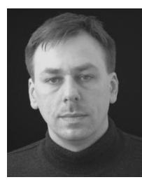

**Norman Hendrich** received the B.Sc. and M.Sc. degrees in physics and the Ph.D. degree in computer science from the Universität Hamburg, Hamburg, Germany, in 1986, 1991, and 1996, respectively.

He is a Senior Lecturer with the Department of Informatics, Universität Hamburg. He participated as a Principal Investigator in several collaborative European research projects and currently acts as a Project Manager of the joint Sino-German project Transregio-SFB TRR169 "Crossmodal Learning." His research interests include computer simulation

and machine learning, with a focus on applications in service robotics and dexterous manipulation.

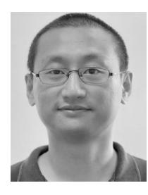

**Hongzhuo Liang** received the M.Sc. degree in mechanical engineering from the Anhui University of Technology, Ma'anshan, China, in 2016, and the Ph.D. degree in computer science from the Universität Hamburg, Hamburg, Germany, in 2022.

He is a Postdoctoral Researcher with the Department of Informatics, Universität Hamburg. His research interests include crossmodal learning and reinforcement learning in robotic grasping and manipulation.

**Philipp Ruppel** received the B.Sc. and M.Sc. degrees in informatics from the Universität Hamburg, Hamburg, Germany, in 2014 and 2017, respectively.

He is currently a Research Associate with the Department of Informatics, Universität Hamburg. His research interests include robotics, machine learning, tactile sensing, and dexterous manipulation.

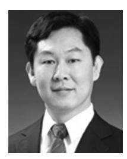

**Changshui Zhang** (Fellow, IEEE) received the B.S. degree in mathematics from Peking University, Beijing, China, in 1986, and the M.S. and Ph.D. degrees in control science and engineering from Tsinghua University, Beijing, in 1989 and 1992, respectively.

He joined the Department of Automation, Tsinghua University, in 1992, where he is currently a Professor. He has authored more than 200 articles. His current research interests include pattern recognition and machine learning.

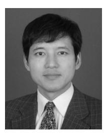

**Jianwei Zhang** (Member, IEEE) received the Bachelor of Engineering (with distinction) and Master of Engineering degrees from the Department of Computer Science, Tsinghua University, Beijing, China, in 1986 and 1989, respectively, the Ph.D. degree from the Institute of RealTime Computer Systems and Robotics, Department of Computer Science, University of Karlsruhe, Karlsruhe, Germany, in 1994, and the Habilitation degree from the Faculty of Technology, University of Bielefeld, Bielefeld, Germany, in 2000.

He is a Professor and the Director of group TAMS, Department of Informatics, Universität Hamburg, Hamburg, Germany. His research interests are sensor fusion, intelligent robotics, and multimodal machine learning. In these areas, he has published about 400 journal and conference papers, technical reports, and four books.

Prof. Zhang is the General Chair of IEEE MFI 2012, IEEE/RSJ IROS 2015, and the International Symposium of Human Centered Robotics and Systems 2018.