# AnyTeleop: A General Vision-Based Dexterous Robot Arm-Hand Teleoperation System

Yuzhe Qin1 , Wei Yang2 , Binghao Huang1 , Karl Van Wyk2 Hao Su1 , Xiaolong Wang1 , Yu-Wei Chao2 , Dieter Fox2 1UC San Diego 2NVIDIA

<https://yzqin.github.io/anyteleop/>

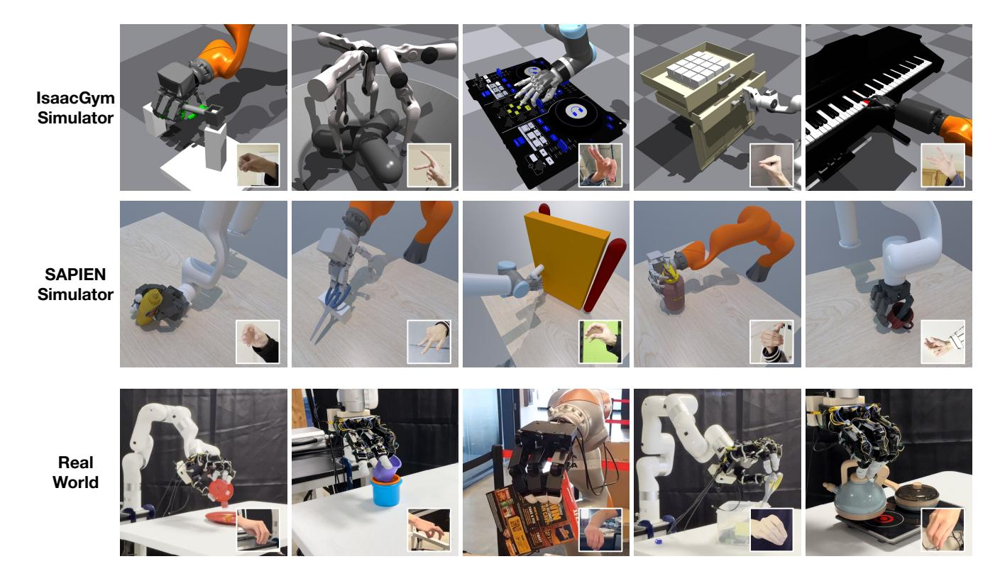

Fig. 1: We present AnyTeleop, a vision-based teleoperation system for a variety of scenarios to solve a wide range of manipulation tasks. AnyTeleop can be used for various robot arms with different robot hands. It also supports teleoperation within different realities, such as IsaacGym (top row), and SAPIEN simulator (middle row), and real world (bottom rows).

*Abstract*—Vision-based teleoperation offers the possibility to endow robots with human-level intelligence to physically interact with the environment, while only requiring low-cost camera sensors. However, current vision-based teleoperation systems are designed and engineered towards a particular robot model and deploy environment, which scales poorly as the pool of the robot models expands and the variety of the operating environment increases. In this paper, we propose AnyTeleop, a unified and general teleoperation system to support multiple different arms, hands, realities, and camera configurations within a single system. Although being designed to provide great flexibility to the choice of simulators and real hardware, our system can still achieve great performance. For real-world experiments, AnyTeleop can outperform a previous system that was designed for a specific robot hardware with a higher success rate, using the same robot. For teleoperation in simulation, AnyTeleop leads to better imitation learning performance, compared with a previous system that is particularly designed for that simulator.

# I. INTRODUCTION

A grand goal of robotics is to endow robots with humanlevel intelligence to physically interact with the environment. Teleoperation [\[39\]](#page-9-0), as a direct means to acquire human demonstrations for teaching robots, has been a powerful paradigm to approach this goal [\[22,](#page-9-1) [11,](#page-8-0) [67,](#page-11-0) [17,](#page-8-1) [34,](#page-9-2) [6,](#page-8-2) [19,](#page-9-3) [5,](#page-8-3) [38,](#page-9-4) [53,](#page-10-0) [63\]](#page-10-1). Compared to gripper-based manipulators, teleoperating dexterous hand-arm systems poses unprecedented challenges and often requires specialized apparatus that comes with high costs and setup efforts, such as Virtual Reality (VR) devices [\[4,](#page-8-4) [17,](#page-8-1) [15\]](#page-8-5), wearable gloves [\[29,](#page-9-5) [30\]](#page-9-6), handheld controller [\[47,](#page-10-2) [48,](#page-10-3) [20\]](#page-9-7), haptic sensors [\[12,](#page-8-6) [23,](#page-9-8) [52,](#page-10-4) [55\]](#page-10-5), or motion capture trackers [\[68\]](#page-11-1). Fortunately, recent developments in vision-based teleoperation [\[2,](#page-8-7) [24,](#page-9-9) [16,](#page-8-8) [26,](#page-9-10) [43,](#page-10-6) [27,](#page-9-11) [21,](#page-9-12) [22,](#page-9-1) [3\]](#page-8-9) have provided a low-cost and more generalizable alternative for teleoperating dexterous robot systems.

Despite the progress, the current paradigm of visionbased teleoperation systems still falls short when it comes to scaling up data collection for robot teaching. First, prior systems are often designed and engineered towards a particular robot model or deployment environment. For example, some systems rely on vision-based hand tracking models trained on datasets collected in the deployed studio [\[24,](#page-9-9) [16\]](#page-8-8), and some rely on human-robot retargeting models [\[65,](#page-11-2) [13\]](#page-8-10) or collision avoidance models [\[54\]](#page-10-7) trained for the particular robot at use. These systems will scale poorly as the pool of robot models expands and the variety of operating environments increases. Second, each system is created and coupled with one specific "reality", either only in the real world or with a particular choice of simulators. For example, the HAPTIX [\[23\]](#page-9-8) motion capture system is only developed for teleoperation in MuJoCo-based environments [\[58\]](#page-10-8). To facilitate large-scale data collection with simulation as well as closing sim-to-real gaps, we need teleoperation systems to operate both in virtual (with arbitrary choices of simulators) and in the real world. Finally, existing teleoperation systems are often tailored for single-operator and single-robot settings. To teach robots how to collaborate with other robot agents as well as with human agents, a teleoperation system should be designed to support multiple pilot-robot partners where the robots can physically interact with each other in a shared environment.

In this paper, we aim to set the foundation for scaling up data collection with vision-based dexterous teleoperation, by filling in the aforementioned gaps. To this end, we propose *AnyTeleop*, a unified and general teleoperation system (Fig. [1\)](#page-0-0), which can be used for:

- *Diverse* robot arm and dexterous hand models;
- *Diverse* realities, i.e. different choices of simulators or the real world;
- Teleoperation from *diverse* geographic locations, via a browser-based web visualizer developed for remote visual feedback;
- *Diverse* camera configurations, e.g. RGB camera with or without depth, single or multiple cameras;
- *Diverse* operator-robot partnerships, e.g. two operators separately piloting two robots to collaboratively solve a manipulation task.

To achieve this goal, we first develop a general and highperformance motion retargeting library to translate human motion to robot motion in real time without learned models. Our collision avoidance module is also learning-free and powered by CUDA-based geometry queries. They can adapt to new robots given only the kinematic model, i.e., URDF files. Second, we develop a web-based viewer compatible with standard browsers, to achieve simulator-agnostic visualization and enable remote teleoperation across the internet. Third, we define a general software interface for visualbased teleoperation, which standardizes and decouples each module inside the teleoperation system. It enables smooth deployment on different simulators or real hardware.

While being very general to support many settings with a single system, our system can still achieve great performance in the experiments. For real-world teleoperation, AnyTeleop can outperform a previous system [\[54\]](#page-10-7) designed for specific robot hardware with higher success rates on 8 out of 10 tasks proposed in their paper, using the same robot as [\[54\]](#page-10-7). For simulated environment teleportation, the smoother and collision-free demonstrations collected by AnyTeleop can bring better imitation learning results with higher success rates on 5 out of 6 tasks proposed in their paper, compared with a previous system [\[43\]](#page-10-6) specifically designed for that simulator. Finally, we demonstrate that AnyTeleop can be extended to support collaborative manipulation, which to our best knowledge has neither been achieved in the literature of vision-based teleoperation nor on dexterous hands.

Our system is also packaged to be easily-deployable. The containerized design makes installation easy and frees users from handling software dependencies. We are committed to open-sourcing the system and benefiting the community.

# II. RELATED WORK

Vision-based Robot Teleoperation. Recent years have witnessed an increasing interest in teleoperation of dexterous robot hands by human hands. It relies on accurate tracking of human hand motions and finger articulations. Compared to the costly wearable hand tracking solutions, such as gloves [\[29,](#page-9-5) [30,](#page-9-6) [37\]](#page-9-13), marker-based motion capture systems [\[68,](#page-11-1) [31\]](#page-9-14), inertia sensors [\[66\]](#page-11-3) or VR headsets [\[4,](#page-8-4) [28,](#page-9-15) [51,](#page-10-9) [41\]](#page-9-16), vision-based hand tracking is particularly favorable due to its low cost and low intrusion to the human operator. Early research in vision-based teleoperation focused on improving the performance of hand tracking [\[57,](#page-10-10) [60,](#page-10-11) [1\]](#page-8-11) and mapping human hand pose to robot hand pose [\[24,](#page-9-9) [2,](#page-8-7) [5,](#page-8-3) [35\]](#page-9-17). Recent works have expanded the scope of teleoperating a single robot hand to complete arm-hand systems [\[16,](#page-8-8) [25,](#page-9-18) [67\]](#page-11-0). However, these systems are designed and engineered towards a particular robot model (e.g., Kuka arm with Allegro hand in [\[16\]](#page-8-8), and PR2 arm with Shadow hand in [\[26\]](#page-9-10)), and rely on retargeting or collision detection models trained for specific robot hardware (e.g., Allegro hand and XArm6) [\[16,](#page-8-8) [54\]](#page-10-7) , making them difficult to transfer to new arm-hand systems and new environments. In contrast, our system is highly modularized with a versatile hand-tracking solution compat-

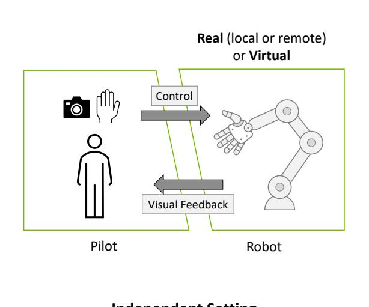

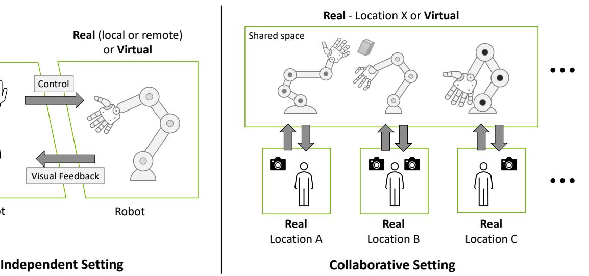

Fig. 2: Paradigms of vision-based teleoperation systems in *independent* and *collaborative* settings. The system should support any arm-hand models, existed in either virtual or the real world, can operate with flexible camera configurations, provide visual feedback for both local or remote presence, and support multiple robots piloted in a shared space.

ible with an arbitrary number of cameras, and configurable robot hand retargeting and motion generation modules for easy adaption to various robot arms and robot hand choices. This allows our system to achieve better performance compared to prior systems on various tasks while generalizing to a set of robot arm-hand systems and multiple environments.

Teleoperation in Different Reality. Manipulation with a dexterous robot hand is challenging due to its high degree of freedom. In recent years, dexterous robot teleoperation has been actively studied and shown promising progress in controlling a multi-fingered hand to perform manipulation tasks in the real world [\[4,](#page-8-4) [16,](#page-8-8) [36\]](#page-9-19) by leveraging the morphological similarity between the dexterous hand and the human hand.

With the advancement of data-driven approaches for robot manipulation [\[12,](#page-8-6) [18\]](#page-8-12), there is a growing need to collect human demonstrations in robotics. To enable easy and scalable data collection, teleoperation has also gained attention in simulated environments [\[62,](#page-10-12) [32,](#page-9-20) [58,](#page-10-8) [14,](#page-8-13) [8\]](#page-8-14). This provides a scalable solution to data collection by eliminating the need for real hardware, while maintaining access to oracle world information. For example, Mandlekar et al. [\[33\]](#page-9-21) developed a crowd-sourcing platform to teleoperate robots via mobile devices as controllers. Tung et al. [\[59\]](#page-10-13) further extended this framework to allow multi-arm collaborative teleoperation. The above frameworks rely on inertial sensors for control signals and thus are limited to parallel-gripper and simple tasks such as pick-and-place. Our system offers the ability to perform a wide range of dexterous tasks with robots of different morphologies by utilizing state-of-theart techniques in perception, optimization, and control. In addition, AnyTeleop is designed to support teleoperation in both virtual and the real world with a unified framework.

# III. SYSTEM OVERVIEW

Fig. [2](#page-2-0) illustrates our proposed paradigms of vision-based teleoperation systems. Below we introduce the features and designs of our system which realize the paradigms.

# *A. System Features*

- 1) Any arm-hand. As shown in Fig. [1,](#page-0-0) AnyTeleop is designed for arbitrary dexterous arm-hand systems that are not limited to any specific robot type.
- 2) Any reality. AnyTeleop is decoupled from specific hardware drivers or physics simulators. It can support different realities as visualized in Fig. [1.](#page-0-0)
- 3) Anywhere remote teleoperation. AnyTeleop provides a web-based visualizer to monitor the teleoperation and simulation in standard web browsers, e.g. Chrome.
- 4) Any camera configuration. AnyTeleop can consume data from both RGB and RGB-D cameras, and from either single or multiple cameras. Most importantly, it does not require extrinsic calibration as in most previous systems. This allows more flexible camera configurations and lower deployment overhead.
- 5) Any number of operator-robot partnerships. AnyTeleop supports collaborative settings where operators separately pilot two robots to collaboratively solve a manipulation task.
- 6) Simple deployment. AnyTeleop and all libraries are encapsulated as a docker image that can be downloaded and deployed on any Linux machine, which frees users from handling troublesome dependencies.

Table [I](#page-3-0) compares AnyTeleop with other vision-based dexterous teleoperation systems. We compare the systems

|                     | Sensor Requirements |                 | Robot-related Support |                  |                   | Use Case |                   |                  |                         |
|---------------------|---------------------|-----------------|-----------------------|------------------|-------------------|----------|-------------------|------------------|-------------------------|
|                     | Calibration Free | Contact Free | Depth Free         | Multiple Arms | Multiple Hands | Reality  | Collision Free | Remote Teleop | Collaborative Teleop |
| DexPilot [16]       | ×                   | <b>√</b>        | X                     | ×                | ×                 | Real     | <b>√</b>          | ×                | X                       |
| Holo-Dex [4]        | $\checkmark$        | $\checkmark$    | $\checkmark$          | No Arm           | X                 | Real     | X                 | $\checkmark$     | ×                       |
| DIME [5]            | ×                   | $\checkmark$    | $\checkmark$          | No Arm           | X                 | Real     | X                 | $\checkmark$     | ×                       |
| TeachNet [24]       | $\checkmark$        | $\checkmark$    | X                     | No Arm           | X                 | Sim&Real | X                 | X                | ×                       |
| Telekinesis [54]    | $\checkmark$        | ×               | $\checkmark$          | X                | X                 | Real     | $\checkmark$      | $\checkmark$     | ×                       |
| Qin et al. [43]     | $\checkmark$        | $\checkmark$    | ×                     | No Arm           | $\checkmark$      | Sim      | X                 | $\checkmark$     | ×                       |
| MVP-Real [45]       | ×                   | ×               | $\checkmark$          | No Arm           | X                 | Real     | X                 | $\checkmark$     | ×                       |
| Transteleop [26]    | ×                   | X               | X                     | X                | X                 | Real     | $\checkmark$      | $\checkmark$     | ×                       |
| Mosbach et al. [37] | ×                   | X               | $\checkmark$          | X                | ×                 | Sim      | X                 | $\checkmark$     | ×                       |
| AnyTeleop           | $\checkmark$        | $\checkmark$    | $\checkmark$          | $\checkmark$     | $\checkmark$      | Sim&Real | $\checkmark$      | $\checkmark$     | $\checkmark$            |

TABLE I: Comparison of Vision-Based Teleoperation System. We compare AnyTeleop's capabilities with related visual teleoperation system for multi-fingered dexterous robots. "No Arm" in the column of "Multiple Arms" means this system can only control hand motion but not arm-hand systems.

in three dimensions: (i) sensor requirements; (ii) robotrelated support; (iii) afforded use cases. Among all these teleoperation systems, AnyTeleop is the only one which can support different robot arms and enable collaborative teleoperation. It is also one of the only two systems that can support different dexterous hands.

#### B. System Design

The architecture of the teleoperation system is shown in Fig. 3. The teleoperation server (Section IV) receives the camera stream from the driver, detects the hand pose, and then converts it to joint control commands. The client receives these commands via network communication and uses them to control a simulated or real robot. The system is designed with three key principles: modularity, communication-focused, and containerization. Modularity is achieved by implementing well-defined input-output interfaces for each sub-component, allowing for wide applicability to different robot arms, dexterous hands, cameras, and realities. Communication-focused design allows for remote and collaborative teleoperation and reduces computation requirements on the operator's side by deploying heavy computations on a powerful server. Finally, the containerized design makes installation and deployment easier compared to other robotics systems with heavy software dependencies.

# IV. TELEOPERATION SERVER

The teleoperation server, outlined in Section III, utilizes the RGB or RGB-D data from one or multiple cameras and generates smooth and collision-free control commands for the robot arm and dexterous hand. It consists of four modules: (i) the hand pose detection module, which predicts hand wrist and finger poses from the camera stream, (ii) the detection fusion module, which integrates the results from multiple cameras, (iii) the hand pose retargeting module, which maps human hand poses to the dexterous robot hand, and (iv) the motion generation module, which produces high-frequency control signals for the robot arm. A standardized

software interface is defined for all four modules to facilitate flexibility and generalizability in AnyTeleop .

#### A. Hand Pose Detection

The hand pose detection module offers a unique feature to utilize input from various camera configurations, including RGB or RGB-D cameras, and single or multiple cameras. The design principle is to leverage more information, such as depth, and additional cameras, to improve performance when available. But it can also perform the task with minimal input, i.e. a single RGB camera. The detection module has two outputs: local finger keypoint positions in the wrist frame and global 6D wrist pose in the camera frame. The finger keypoint detection only requires RGB data while the wrist pose detection can optionally use depth information to achieve better results.

**Finger Keypoint Detection.** Our finger keypoint detection utilizes MediaPipe [64], a lightweight, RGB-based hand detection tool that can operate in real-time on a CPU. The MediaPipe detector can accurately locate 3D keypoints of 21 hand-knuckle coordinates in the wrist frame and 2D keypoints on the image.

Wrist Pose Detection from RGB-D. We use the pixel positions of the detected keypoints to retrieve the corresponding depth values from the depth image. Then, utilizing known intrinsic camera parameters, we compute the 3D positions of the keypoints in the camera frame. The alignment of the RGB and depth images is handled by the camera driver. With the 3D keypoint positions in both the local wrist frame and global camera frame, we can estimate the wrist pose using the Perspective-n-Point (PnP) algorithm.

Wrist Pose Detection from RGB only. The orientation of the hand can be computed analytically from the local positions of the detected keypoints. However, determining the wrist position in the camera frame can be challenging without explicit 3D information. To enhance MediaPipe for global wrist pose estimation, we adopt the approach used in FrankMocap [50] by incorporating an additional neural

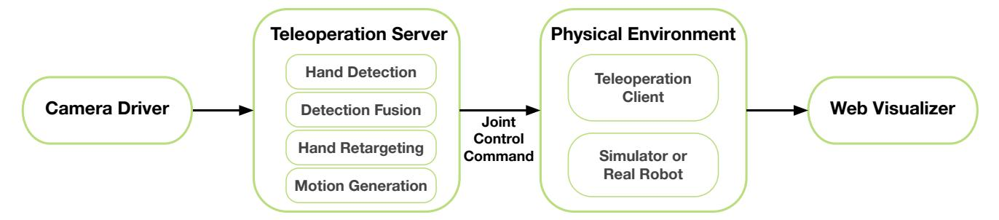

Fig. 3: **System Architecture.** AnyTeleop is composed of four components: (i) camera driver, which captures the human hand pose in RGB or RGB-D format; (ii) teleportation server, the core component in our system, which performs hand pose detection and converts detection results to robot control commands; (iii) teleoperated robot, which is either a real robot or a simulated robot in a virtual environment; (iv) web visualizer, which enables remote visualization across the internet.

network that predicts the weak perspective transformation scale of the hand. The weak perspective transformation approximates the original perspective camera model by assuming that the observed object is farther from the camera than its size. Together with intrinsic parameters, this scale factor can be used to approximate the 3D position of the hand. The wrist position computed this way has a larger error than depth camera, but it is still sufficient for many downstream teleoperation tasks.

#### B. Detection Fusion

The detection fusion module integrates multiple camera detection results. Self-occlusion can be a problem when performing hand pose detection, especially when the hand is perpendicular to the camera plane. Using multiple cameras can alleviate this problem by providing additional views. However, there are two main challenges in fusing multiple detection results: (i) each camera can only estimate the hand pose in its own frame and (ii) there is no straightforward metric to quantify the confidence of each detection result.

To overcome the first challenge, we perform an autocalibration process using the human hand as a natural marker. We use the first N frames of hand detection results from multiple cameras to calculate the relative rotation between each camera, expressed in SO(3). We find that although the absolute position of detected hand pose is not so accurate in RGB-only setting, the relative motion between consecutive frames is more robust. With orientation between each camera, we can transform the detected relative motion from different cameras into a single frame.

To address the second challenge, we use the SMPL-X [40] hand shape parameters predicted from the detection module, as inspired by Qin *et al.* [43]. During teleoperation, the true shape parameters should remain constant for a given operator, but the predicted values can contain errors during self-occlusion. We observe that larger shape parameter prediction errors often correspond to larger pose errors. To approximate the confidence score, we take the mean of the estimated shape parameters in the first *N* frames as a reference and compute the error between the predicted shape parameters and the reference. Implementation-wise,

we require the operator to spread their fingers during the first N frames to ensure an accurate reference value of shape parameters. The fusion module then selects the relative motion captured by the camera with the highest confidence score and forwards it to the next module. In implementation, we choose N = 50.

#### C. Hand Pose Retargeting

The hand pose retargeting module maps the human hand pose data obtained from perception algorithms into joint positions of the teleoperated robot hand. This process is often formulated as an optimization problem [42, 16], where the difference between the keypoint vectors of the human and robot hand is minimized. The optimization can be defined as follows:

$$\min_{q_t} \sum_{i=0}^{N} ||\alpha v_t^i - f_i(q_t)||^2 + \beta ||q_t - q_{t-1}||^2 
\text{s.t.} \quad q_l \le q_t \le q_u,$$
(1)

where  $q_t$  represents the joint positions of the robot hand at time step t,  $v_t^i$  is the i-th keypoint vector for human hand computed from the detected finger keypoints,  $f_i(q_t)$  is the i-th forward kinematics function which takes the robot hand joint positions  $q_t$  as input and computes the i-th keypoint vector for the robot hand,  $q_t$  and  $q_u$  are the lower and upper limits of the joint position,  $\alpha$  is a scaling factor to account for hand size difference. An additional penalty term with weight  $\beta$  is included to improve temporal smoothness. When retargeting to a different morphology, such as a Dclaw in Figure 1, we need to specify the keypoint vectors mapping between the robot and human fingers manually. It is worth noting that this module only considers the robot hand.

# D. Motion Generation

Given the detected wrist and hand pose, our goal is to generate smooth and collision-free motion of robot arm to reach the target Cartesian end-effector pose. Real-time motion generation methods are required to have a smooth teleoperation experience. In the prior work of [16], the robot motion is driven by Riemannian Motion Policies

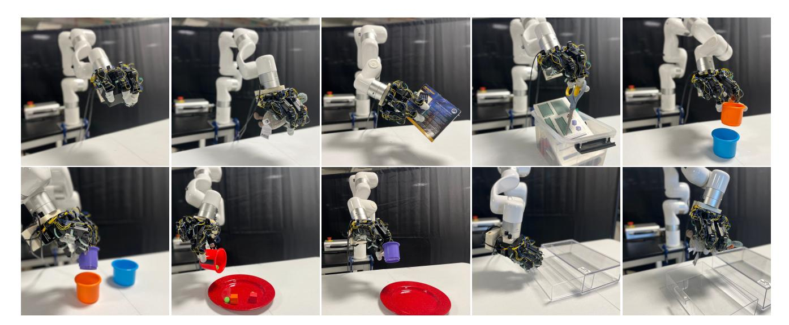

Fig. 4: Real Robot Teleoperation Tasks. We replicate the ten manipulation tasks proposed in Sivakumar *et al.* [\[54\]](#page-10-7) using same or similar objects. Top row, left to right: Pickup Box Object, Pickup Fabric Toy, Box Rotation, Scissor Pickup, Cup Stack. Bottom row, left to right: Two Cup Stacking, Pouring Cubes onto Plate, Cup Into Plate, Open Drawer and Open Drawer and Pickup Cup.

(RMPs) [\[49,](#page-10-18) [7\]](#page-8-15) that can calculate acceleration fields in real-time. However, accelerations towards a particular endeffector pose do not guarantee natural trajectories. In this work, we adopt CuRobo [\[56\]](#page-10-19), a highly parallelized collisionfree robot motion generation library accelerated by GPUs, to generate natural and reactive robot motion in real-time. In AnyTeleop, the motion generation module receives the Cartesian pose of the end-effector at a low frequency (25 Hz) from the hand detection and retargeting modules, and generates collision-free joint-space trajectories within joint limits at a higher frequency (120 Hz). The generated trajectories are ready for safe execution by impedance controllers on either a simulated or real robot.

#### V. WEB-BASED TELEOPERATION VIEWER

To better support the teleoperation tasks, we implement a web-based visualization module to facilitate remote and collaborative teleoperation, especially for teleoperation in simulated environments. It has the following features: (i) browser-based viewer, which makes it easily accessible remotely; (ii) synchronized visualization, i.e. two operators working on the same collaborative task should see the same scene synchronously from their own local view ports. The viewer is developed based upon the meshcat [\[10\]](#page-8-16) library and utilize Three.js [\[9\]](#page-8-17) for rendering. The visualization server ports the simulation results onto the browser after each simulation iteration. Operators can get visual feedback from the browser window and move their hands to control the corresponding robot. More details about the implementation of our viewer can be found in the supplementary materials.

| HardWare  | GPU CPU        | Desktop RTX 3090 i9-10980XE | Laptop RTX 2070 i7-8750 |
|-----------|-------------------|-----------------------------------|-------------------------------|
|           | Modules           | Time (ms)                         | Time (ms)                     |
|           | Hand Pose (RGB)   | 26±5                              | 34±5                          |
|           | Hand Pose (RGB-D) | 27±5                              | 35±5                          |
| Profiling | Fusion            | 1±0                               | 1±0                           |
|           | Retargeting       | 9±7                               | 10±9                          |
|           | Motion            | 8±3                               | 11±5                          |
|           |                   |                                   |                               |

TABLE II: Profiling Results. We profile different modules inside teleoperation server on both desktop and laptop. The time is measured when all teleoperation modules are run on the same computer simultaneously.

# VI. SYSTEM EVALUATION

# *A. Profiling Analysis*

We perform profiling on modules mentioned in Section [IV](#page-3-1) on a desktop and a laptop. As shown in Table [II,](#page-5-0) the most time-consuming module is hand pose detection, which runs on a GPU for real-time inference. The designed maximum frequency for hand pose detection is 25Hz, so both the desktop and laptop can meet the requirement. Both the retargeting module and the fusion module run at the same frequency as the hand detection module due to the publisher and subscriber logic. For best performance, the motion generation module should run at 120Hz but can still work with a lower frequency. Notably, we found it difficult to achieve this throughput when running all these modules on the same computer. Luckily, with our communication-oriented design, we can run the control modules on a separate machine to achieve the best performance.

# *B. Real Robot Teleoperation*

In this section, we will test our AnyTeleop system across a wide range of real-world tasks that covers diverse ob-

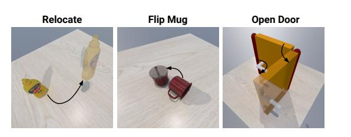

|               | Manipulation Task |           | RL        | Baseline [43] | Ours      |
|---------------|-------------------|-----------|-----------|---------------|-----------|
|               |                   | Relocate  | 36.3±15.3 | 49.7±18.3     | 53.7±12.2 |
| Floating-Hand |                   | Flip Mug  | 33.7±15.0 | 51.3±34.7     | 47.3±28.3 |
|               | Open Door         | 69.3±38.0 | 64.7±14.7 | 73.3± 9.0     |           |
|               |                   | Relocate  | 33.7±29.3 | 40.3±36.7     | 70.0± 9.8 |
|               | Arm-Hand          | Flip Mug  | 31.0±28.7 | 36.0±32.4     | 53.7±24.0 |
|               |                   | Open Door | 34.7±31.7 | 51.3±30.7     | 79.7±15.5 |
|               |                   |           |           |               |           |

TABLE III: Imitation Learning Experiments in SAPIEN Environments. The left figure visualizes the three tasks we use for both teleoperation data collection and imitation learning. The transparent object represents the goal of the task while the black arrow represents the steps of the task. The right table shows the success rate of the evaluated methods. We use ± to represent the mean and standard deviation over three random seeds. The success rate is computed from 100 trials.

| Task                          | AnyTeleop | Telekinesis [54] |
|-------------------------------|-----------|------------------|
| Pickup Box Object             | 1.0       | 0.9              |
| Pickup Fabric Toy             | 1.0       | 0.9              |
| Box Rotation                  | 0.6       | 0.6              |
| Scissor Pickup                | 0.8       | 0.7              |
| Cup Stack                     | 0.9       | 0.6              |
| Two Cup Stacking              | 0.7       | 0.3              |
| Pouring Cubes onto Plate      | 0.7       | 0.7              |
| Cup Into Plate                | 1.0       | 0.8              |
| Open Drawer                   | 1.0       | 0.9              |
| Open Drawer and Pickup Object | 0.9       | 0.6              |

TABLE IV: Real Robot Teleoperation Results. We replicate the experiment settings and tasks in [\[54\]](#page-10-7) and compare with [\[54\]](#page-10-7). For the baseline method, we use the success rate reported in their paper [\[54\]](#page-10-7)

jects and manipulation skills. Besides, we will compare our teleoperation performance of AnyTeleop with a similar teleoperation system. A fair comparison of real-robot tasks is often very challenging due to the difficulty in replicating the baseline methods delicately. To ensure a more fair comparison, we replicate the ten manipulation tasks proposed in Robotic Telekinesis [\[54\]](#page-10-7) with the same XArm6 robot, Allegro hand, and similar objects. A trained operator attempt to solve this tasks using AnyTeleop system. The ten tasks are visualized in Fig. [4.](#page-5-1) Same as [\[54\]](#page-10-7), we run each task ten times for AnyTeleop and use a single Intel RealSense camera. For the baseline method, we directly use the results reported in their paper.

As shown in Table [IV,](#page-6-0) AnyTeleop can get a higher success rate of 8/10 tasks and the same success rate on 2/10 compared with the baseline. Although AnyTeleop is designed to be more general, it can still outperform the baseline system that was specifically designed for the XArm6-Allegro hardware. We find that the major advantage of our system is the capability to handle objects with thin-walled structures, such as the cup-stack, two-cup-stacking, and cup-into-plate tasks. Our optimization-based retargeting module can close the distance between finger tips, which makes grasping the cup more stable. However, the network-based retargeting can hardly translate the fine-grained precision grasp from human to robot, which leads to a lower success rate.

#### VII. APPLICATIONS

#### *A. Imitation Learning*

The most important application of the proposed system is imitation learning from demonstration. We can first collect demonstrations on several dexterous manipulation tasks and then use the data to train imitation learning algorithms. In this experiment, we will show that the teleoperation data collected using our AnyTeleop can better support downstream imitation learning tasks. In the following subsection, we will first introduce the experiment setting and baseline and then discuss the experimental results.

Baseline and Comparison. To fairly compare with previous teleoperation systems, we need to align both the task setting and robot configuration precisely. It is often challenging for real-robot hardware but much easier for a simulated environment. Thus, we choose a recent visionbased teleoperation work [\[43\]](#page-10-6) that can be used for simulated robots as our baseline. It is worth noting that we are comparing two teleoperation systems via the demonstration data collected by each system. Thus, we compared with the baseline by training the same learning algorithm on different demonstration data collected via the baseline system and our teleoperation system. We follow [\[43\]](#page-10-6) to choose Demo Augmented Policy Gradient (DAPG) [\[46\]](#page-10-20) as the imitation algorithm. We also compare it with a pure reinforcement learning (RL) based algorithm from [\[44\]](#page-10-21) which does not utilize demonstrations. We provide the same dense reward for RL training as previous work [\[43\]](#page-10-6).

Manipulation Tasks. We directly use the manipulation tasks proposed by the baseline work [\[43\]](#page-10-6) for comparison, which include three tasks: (i) *Relocate*, where the robot picks an object on the table and moves it to the target position; (ii) *Flip Mug*, where the robot needs to rotate the mug for 90 degrees to flip it back; (iii) *Open Door*, where the robot needs to first rotate the lever to unlock the door, and then pull it to open the door. These tasks are visualized in the left figure of Table [III.](#page-6-1) The manipulated objects in all three tasks are randomly initialized and the target position is also randomized in *Relocate*. Each manipulation task has two variants: the floating-hand variant and the arm-hand variant. The floating-hand is a dexterous hand without a robot arm

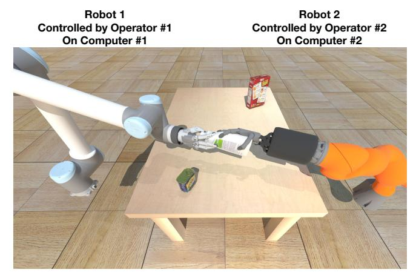

Fig. 5: Collaborative Teleoperation for Handover Task. Operator #1 act as the UR10-Schunk robot and operator #2 acts as the Kuka-Shadow robot. In this task, the operator #2 needs to pick up an object on the table and handover it to operator #1.

that can move freely in space. The arm-hand means the hand is mounted on a robot arm with a fixed base, which is a more realistic setting.

**Demonstration Details.** For the baseline teleoperation system [43], we directly use the demonstration collected by the original authors with 50 demonstration trajectories for each task. The baseline system only utilizes a single RGB-D camera. For fairness, we also collect 50 trajectories for each task using the single camera setup. The baseline system can only handle floating hands and they propose a demonstration translation pipeline to convert the demonstration with floating hands to demonstrations with arm-hand. For our AnyTeleop, we collect demonstrations using the arm-hand setting and convert the demonstration to floating hand so that the demonstration can be used by both the floating-hand variant and arm-hand variant.

**Results and Discussion.** For each method on each task, we train policies with three different random seeds. For each policy, we evaluate it on 100 trials. More details about the success metrics can be found in [43]. As shown in Table III, the imitation learning algorithm trained on demonstration collected by AnyTeleop can outperform baseline and RL on most tasks with one exception. Compared with the demonstration collected via the baseline system, our system has two benefits that contribute to better performance in imitation learning: (i) The collected trajectory is more smooth, which means that the state-action pairs are more consistent and easier to be consumed by the network. (ii) Different from the baseline, our system explicitly supports teleoperation with arm-hand system and guarantees no self-collision. On the contrary, the baseline system utilizes retargeting to generate joint trajectory for robot arm, which may lead to several self-collision for robot arm. Thus we can observe significant performance gain of our system for manipulation tasks with arm-hand. For the flip mug task, the difficulty of collecting demonstration with arm is much larger than with a floating

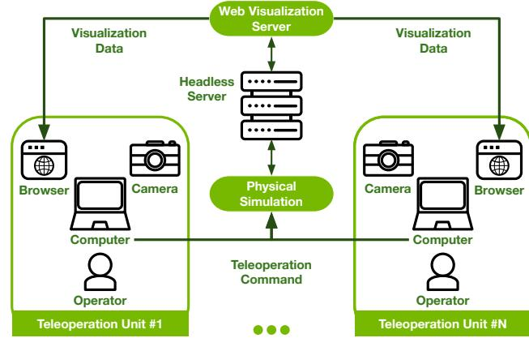

Fig. 6: Collaborative Teleoperation System. Our system can be extended to collaborative manipulation tasks even when operators are not in the same physical location. Each operator can use a local computer with camera to detect the hand pose and send the detection results to a central server. Meanwhile, they can use the web browser to visualize the current simulation environment, including the robot controlled by other operators.

hand, which influences the demonstration quality.

#### B. Collaborative Manipulation

Collaborative manipulation is a key technology for the development of human-robot systems [59]. Collecting demonstration data for collaborative manipulation tasks has been a challenging task since it requires multiple operators to work together seamlessly. With our modularized and extensible system design and web-based visualization, our system enables convenient data collection on collaborative tasks, even if operators are not in the same physical location. In this section, we show that our teleoperation system can be extended to a collaborative setting where multiple operators coordinate together to perform manipulation tasks. We choose human-to-robot handover as an example as shown in Fig. 5. In this setting, operator #1 control a robot hand, and operator #2 control a human hand.

Collaborative Teleoperation System Design. Fig. 6 illustrates the system architecture for multi-operator collaboration, which includes two components. (i) Teleoperation Units: It is composed of a computer that is connected to at least one camera and a human operator. In each teleoperation unit, the human operator will watch the real-time visualization on a web browser and move the hand accordingly to perform manipulation tasks. (ii) Central Server: it runs the physical simulation and the web visualization server. The detection results from multiple teleoperation units are sent to the server and converted into robot control commands based on the pipeline in Section IV. Meanwhile, the web visualizer server will keep synchronized with the simulated environment and maintain the visualization resources as described in Section V.

# VIII. FAILURE MODES

As illustrated on the project page, we have identified two failure modes: (i) loss of tracking during fast human hand motion, which triggers a pause and re-detection process; (ii) unreliable hand pose when the hand is in self-occlusion. For mode (i), the workaround is to instruct the operator to slow down their hand motion. The issue (ii) can be solved by incorporating multiple cameras for tasks that require significant hand rotation.

#### IX. CONCLUSION

In this paper, we introduced AnyTeleop, a versatile teleoperation system that can be applied to diverse robots, assorted reality, and varied camera setup, and can be operated by a flexible number of users from any geographic locations. The experiments show that AnyTeleop outperforms previous systems in both simulation and real-world scenarios while offering superior generalizability and flexibility. Our commitment to an open-source approach will facilitate further research in the field of teleoperation.

# X. ACKNOWLEDGEMENT

We express our gratitude to Ankur Handa, Balakumar Sundaralingam, and Nick Walker for their insightful discussions throughout the development process of the motion control module in AnyTeleop. We would also like to extend our thanks to Isabella Liu, An-Chieh Cheng, Ruihan Yang, Yang Fu, Linghao Chen, Jiarui Xu, Xinyu Zhang, Xinyue Wei, Jiteng Mu, and Jianglong Ye for their efforts in testing and evaluating the teleoperation system.

# REFERENCES

- [1] Insaf Ajili, Malik Mallem, and Jean-Yves Didier. Gesture recognition for humanoid robot teleoperation. In *2017 26Th IEEE international symposium on robot and human interactive communication (RO-MAN)*, pages 1115–1120. IEEE, 2017.
- [2] Dafni Antotsiou, Guillermo Garcia-Hernando, and Tae-Kyun Kim. Task-oriented hand motion retargeting for dexterous manipulation imitation. In *ECCV Workshops*, 2018.
- [3] Reuben M Aronson and Henny Admoni. Gaze complements control input for goal prediction during assisted teleoperation. In *Robotics science and systems*, 2022.
- [4] Sridhar Pandian Arunachalam, Irmak Guzey, Soumith ¨ Chintala, and Lerrel Pinto. Holo-dex: Teaching dexterity with immersive mixed reality. *arXiv preprint arXiv:2210.06463*, 2022.
- [5] Sridhar Pandian Arunachalam, Sneha Silwal, Ben Evans, and Lerrel Pinto. Dexterous imitation made easy: A learning-based framework for efficient dexterous manipulation. *arXiv preprint arXiv:2203.13251*, 2022.

- [6] Sean Chen, Jensen Gao, Siddharth Reddy, Glen Berseth, Anca D Dragan, and Sergey Levine. Asha: Assistive teleoperation via human-in-the-loop reinforcement learning. In *2022 International Conference on Robotics and Automation (ICRA)*, pages 7505–7512. IEEE, 2022.
- [7] Ching-An Cheng, Mustafa Mukadam, Jan Issac, Stan Birchfield, Dieter Fox, Byron Boots, and Nathan Ratliff. Rmp flow: A computational graph for automatic motion policy generation. In *Algorithmic Foundations of Robotics XIII: Proceedings of the 13th Workshop on the Algorithmic Foundations of Robotics 13*, pages 441–457. Springer, 2020.
- [8] Erwin Coumans and Yunfei Bai. PyBullet, a python module for physics simulation for games, robotics and machine learning. *GitHub repository*, 2016.
- [9] Brian Danchilla and Brian Danchilla. Three. js framework. *Beginning WebGL for HTML5*, pages 173–203, 2012.
- [10] Robin Deits. Meshcat. [https://github.com/rdeits/](https://github.com/rdeits/meshcat) [meshcat,](https://github.com/rdeits/meshcat) 2018.
- [11] Guanglong Du, Ping Zhang, Jianhua Mai, and Zeling Li. Markerless kinect-based hand tracking for robot teleoperation. *International Journal of Advanced Robotic Systems*, 9(2):36, 2012.
- [12] Jean Elsner, Gerhard Reinerth, Luis Figueredo, Abdeldjallil Naceri, Ulrich Walter, and Sami Haddadin. Parti-a haptic virtual reality control station for model-mediated robotic applications. *Frontiers in Virtual Reality*, 3, 2022.
- [13] Bin Fang, Xiao Ma, Jiachun Wang, and Fuchun Sun. Vision-based posture-consistent teleoperation of robotic arm using multi-stage deep neural network. *Robotics and Autonomous Systems*, 131:103592, 2020.
- [14] Chuang Gan, Jeremy Schwartz, Seth Alter, Damian Mrowca, Martin Schrimpf, James Traer, Julian De Freitas, Jonas Kubilius, Abhishek Bhandwaldar, Nick Haber, et al. Threedworld: A platform for interactive multi-modal physical simulation. *arXiv preprint arXiv:2007.04954*, 2020.
- [15] Zaid Gharaybeh, Howard Chizeck, and Andrew Stewart. *Telerobotic control in virtual reality*. IEEE, 2019.
- [16] Ankur Handa, Karl Van Wyk, Wei Yang, Jacky Liang, Yu-Wei Chao, Qian Wan, Stan Birchfield, Nathan Ratliff, and Dieter Fox. Dexpilot: Vision-based teleoperation of dexterous robotic hand-arm system. In *ICRA*, 2020.
- [17] Hooman Hedayati, Michael Walker, and Daniel Szafir. Improving collocated robot teleoperation with augmented reality. In *International Conference on Human-Robot Interaction*, 2018.
- [18] Zebin Huang, Ziwei Wang, Weibang Bai, Yanpei Huang, Lichao Sun, Bo Xiao, and Eric M Yeatman. A novel training and collaboration integrated framework

- for human–agent teleoperation. *Sensors*, 21(24):8341, 2021.
- [19] Eric Jang, Alex Irpan, Mohi Khansari, Daniel Kappler, Frederik Ebert, Corey Lynch, Sergey Levine, and Chelsea Finn. Bc-z: Zero-shot task generalization with robotic imitation learning. In *Conference on Robot Learning*, pages 991–1002. PMLR, 2022.
- [20] Bachir El Khadir, Jake Varley, and Vikas Sindhwani. Teleoperator imitation with continuous-time safety. *arXiv preprint arXiv:1905.09499*, 2019.
- [21] Jonathan Kofman, Xianghai Wu, Timothy J Luu, and Siddharth Verma. Teleoperation of a robot manipulator using a vision-based human-robot interface. *IEEE transactions on industrial electronics*, 52(5): 1206–1219, 2005.
- [22] Jonathan Kofman, Siddharth Verma, and Xianghai Wu. Robot-manipulator teleoperation by markerless visionbased hand-arm tracking. *International Journal of Optomechatronics*, 2007.
- [23] Vikash Kumar and Emanuel Todorov. Mujoco haptix: A virtual reality system for hand manipulation. In *International Conference on Humanoid Robots (Humanoids)*, 2015.
- [24] Shuang Li, Xiaojian Ma, Hongzhuo Liang, Michael Gorner, Philipp Ruppel, Bin Fang, Fuchun Sun, and ¨ Jianwei Zhang. Vision-based teleoperation of shadow dexterous hand using end-to-end deep neural network. In *ICRA*, 2019.
- [25] Shuang Li, Jiaxi Jiang, Philipp Ruppel, Hongzhuo Liang, Xiaojian Ma, Norman Hendrich, Fuchun Sun, and Jianwei Zhang. A mobile robot hand-arm teleoperation system by vision and IMU. In *IROS*, 2020.
- [26] Shuang Li, Norman Hendrich, Hongzhuo Liang, Philipp Ruppel, Changshui Zhang, and Jianwei Zhang. A dexterous hand-arm teleoperation system based on hand pose estimation and active vision. *IEEE Transactions on Cybernetics*, 2022.
- [27] Jacky Liang, Ankur Handa, Karl Van Wyk, Viktor Makoviychuk, Oliver Kroemer, and Dieter Fox. Inhand object pose tracking via contact feedback and gpu-accelerated robotic simulation. In *2020 IEEE International Conference on Robotics and Automation (ICRA)*, pages 6203–6209. IEEE, 2020.
- [28] Jeffrey I Lipton, Aidan J Fay, and Daniela Rus. Baxter's homunculus: Virtual reality spaces for teleoperation in manufacturing. *IEEE Robotics and Automation Letters*, 3(1):179–186, 2017.
- [29] Hangxin Liu, Xu Xie, Matt Millar, Mark Edmonds, Feng Gao, Yixin Zhu, Veronica J Santos, Brandon Rothrock, and Song-Chun Zhu. A glove-based system for studying hand-object manipulation via joint pose and force sensing. In *2017 IEEE/RSJ International Conference on Intelligent Robots and Systems (IROS)*, pages 6617–6624. IEEE, 2017.

- [30] Hangxin Liu, Zhenliang Zhang, Xu Xie, Yixin Zhu, Yue Liu, Yongtian Wang, and Song-Chun Zhu. Highfidelity grasping in virtual reality using a glove-based system. In *2019 international conference on robotics and automation (icra)*, pages 5180–5186. IEEE, 2019.
- [31] Shaowei Liu, Hanwen Jiang, Jiarui Xu, Sifei Liu, and Xiaolong Wang. Semi-supervised 3d hand-object poses estimation with interactions in time. In *CVPR*, 2021.
- [32] Viktor Makoviychuk, Lukasz Wawrzyniak, Yunrong Guo, Michelle Lu, Kier Storey, Miles Macklin, David Hoeller, Nikita Rudin, Arthur Allshire, Ankur Handa, et al. Isaac gym: High performance gpu-based physics simulation for robot learning. *arXiv preprint arXiv:2108.10470*, 2021.
- [33] Ajay Mandlekar, Yuke Zhu, Animesh Garg, Jonathan Booher, Max Spero, Albert Tung, Julian Gao, John Emmons, Anchit Gupta, Emre Orbay, et al. Roboturk: A crowdsourcing platform for robotic skill learning through imitation. In *Conference on Robot Learning*, pages 879–893. PMLR, 2018.
- [34] Ajay Mandlekar, Danfei Xu, Roberto Mart´ın-Mart´ın, Yuke Zhu, Li Fei-Fei, and Silvio Savarese. Human-inthe-loop imitation learning using remote teleoperation. *arXiv preprint arXiv:2012.06733*, 2020.
- [35] Cassie Meeker, Maximilian Haas-Heger, and Matei Ciocarlie. A continuous teleoperation subspace with empirical and algorithmic mapping algorithms for nonanthropomorphic hands. *IEEE Transactions on Automation Science and Engineering*, 19(1):373–386, 2020.
- [36] C Mizera, T Delrieu, V Weistroffer, C Andriot, A Decatoire, and J-P Gazeau. Evaluation of hand-tracking systems in teleoperation and virtual dexterous manipulation. *IEEE Sensors Journal*, 20(3):1642–1655, 2019.
- [37] Malte Mosbach, Kara Moraw, and Sven Behnke. Accelerating interactive human-like manipulation learning with GPU-based simulation and high-quality demonstrations. In *Humanoids*, 2022.
- [38] Katharina Muelling, Arun Venkatraman, Jean-Sebastien Valois, John Downey, Jeffrey Weiss, Shervin Javdani, Martial Hebert, Andrew B Schwartz, Jennifer L Collinger, and J Andrew Bagnell. Autonomy infused teleoperation with application to bci manipulation. *arXiv preprint arXiv:1503.05451*, 2015.
- [39] Gunter Niemeyer, Carsten Preusche, Stefano Stramigi- ¨ oli, and Dongjun Lee. Telerobotics. *Springer handbook of robotics*, pages 1085–1108, 2016.
- [40] Georgios Pavlakos, Vasileios Choutas, Nima Ghorbani, Timo Bolkart, Ahmed A. A. Osman, Dimitrios Tzionas, and Michael J. Black. Expressive body capture: 3d hands, face, and body from a single image. In *CVPR*, 2019.
- [41] Polina Ponomareva, Daria Trinitatova, Aleksey Fe-

- doseev, Ivan Kalinov, and Dzmitry Tsetserukou. Grasplook: a vr-based telemanipulation system with r-cnndriven augmentation of virtual environment. In *2021 20th International Conference on Advanced Robotics (ICAR)*, pages 166–171. IEEE, 2021.
- [42] Yuzhe Qin, Yueh-Hua Wu, Shaowei Liu, Hanwen Jiang, Ruihan Yang, Yang Fu, and Xiaolong Wang. Dexmv: Imitation learning for dexterous manipulation from human videos. *arXiv preprint arXiv:2108.05877*, 2021.
- [43] Yuzhe Qin, Hao Su, and Xiaolong Wang. From one hand to multiple hands: Imitation learning for dexterous manipulation from single-camera teleoperation. *RA-L*, 7(4):10873–10881, 2022.
- [44] Yuzhe Qin, Binghao Huang, Zhao-Heng Yin, Hao Su, and Xiaolong Wang. Dexpoint: Generalizable point cloud reinforcement learning for sim-to-real dexterous manipulation. In *Conference on Robot Learning*, pages 594–605. PMLR, 2023.
- [45] Ilija Radosavovic, Tete Xiao, Stephen James, Pieter Abbeel, Jitendra Malik, and Trevor Darrell. Real-world robot learning with masked visual pre-training. *arXiv preprint arXiv:2210.03109*, 2022.
- [46] Aravind Rajeswaran, Vikash Kumar, Abhishek Gupta, Giulia Vezzani, John Schulman, Emanuel Todorov, and Sergey Levine. Learning complex dexterous manipulation with deep reinforcement learning and demonstrations. In *RSS*, 2018.
- [47] Daniel Rakita, Bilge Mutlu, and Michael Gleicher. A motion retargeting method for effective mimicry-based teleoperation of robot arms. In *Proceedings of the 2017 ACM/IEEE International Conference on Human-Robot Interaction*, pages 361–370, 2017.
- [48] Daniel Rakita, Bilge Mutlu, and Michael Gleicher. Remote telemanipulation with adapting viewpoints in visually complex environments. *Robotics: Science and Systems XV*, 2019.
- [49] Nathan D Ratliff, Jan Issac, Daniel Kappler, Stan Birchfield, and Dieter Fox. Riemannian motion policies. *arXiv preprint arXiv:1801.02854*, 2018.
- [50] Yu Rong, Takaaki Shiratori, and Hanbyul Joo. Frankmocap: Fast monocular 3d hand and body motion capture by regression and integration. *arXiv preprint arXiv:2008.08324*, 2020.
- [51] Eric Rosen, David Whitney, Michael Fishman, Daniel Ullman, and Stefanie Tellex. Mixed reality as a bidirectional communication interface for human-robot interaction. In *2020 IEEE/RSJ International Conference on Intelligent Robots and Systems (IROS)*, pages 11431–11438. IEEE, 2020.
- [52] M Salvato, Negin Heravi, Allison M Okamura, and Jeannette Bohg. Predicting hand-object interaction for improved haptic feedback in mixed reality. *IEEE Robotics and Automation Letters*, 7(2):3851–3857,

- 2022.
- [53] Kenneth Shaw, Shikhar Bahl, and Deepak Pathak. Videodex: Learning dexterity from internet videos. *arXiv preprint arXiv:2212.04498*, 2022.
- [54] Aravind Sivakumar, Kenneth Shaw, and Deepak Pathak. Robotic telekinesis: learning a robotic hand imitator by watching humans on youtube. *arXiv preprint arXiv:2202.10448*, 2022.
- [55] Hyoung Il Son, Antonio Franchi, Lewis L Chuang, Junsuk Kim, Heinrich H Bulthoff, and Paolo Robuffo Giordano. Human-centered design and evaluation of haptic cueing for teleoperation of multiple mobile robots. *IEEE transactions on cybernetics*, 43(2):597– 609, 2013.
- [56] Balakumar Sundaralingam, Siva Hari, Adam Fishman, Caelan Garrett, Karl Van Wyk, Valts Blukis, Alexander Millane, Helen Oleynikova, Ankur Handa, Fabio Ramos, Nathan Ratliff, and Dieter Fox. CuRobo: Parallelized collision-free robot motion generation. In *Proceedings of the IEEE International Conference on Robotics and Automation (ICRA)*, June 2023.
- [57] Christian Theobalt, Irene Albrecht, Jorg Haber, Marcus ¨ Magnor, and Hans-Peter Seidel. Pitching a baseball: tracking high-speed motion with multi-exposure images. In *ACM SIGGRAPH 2004 Papers*, pages 540– 547. 2004.
- [58] Emanuel Todorov, Tom Erez, and Yuval Tassa. Mujoco: A physics engine for model-based control. In *IROS*, 2012.
- [59] Albert Tung, Josiah Wong, Ajay Mandlekar, Roberto Mart´ın-Mart´ın, Yuke Zhu, Li Fei-Fei, and Silvio Savarese. Learning multi-arm manipulation through collaborative teleoperation. In *2021 IEEE International Conference on Robotics and Automation (ICRA)*, pages 9212–9219. IEEE, 2021.
- [60] Robert Y Wang and Jovan Popovic. Real-time hand- ´ tracking with a color glove. *ACM transactions on graphics (TOG)*, 28(3):1–8, 2009.
- [61] Dong Wei, Bidan Huang, and Qiang Li. Multi-view merging for robot teleoperation with virtual reality. *IEEE Robotics and Automation Letters*, 6(4):8537– 8544, 2021.
- [62] Fanbo Xiang, Yuzhe Qin, Kaichun Mo, Yikuan Xia, Hao Zhu, Fangchen Liu, Minghua Liu, Hanxiao Jiang, Yifu Yuan, He Wang, et al. Sapien: A simulated partbased interactive environment. In *CVPR*, 2020.
- [63] Jianglong Ye, Jiashun Wang, Binghao Huang, Yuzhe Qin, and Xiaolong Wang. Learning continuous grasping function with a dexterous hand from human demonstrations. *IEEE Robotics and Automation Letters*, 8(5): 2882–2889, 2023.
- [64] Fan Zhang, Valentin Bazarevsky, Andrey Vakunov, Andrei Tkachenka, George Sung, Chuo-Ling Chang, and Matthias Grundmann. Mediapipe hands: On-

- device real-time hand tracking. *arXiv preprint arXiv:2006.10214*, 2020.
- [65] Haodong Zhang, Weijie Li, Yuwei Liang, Zexi Chen, Yuxiang Cui, Yue Wang, and Rong Xiong. Humanrobot motion retargeting via neural latent optimization. *CoRR*, 2021.
- [66] Heng Zhang, Zeming Zhao, Yang Yu, Kai Gui, Xinjun Sheng, and Xiangyang Zhu. A feasibility study on an intuitive teleoperation system combining imu with semg sensors. In *Intelligent Robotics and Applications: 11th International Conference, ICIRA 2018, Newcastle, NSW, Australia, August 9–11, 2018, Proceedings, Part I 11*, pages 465–474. Springer, 2018.
- [67] Tianhao Zhang, Zoe McCarthy, Owen Jow, Dennis Lee, Xi Chen, Ken Goldberg, and Pieter Abbeel. Deep imitation learning for complex manipulation tasks from virtual reality teleoperation. In *ICRA*, 2018.
- [68] Wenping Zhao, Jinxiang Chai, and Ying-Qing Xu. Combining marker-based mocap and rgb-d camera for acquiring high-fidelity hand motion data. In *Proceedings of the ACM SIGGRAPH/eurographics symposium on computer animation*, pages 33–42, 2012.

# APPENDIX

# *A. Supplementary Overview*

This supplementary material provides more details, results and visualizations accompanying the main paper, including

- More details and visualization about teleoperation server, including detection and retargeting modules;
- More details about web-based teleoperation viewer;
- Additional experimental results on system evaluation.

More visualization can be found at our project page: <http://anyteleop.com>.

### *B. Teleoperation Server*

In this section, we will show more intermediate results from our system, including visualization of hand pose detection results and the retargeting results of various robot hands.

Visualization of Hand Pose Detection We visualize the hand pose detection results in Figure [7.](#page-13-0) We showcase five typical cases, which include: (i) a hand spreading out the fingers for teleoperation initialization, (ii) fingers facing downwards in preparation for a top-down grasp, (iii) a precision grasp using the thumb and index finger, (iv) a power grasp using all five fingers, and (v) a failure case where the hand is positioned vertically relative to the camera plane.

Visualization of Hand Pose Retargeting We demonstrate the results of hand pose retargeting in Figure [10.](#page-14-0) The figure displays seven gestures being performed using four different dexterous hands.

# *C. Web-based Teleoperation Viewer*

In this section, we demonstrate how the web-based visualizer provides accessibility and multi-view support for teleoperation through its lightweight rendering and capability to run in multiple browser windows. Figure [8](#page-13-1) shows screenshots of the web-based visualizer when it is used to visualize the five IsaacGym tasks depicted in the Figure 1 in the main paper.

Lightweight Rendering vs High Visual Quality. The design of our web-based viewer prioritizes accessibility and convenience, as it can be used on any device with a browser and provides minimal but sufficient rendering capabilities for teleoperation. Although the rendering quality may not be as advanced as the original simulator viewer, simulation states can be saved for offline rendering to produce high-quality visual data. For example, in visual reinforcement learning tasks using RGB images as inputs, the rendered data can be generated using a more powerful engine such as a ray tracer after teleoperation is completed.

Multi-View Support for Teleoperation. In teleoperation, human operators often require a clear understanding of the spatial relationships between objects and robots to make informed decisions. This information can be provided through multi-view rendering, which is a widely used technique in

| Camera Configuration | Completion Time | Error Percentage (%) |  |  |
|----------------------|-----------------|----------------------|--|--|
| Single RGB           | 109s            | 28.1%                |  |  |
| Single RGB-D         | 87s             | 21.8%                |  |  |
| Two RGB-D            | 74s             | 12.5%                |  |  |

TABLE V: Comparison of Camera Configurations. We evaluate the teleoperation performance on the Play Piano task with different camera configurations.

previous teleoperation works [\[26,](#page-9-10) [43,](#page-10-6) [61\]](#page-10-22). Our web-based viewer offers multi-view support to the operator by simply opening multiple browser windows. As shown in Figure [9,](#page-13-2) an example of the operator using two views to perform a manipulation task is displayed. The operator is able to open as many windows as needed to enhance their teleoperation experience.

In this section, we examine the impact of different camera configurations on the teleoperation performance of our system, AnyTeleop , which is capable of supporting diverse configurations including RGB, RGB-D, and single or multiple cameras. Even with a minimal configuration, i.e. a single RGB camera, the system can still perform effectively. Additionally, by adding more resources, such as multiple cameras, our system can achieve better performance.

We use the *Play Piano* task implemented in Isaac-Gym [\[32\]](#page-9-20) as the evaluation scenario, which requires the robot hand to press piano keys in a specific order. The task is shown in the Figure 1 in the main paper and the video in the supplementary material. To quantify performance, we introduce two task metrics: (i) completion time, i.e. the elapsed time from start to finish, and (ii) the percentage of incorrect key presses, which measures the number of incorrectly pressed keys relative to the total number of keys.

A trained operator performs the task ten times for each camera configuration. As reported in Table [V,](#page-12-0) with additional information, such as depth, and increasing number of cameras, the task can be completed faster and with fewer errors, which demonstrates that our system allows users to easily trade-off between efficiency and system cost based on their use case.

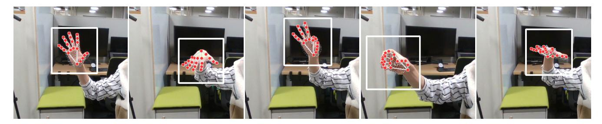

Fig. 7: Hand Pose Detection Visualization. This figure visualizes the hand detection results, with the white bounding box highlighting the predicted area and red points marking the identified finger key points. The hand skeleton is represented by the grey lines connecting the key points. Additionally, the small grey points depict the 2D projection of 3D vertices from the SMPL-X hand model. The figure showcases five diverse cases, from left to right: (i) a hand spreading out the fingers to initiate teleoperation, (ii) fingers facing downwards in preparation for a top-down grasp, (iii) a precision grasp using the thumb and index finger, (iv) a power grasp using all five fingers, and (v) a failure scenario where the hand is positioned vertically relative to the camera plane.

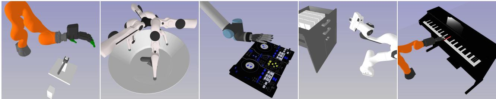

Fig. 8: Web-based Viewer. The visualization of teleoperation process can be perform in the web-based viewer, which features the five tasks from the IsaacGym tasks shown in the Figure 1 of the main paper. The viewer utilizes the *three.js* library for real-time rendering through a web browser.

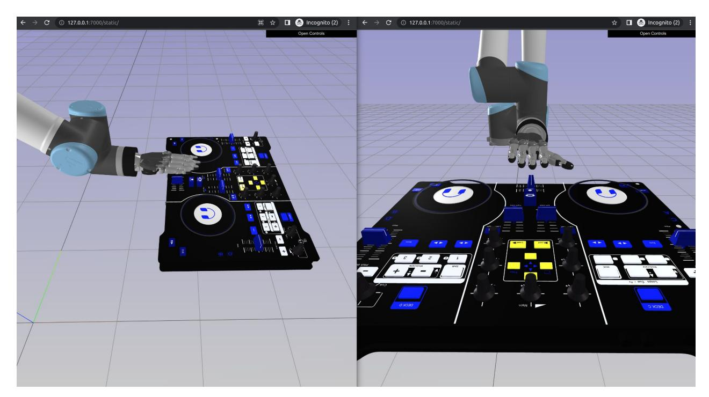

Fig. 9: Multi-view Support with More Browser Windows. The web-based viewer offers multiple views to enhance the operator's understanding of the 3D object relationships. Additional views can be accessed by simply opening more browser windows.

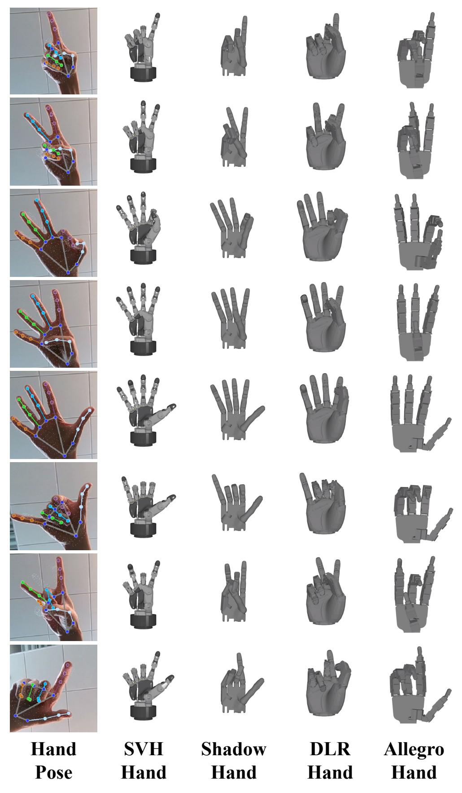

Fig. 10: **Visualization of Hand Pose Retargeting.** The figure presents the results of hand pose retargeting for seven gestures and four different dexterous robot hands. The four hands are displayed in order from left to right: (i) Schunk SVH hand; (ii) Shadow Hand; (iii) DLR Hand; (iv) Allegro Hand.