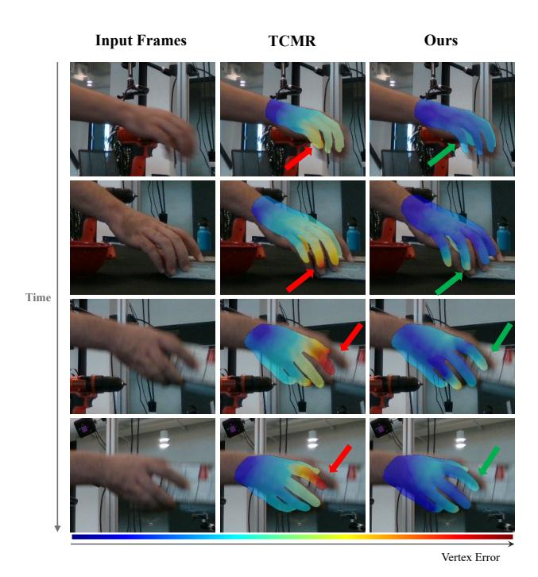
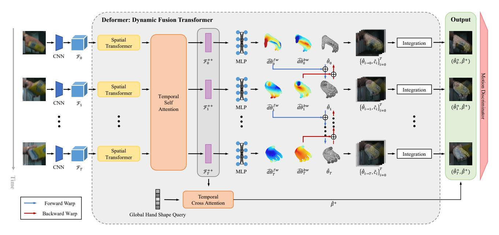
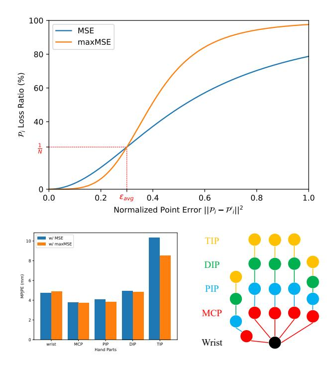
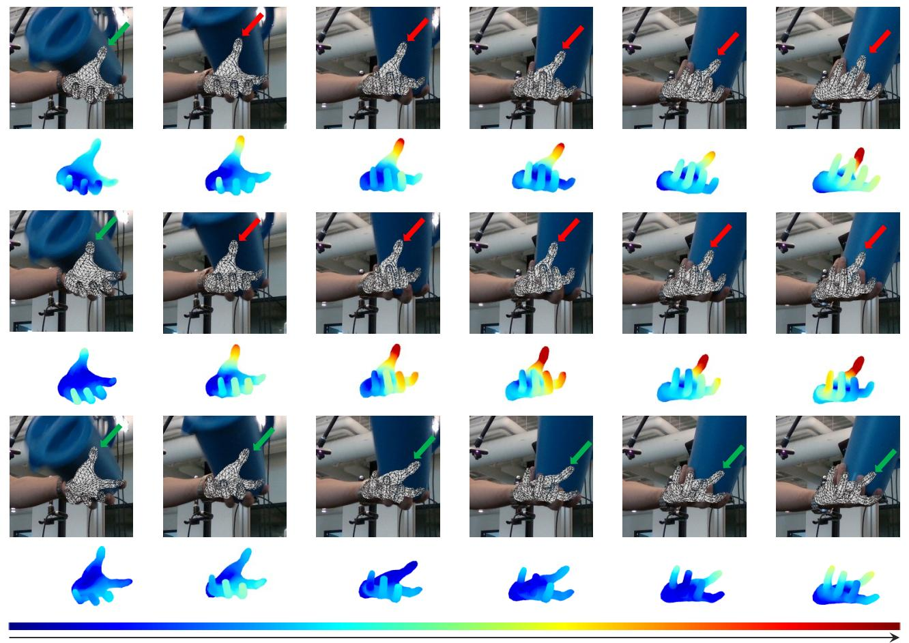
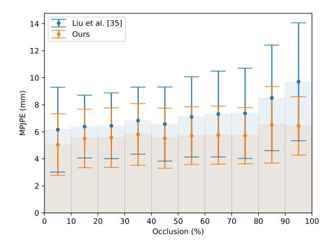
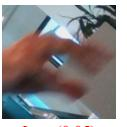
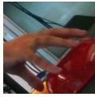
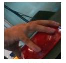
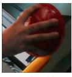
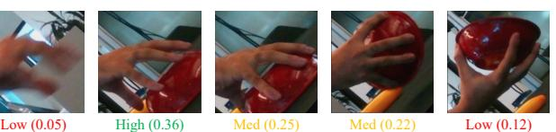

# Deformer: Dynamic Fusion Transformer for Robust Hand Pose Estimation

Qichen Fu1 Xingyu Liu1 Ran Xu2 1 Carnegie Mellon University 2 Salesforce Research

Juan Carlos Niebles2 Kris M. Kitani1

## Abstract

*Accurately estimating 3D hand pose is crucial for understanding how humans interact with the world. Despite remarkable progress, existing methods often struggle to generate plausible hand poses when the hand is heavily occluded or blurred. In videos, the movements of the hand allow us to observe various parts of the hand that may be occluded or blurred in a single frame. To adaptively leverage the visual clue before and after the occlusion or blurring for robust hand pose estimation, we propose the Deformer: a framework that implicitly reasons about the relationship between hand parts within the same image (spatial dimension) and different timesteps (temporal dimension). We show that a naive application of the transformer self-attention mechanism is not sufficient because motion blur or occlusions in certain frames can lead to heavily distorted hand features and generate imprecise keys and queries. To address this challenge, we incorporate a Dynamic Fusion Module into Deformer, which predicts the deformation of the hand and warps the hand mesh predictions from nearby frames to explicitly support the current frame estimation. Furthermore, we have observed that errors are unevenly distributed across different hand parts, with vertices around fingertips having disproportionately higher errors than those around the palm. We mitigate this issue by introducing a new loss function called maxMSE that automatically adjusts the weight of every vertex to focus the model on critical hand parts. Extensive experiments show that our method significantly outperforms state-of-the-art methods by 10%, and is more robust to occlusions (over 14%).*

### 1. Introduction

Accurately estimating hand poses in the wild is a challenging task that is affected by various factors, including object occlusion, self-occlusion, motion blur, and low camera exposure. To address these challenges, temporal information can be leveraged using a self-attention mechanism [52] that reasons the feature correlation between adjacent frames to generate better hand pose estimations. However, as the generation of key and query vectors depends on per-frame

Figure 1: Given a video where in some frames (*left*) the hand is heavily occluded or blurred, the existing state-ofthe-art video-based method TCMR [10] (*middle*) fails to predict accurate hand poses. Our method (*right*) is able to capture the hand dynamics and leverage neighborhood frames to robustly produce plausible hand pose estimations.

features, heavy occlusion or blurring can significantly contaminate them, resulting in inaccurate output. Another challenge of hand pose estimation is that the fingertips, located at the periphery of the hand, are more prone to occlusion and have more complex motion patterns, making them particularly challenging for the model to estimate accurately.

To tackle the aforementioned challenges, we propose Deformer: a dynamic fusion transformer that leverages nearby frames to learn hand deformations and assemble multiple wrapped hand poses from nearby frames for a robust hand pose estimation in the current frame. Deformer implicitly models the temporal correlations between adjacent frames and automatically selects frames to focus on. To mitigate the error imbalance issue, we design a novel loss function, called maxMSE, that emphasizes the importance of difficult-to-estimate vertices and provides a more balanced optimization.

Given a sequence of frames, our approach first uses a shared CNN to extract frame-wise hand features. To reason the non-local relationships between hand parts within a single frame, we use a shared spatial transformer that outputs an enhanced per-frame hand representation. Then, we leverage a global temporal transformer to attend to framewise hand features by exploring their correlations between different timestamps and forward the enhanced features to a shared MLP to regress the MANO hand pose parameters. To ensure consistency of the hand shape over time, we predict a global hand shape representation from all frame-wise features through the cross-attention mechanism. Despite incorporating temporal attention, the model may struggle to accurately predict hand poses in frames where the hand is heavily occluded or blurred. To address this issue, we introduce a *Dynamic Fusion Module*, which predicts a tuple of forward and backward hand motion for each frame, deforming the hand pose to the previous and next timestamps. This allows the model to leverage nearby frames with clear hand visibility to assist in estimating hand poses in occluded or blurred frames. Finally, the set of deformed hand poses of each timestamp is synthesized into the final output with implicitly learned confidence scores. In optimization, we found that standard MSE loss leads to imbalanced errors between different hand parts. Specifically, we observed that the model trained with MSE loss had lower errors for vertices around the palm and larger errors for the vertices around the fingertips, which are more prone to occlusions and have more complex motion patterns. Inspired by focal loss [35] in the classification task, we introduce *maxMSE*, a new loss function that maximizes the MSE loss by automatically adding a weight coefficient to every hand vertex. The *maxMSE* allows the model to focus on critical hand parts like fingertips and achieve better overall performance.

Experimental results on two large-scale hand pose estimation video datasets, DexYCB [8] and HO3D [17], show the proposed method achieves state-of-the-art performance and is more robust to occlusions. In summary, our contributions include: (1) a Deformer architecture for robust and plausible 3D hand pose estimation from videos; (2) a novel dynamic fusion module that explicitly deforms nearby frames with clear hand visibility for robust hand pose estimation in occluded or blurred frames; (3) a new *maxMSE* loss function that focuses the model on critical hand parts.

### 2. Related Work

3D hand pose estimation (HPE) aims to predict the 3D coordinates of the 21 hand joints, or more precisely, recover the hand mesh. It is a crucial computer vision task for understanding human activities, which plays an important role in many applications, including human-computer interaction [43, 47, 54], AR/VR [44, 24], imitation learning [53, 18, 15], and etc.

Hand Pose Estimation from a Single Image Singleview methods for hand pose estimation can be broadly divided into two categories: model-free and model-based methods.

Model-free methods [62, 57, 32, 31, 41, 42, 30, 49] directly regress the 3D coordinates or occupancy of hand joints and mesh vertices. For example, [30] uses a graph convolutional neural network to model triangle mesh topography and directly predicts the 3D coordinates of hand mesh vertices. [42] discretizes the 3D space into a voxel grid, and proposed a CNN in the stacked hourglass [39] style to estimate per joint occupancy. As hand mesh has a high degree of freedom, model-free methods need to introduce biological constraints [49] to get reasonable predictions. Meanwhile, these methods need a lot of data to train due to the lack of priors.

Recently, [48] introduces a pre-defined hand model, named MANO, which contains abundant structure priors of human hands. It reduces the dimensions by mapping a set of low-dimensional pose and shape parameters to a hand mesh. Most model-based methods [20, 36, 3, 4, 58] instead predict the MANO parameters, which consists of the pose and shape deformation w.r.t. a mean pose and shape learned from various hand scans of multiple subjects. 3D joints and mesh vertices coordinates can be retrieved from the predicted parameters using the differentiable MANO model. For instance, [58] develops an end-to-end framework optimized by a differentiable re-projection loss to recover the hand mesh. [20] exploits the contact loss between hand and object to ensure the prediction is physically plausible. In this work, we leverage the MANO model to reduce reliance on annotations and prevent overfitting.

While image-based methods have made remarkable progress, their predictions are not stable due to the occlusions and visual jitters in static images.

Temporal Hand Pose Estimation Some recent methods [36, 56, 29, 19, 40, 13, 59, 50] start to explore the temporal information in videos to regularize the per-frame prediction. [19] exploits the photometric consistency between the re-projected 3D hand prediction and the optical flow of nearby frames. [56, 36] impose the temporal consistency for smooth motions. [29] introduces a recurrent network as a discriminator to supervise motion sequences through adversarial training. Though the above methods use temporal information as extra supervision, they are not specialized

Figure 2: Overview of the Deformer Architecture. Our approach uses transformers to reason spatial and temporal relationships between hand parts in an image sequence, and output frame-wise hand pose and motion. In order to overcome the challenge when the hand is heavily occluded or blurred in some frames, the Dynamic Fusion Module explicitly deforms the hand poses from neighborhood frames and fuses them toward a robust hand pose estimation.

for sequence input and the models fail to leverage the dynamic from the video.

Alternatively, [5] exploits spatial and temporal relationships using a graph convolutional neural network to predict 3D hand pose. However, it relies on the 2D pose estimator [39] to pre-computed consecutive 2D hand poses as input and can't be optimized jointly. Recently, [27] utilizes temporal information by propagating frame-wise features using a sequence-to-sequence model based on LSTM [23], yet it only gives sparse joint location predictions. [10] presents a temporally consistent system that synthesizes the implicit feature from the past and future to recover the mesh of the center frame. Those methods, mainly relying on recurrent neural network, assumes a strong dependency on local relationships, which suffers from modeling long-range dependency. Differently, our transformer-based method can explicitly attend to every frame as direct evidence, without being constrained by spatial and temporal gaps, to give an accurate hand pose estimation.

**Transformer-based Methods** Transformer [52] has been the dominant model in various NLP tasks [11, 45, 46]. In contrast to CNNs, the self-attention mechanism at the heart of the Transformer has no strong inductive biases and can adaptively attend to a sequence of features. Inspired by its success and versatility, there are growing interests in applying the self-attention layer to computer vision tasks, including classification [12, 37], detection [7, 60], video understanding [2, 38], human-object interaction [14, 28],

etc. Recently, [32, 25] applied the transformer to exploit non-local interactions for 3D human pose and mesh reconstruction from a single image. [36] utilizes the transformer to perform explicit contextual reasoning between hand and object representations. Differently from these methods only focusing on the spatial relationships in static images, we propose a sequential transformer structure to simultaneously model spatiotemporal relationships of hand joints and their motion for hand pose estimation from video.

#### 3. Method

The overview structure of our framework is illustrated in Fig. 2. Given an input image sequence  $V = \{I_t\}_{t=1}^T$  of length T, we aim to estimate the 3D hand joints  $\mathcal{J}_t$  and mesh vertices  $\mathcal{V}_t$ . To achieve the goal, we first use a pretrained CNN to extract the hand feature map in every frame. Then we learn transformers to sequentially reason spatial and temporal relationships, which outputs a set of attended latent vectors containing information on hand mesh and motion at each timestamp. The latent feature vector, on one hand, is used to regress the MANO parameters by an MLP, which is served as the input to the differential MANO[48] hand layer to recover the hand mesh.

In addition to estimating MANO parameters, we also proposed a dynamic fusion module to estimate deformation parameters and a confidence score from the hidden feature to model hand motion and frame accountability. Finally, the predicted hand motions are utilized to explicitly deform the hand mesh prediction of all timestamps into other frames and integrated by the implicitly learned confidence scores, resulting in a more accurate estimation of hand pose and better handling of occlusions and blurs.

Apart from the MANO parameters, we further estimate the deformation parameters and a confidence score from the hidden feature to model the motion of the hand and the accountability of the frame. Furthermore, we utilize the predicted hand motions to explicitly deform the hand mesh prediction of all timestamps into other frames and integrate them with the implicitly learned confidence scores. This results in a more precise estimation of hand pose and better handling of occlusions and blurs.

#### 3.1. Deformer

The Deformer is a sequential combination of a spatial transformer, a temporal transformer, and a dynamic fusion module. The spatial transformer focuses on extracting a compact representation from an image, which is robust to occlusions. The network weight of the spatial transformer is shared for all frames. The temporal transformer enhances the hand feature by exploiting the correlation of hand in every timestamp and regresses a global hand shape. The dynamic module learns the hand motion and frames accountability to explicitly fuse the frame-wise predictions toward final hand pose estimations in a confidence-driven manner.

**Spatial Transformer** Following the idea of the hybrid model [7, 28], our method first uses the truncated FPN [34] with ResNet50 [22], followed by ROIAlign [21] to extract initial hand feature  $\mathcal{F}_t \in \mathcal{R}^{H \times W \times C}$  for every timestamp t. The feature extracted by CNN, fundamentally using a set of convolutional kernels, has an inductive bias toward two-dimensional neighborhood structure. It suffers from occlusions where local structures are contaminated. In order to overcome this challenge, we incorporate the Transformer [52] to address non-local relationships to make our method more robust.

The spatial transformer encoder expects a sequence as input. Thus, we flatten the spatial dimension of the hand feature, resulting in HW vectors where each has a length of C. Those feature vectors, named tokens, are processed by several layers of multi-head self-attention and feed-forward network (FFN). Since every layer of the transformer is permutation-invariant, we supplement the 2D location information to every token by adding 2D positional embeddings. The output feature  $\mathcal{F}_t^e \in \mathcal{R}^{HW \times C}$  of the transformer encoder reinforces the original feature by capturing the nonlocal interactions of all tokens. The enhanced feature should contain rich contextual about the hand, including the location of hand joints. As an intermediate supervision, we regress a heatmap of hand joints  $\hat{\mathcal{H}}_t$  from  $\mathcal{F}_t^e$ , and retrieve the  $N_j = 21$  joints location prediction  $\hat{\mathcal{J}}_t^{2D} \in \mathcal{R}^{21 \times 2}$ . Inspired by the idea of skip connection [22], the joints

heatmap is explicitly added to  $\mathcal{F}_t^e$  through concatenation.

The spatial transformer decoder takes a learnable query vector  $\mathcal{Q} \in \mathcal{R}^C$  as input, and gradually fuses the information from the combined feature of  $\mathcal{F}^e_t$  and  $\hat{\mathcal{J}}^{2D}$  into it through multiple layers of cross-attention and FFN. Different from self-attention generating query, key, and value from the same set of tokens, cross-attention uses the learnable query vector to generate the query and utilizes learned tokens as the source for key and value. Similar to [26], the decoder adaptively selects relevant information from the feature map and outputs a compact latent representation  $\mathcal{F}^+_t \in \mathcal{R}^C$  of 3D hand. This greatly reduces the computational cost of temporal reasoning in the following stage.

**Temporal Transformer** Estimating hand pose simply based on a single image is not robust for at least two reasons. First, the visual appearance of the hand may change significantly as time proceeds, causing image-based models to generate unstable predictions. Second, a hand could be frequently occluded by itself or objects during hand-object interaction. In these scenarios, an accurate hand pose estimation from a static image is even more challenging as only part of the hand is visible.

In a video, movements of the hand allow us to observe various parts of the hand which may be occluded or blurred in a single frame. Motivated by this, we use a transformer encoder to reason the feature interaction along the temporal dimension. Different from [27, 10, 29] using recurrent architecture [23, 9], the self-attention mechanism of the transformer allows every frame directly benefits from other frames without being constrained by the temporal distance. Similar to the spatial transformer encoder, the temporal transformer encoder accepts the sequence of features of every frame  $\{\mathcal{F}_t^+\}_{t=1}^T$  and outputs a new set of latent vectors  $\{\mathcal{F}_t^{++}\}_{t=1}^T$ . Given the feature, we use an MLP as the mesh regression network to estimate the pose parameter  $\theta_t$ . As the hand shape is consistent throughout all time, we use a standard transformer decoder that extracts a single feature from all frame-wise features and predicts a global shape parameter  $\hat{\beta}^+$ .

**Dynamic Fusion Module** Though the output feature of the temporal encoder encodes the relationships between the neighborhood frames, it still has a strong dependency on the current frame. When the current frame is heavily occluded or blurred, we found the model remains challenging to regress an accurate hand mesh. However, the predictions of its neighborhood are decent because the hand is more clearly visible in those frames. Motivated by this observation, we argue it is important to refer to other frames to help for a robust estimation of the current frame.

To achieve this goal, we predict a confidence score  $\hat{c}_t$ , and a tuple of forward and backward motion  $(\hat{d}\theta_t^{fw}, \hat{d}\theta_t^{bw})$  as extra output from temporally attended latent vector  $\mathcal{F}_t^{++}$  for every frame. The motion ground truth is the deformation

Figure 3: We propose a novel maxMSE loss function (*top*) that automatically assigns larger weights to the hand parts with more significant errors (around fingertips), and lower weights for well-predicted parts (around the wrist). Experiments demonstrate the proposed maxMSE loss mitigates the error imbalance issue (*bottom*) and leads to better overall performance.

of MANO parameters to the next and previous frames.

$$d\theta_t^{fw} = \theta_{t+1} - \theta_t, \quad d\theta_t^{bw} = \theta_{t-1} - \theta_t \tag{1}$$

The frame-wise motion prediction allows us to deform the predicted hand pose of frame i to any frame j by

$$\hat{\theta}_{i \to j} = \begin{cases} \hat{\theta}_i + \sum_{k=j}^{i-1} \hat{d}\theta_k^{bw} & \text{if } j < i \\ \hat{\theta}_i + \sum_{k=i}^{j-1} \hat{d}\theta_k^{fw} & \text{if } j > i \end{cases}$$
 (2)

We deform the hand pose of all frames in the sequence to every timestamp t and synthesize them. Formally, the final hand pose prediction  $\hat{\theta}_t^+$  is the weighted sum of deformed frame-wise predictions based on the confidence

$$\hat{\theta}_t^+ = \frac{\sum_{t'=1}^T e^{\hat{c}_{t'}} \hat{\theta}_{t' \to t}}{\sum_{t'=1}^T e^{\hat{c}_{t'}}}$$
(3)

The 3D coordinates estimation of hand joints  $\hat{\mathcal{J}}_t \in \mathcal{R}^{21 \times 3}$  and mesh vertices  $\hat{\mathcal{V}}_t \in \mathcal{R}^{778 \times 3}$  can be recovered from the predicted MANO parameters  $(\hat{\theta}_t^+, \hat{\beta}^+)$  with the differentiable MANO layer [48].

#### 3.2. Optimization

As the Deformer gives a sequence of hand poses as output, its training is ill-posed without proper regularization. To this end, we first design a novel loss function, named maxMSE, to supervise the frame-wise hand mesh output. In order to address the complex hand dynamics, we further add temporal constraints and a learnable motion discriminator. The total loss is the linear combination of them

$$\mathcal{L}_{hand} = \mathcal{L}_{mesh} + \mathcal{L}_{adv} + \mathcal{L}_{aux} \tag{4}$$

**maxMSE Loss** MSE is a standard loss function for the 3D joints and mesh vertices locations. However, we found there is a large discrepancy of error between different hand positions. For example, the predictions of fingertips generally have large errors than those around the palm. This fact motivated us to design a loss that adjusts the weight for different hand parts. Inspired by focal loss [35], we introduce the maxMSE loss, which adjusts the weight of every location  $w_i = \frac{(\mathcal{P}_i - \mathcal{P}_i')^2}{\sum_{j=1}^N (\mathcal{P}_j - \mathcal{P}_j')^2}$  to maximize the MSE loss. Specifically, the maxMSE loss for two sets of 3D points  $\mathcal{P}, \mathcal{P}' \in \mathcal{R}^{N \times 3}$  is

$$\max MSE(\mathcal{P}, \mathcal{P}') = \sum_{i=1}^{N} w_i ||\mathcal{P}_i - \mathcal{P}'_i||^2 = \frac{\sum_{i=1}^{N} ||\mathcal{P}_i - \mathcal{P}'_i||^4}{\sum_{i=1}^{N} ||\mathcal{P}_i - \mathcal{P}'_i||^2}$$
(5)

In training, maxMSE loss assigns a large weight to the joints or vertices which have larger errors. It allows the model to focus on difficult parts of the hand. We use maxMSE as the loss of predicted hand mesh as

$$\mathcal{L}_{mesh} = \sum_{t=1}^{T} \text{maxMSE}(\hat{\mathcal{V}}_t, \mathcal{V}_t) + \text{maxMSE}(\hat{\mathcal{J}}_t, \mathcal{J}_t) \quad (6)$$

Note we do not have a ground truth for the confidence score of each frame  $\hat{c}_t$ . However, since it is compounded with the final hand pose prediction, the end-to-end loss  $\mathcal{L}_{hand}$  implicitly supervises the confidence score.

**Motion Discrimination** The mesh loss enforces the model to generate a hand pose aligned with the visual evidence. However, as the temporal continuity of hand dynamic is ignored, multiple inaccurate hand pose estimations in a sequence may still be recognized as valid. Following [29], we mitigate this issue by learning a motion discriminator  $\mathcal{D}$ . The motion discriminator accepts a sequence of hand mesh and tells whether it is real or not. To capture the complexity and variety of hand motion, our motion discriminator is a multi-layer GRU [9] neural network. The model details are included in the supplementary.

We train the Deformer (generator) and the motion discriminator together using adversarial training [16]. The

Vertex Error

Figure 4: Qualitative Comparison of the state-of-the-art single-view method [36] (top), video-based method [10] (middle), and our method (bottom). For each method, the first row shows the predicted hand mesh, and the second row shows the error map. The proposed Deformer robustly generates more stable and accurate poses over time than previous approaches.

losses of the generator and discriminator are

$$\mathcal{L}_{adv} = \mathbb{E}_{\Theta \sim p_G} (\mathcal{D}(p_G) - 1)^2 \tag{7}$$

$$\mathcal{L}_{adv} = \mathbb{E}_{\Theta \sim p_G}(\mathcal{D}(p_G) - 1) \tag{7}$$

$$\mathcal{L}_{\mathcal{D}} = \mathbb{E}_{\Theta \sim p_G}(\mathcal{D}(p_G))^2 + \mathbb{E}_{\Theta \sim p_R}(\mathcal{D}(p_R) - 1)^2 \tag{8}$$

where  $p_G$  is a predicted hand mesh sequence and the  $p_R$  is a randomly sampled ground truth sequence.

Auxiliary Constrains The auxiliary loss [1] has been shown to be beneficial for training a deep transformer. Our auxiliary loss comprises two components: (1) intermediate supervision to stabilize the training, and (2) temporal constraints to regularize the sequential output.

$$\mathcal{L}_{aux} = \mathcal{L}_{2D} + \mathcal{L}_{monocular} + \mathcal{L}_{motion} + \mathcal{L}_{smooth} \quad (9)$$

Intermediate Supervision is applied to the intermediate features  $\mathcal{F}^e_t$  and  $\mathcal{F}^+_t$  as each timestamp. The output feature  $\mathcal{F}^e_t$  of the spatial transformer encoder should encode the 2D

static hand feature. We use it to regress a heatmap of 2D hand joints and retrieve the 21 hand joints prediction  $\hat{\mathcal{J}}^{2D}$ . The loss of  $\hat{\mathcal{J}}^{2D}$  is the difference between the hand joints prediction and the re-projected ground truth hand mesh.

$$\mathcal{L}_{2D} = \sum_{j \in N_z} ||\hat{\mathcal{J}}_j^{2D} - \mathcal{J}_j^{2D}||_2^2$$
 (10)

The hand features  $\mathcal{F}^e_t$  are aggregated into a single latent vector  $\mathcal{F}^+_t$  by the spatial transformer decoder, which should represent the 3D hand shape and pose. To supervise this feature, we use it to estimate the MANO parameters  $(\hat{\theta}_t, \hat{\beta}_t)$  at every timestamp as the monocular prediction of our method. Similar to the final output, we retrieve the 3D mesh using the differential MANO layer. The monocular loss  $\mathcal{L}_{monocular}$  is computed by comparing the predicted 3D mesh with the ground truth using the proposed maxMSE loss function. Note that in addition to the 3D joints and ver-

tices, the maxMSE loss also applies to all predicted MANO parameters.

Temporal Constraints are employed to regularize the sequential output to be consistent and smooth. First, we add a motion loss Lmotion to enforce the deformed hand mesh ( ˆθt→t−1, ˆθt→t+1) based on the predicted motion ( ˆdθ bw t , ˆdθ fw t ) to be consistent with the previous and subsequent frames. Second, in order to generate a smooth hand pose sequence without jittering, the hand motion should be slow. We achieve this goal by adding the smooth loss Lsmooth that encourages the first-order and second-order derivative of the hand pose estimations to be close to zero.

#### 3.3. Implementation Details

Motion Discrimination Our method is capable of processing an image sequence of arbitrary length. For the purposes of this paper, we empirically selected a sequence length of T = 7 with a gap of 10 frames between consecutive sampled frames to capture meaningful hand motion over approximately 2-3 seconds, while balancing memory cost and performance considerations.

Model We use the ResNet-50[22] followed by ROIAlign[21] to extract the initial hand feature with a resolution of 32 × 32 and a feature size of 256. For the spatial transformer encoder and decoder, we use 3 multi-head self-attention layers. Each self-attention has 8 heads and a feedforward dimension of 256. We use a size of 256 for the query vector in the transformer decoder. The temporal transformer structure is identical to the spatial transformer.

Optimization Except that the ResNet-50 is pre-trained on ImageNet, both the SpatioTemporal transformer and motion discriminator are trained from scratch in an end-to-end manner. We use the Adam optimizer with a learning rate of 1×10−5 for the SpatioTemporal transformer, and 1×10−3 for the motion discriminator. Following the standard adversarial training protocol, the generator (SpatioTemporal transformer) and the discriminator are updated alternatively in each step. The entire training takes 60 epochs and all the learning rate is scaled by a factor of 0.7 after every 10 epoch.

Computational Cost We used 8 RTX 2080Ti GPUs to train the model. On a single RTX 2080Ti, the inference speed of the Deformer inferences is 105 FPS or 15 FPS, depending on the stride selected.

### 4. Experiments

In this section, we first describe two public datasets used: DexYCB [8] and HO3D [17]. Next, we show our method achieves state-of-the-art performance compared to competitive baselines. Finally, we demonstrate the effectiveness of major designs in ablation studies.

#### 4.1. Dataset

DexYCB contains multi-camera videos of humans grasping 20 YCB [6] objects. It consists of 1000 sequences with 582K frames captured by cameras from 8 different views. During the data collection, there are multiple randomly chosen objects placed on the table. Together with the hand-held object, the hands are frequently occluded during hand-object interaction. We deliberately use these challenging scenarios to test the robustness of the proposed method, especially under occlusions.

HO3D is a large-scale video dataset for hand pose estimation. It consists of 68 sequences captured from 10 subjects manipulating 10 kinds of YCB [6] objects. There are 77,558 frames: 66,034 for training and 11,524 for testing. As the test set annotation is not released, we submit our predictions to the official online system for evaluation.

#### 4.2. Evaluation Metric

We employ the standard metric for hand pose estimation: the Mean Per Joint Position Error (MPJPE) in millimeters (mm), measured after Procrustes alignment. In addition, we present the F-scores and AUC scores as provided by the official evaluation system for each dataset. The released DexYCB test set is further partitioned into three categories based on the hand-object occlusion level, which is determined by the percentage of the hand obscured by the object when re-projected onto the 2D image plane. These levels are set at 25%, 50%, and 75%. We report the results for each category separately to assess the robustness of various methods in handling occlusions.

Following VIBE [29], we add a temporal consistency metric: the acceleration error in (mm)/s2 . This metric quantifies the discrepancy in acceleration between the ground truth and the predicted 3D joint positions. Moreover, we include the root-aligned MPJPE metric, which evaluates accuracy by aligning the predicted and groundtruth 3D hand roots solely through translation.

#### 4.3. Results and Analysis

We compare the proposed method with state-of-the-art video-based method [10, 51, 61, 29], and single-view methods [55, 20, 36, 17, 33, 40, 49] as shown in Tab. 1, Tab. 2, and Tab. 3. The quantitative results demonstrate our method outperforms previous methods, especially under occlusion cases (also shown in Fig. 5). Note that our approach has 31M parameters, which is 20% less than [40] (39M), but still achieves similar performance in the HO3D dataset and better performance in the larger DexYCB dataset. We also include the error of each hand joint at Fig. 3, where we can observe the proposed maxMSE loss mitigates the error imbalance issue and helps the network focus on critical hand parts like fingertips.

| Methods             | Input     | All          | Occlusion (25%-50%) | Occlusion (50%-75%) | Occlusion (75%-100%) |
|---------------------|-----------|--------------|---------------------|---------------------|----------------------|
| A2J [55]            | Depth     | 12.07 (76.0) | 12.44 (75.3)        | 14.74 (70.7)        | 19.59 (61.5)         |
| [49] + ResNet50     | Monocular | 7.12 (85.8)  | 7.65 (84.7)         | 8.73 (82.6)         | 11.90 (76.3)         |
| [49] + HRNet32      | Monocular | 6.83 (86.4)  | 7.22(85.6)          | 8.00 (84.0)         | 10.65 (78.8)         |
| MeshGraphormer [33] | Monocular | 6.41 (87.2)  | 6.85 (86.3)         | 7.22 (85.6)         | 7.76 (84.5)          |
| [36]                | Monocular | 6.33 (87.4)  | 6.70 (86.6)         | 7.17 (85.7)         | 8.96 (82.1)          |
| [40]                | Monocular | 5.80 (88.4)  | 6.22 (87.6)         | $6.43\ (87.2)$      | $7.37 \ (85.3)$      |
| $S^2HAND(V)$ [51]   | Sequence  | 7.27 (85.5)  | 7.74 (84.5)         | 7.71 (84.6)         | 7.87 (84.3)          |
| VIBE [29]           | Sequence  | 6.43 (87.1)  | 6.72 (86.5)         | 6.84 (86.4)         | 7.06 (85.8)          |
| TCMR [10]           | Sequence  | 6.28 (87.5)  | 6.56 (86.9)         | 6.58 (86.8)         | 6.95 (86.1)          |
| Ours                | Sequence  | 5.22 (89.6)  | $5.71\ (88.6)$      | $5.70 \ (88.6)$     | $6.34\ (87.3)$       |

Table 1: Quantitative MPJPE in mm and (AUC Score) comparison of state-of-the-art hand pose estimation methods on the DexYCB dataset. Our model (*last row*) greatly reduces the error in all hand-object occlusion levels, especially when the hand is heavily occluded (*last column*).

Figure 5: The mean  $\pm$  standard deviation of MPJPE on DexYCB test data samples within different hand-object occlusion level ranges. Compared to [36], our method significantly reduces the hand pose estimation error in all occlusion levels, especially when the hand is heavily occluded.

| Methods                          | root-aligned MPJPE | $Accel (mm/s^2)$ |
|----------------------------------|--------------------|------------------|
| VIBE [29]                        | 16.95 (67.5)       | 36.4             |
| TCMR [10]                        | 16.03 (70.1)       | 34.3             |
| $S^2HAND(V)$ [51]                | 19.67 (62.5)       | 41.6             |
| MeshGraphormer [33]              | 16.21 (69.1)       | 35.9             |
| [36]+Temporal Transformer+maxMSE | 14.81 (72.0)       | 33.3             |
| [40]+Temporal Transformer+maxMSE | 15.15 (70.8)       | 33.4             |
| Ours                             | 13.64 (74.0)       | 31.7             |

Table 2: Quantitative comparison of root-aligned MPJPE in mm and (AUC Score), and the acceleration error on the DexYCB.

We also provide qualitative comparisons between stateof-the-art methods by visualizing the hand mesh prediction aligned with images in Fig. 4. As we shall observe, after addressing both spatial and temporal relationships, our method can robustly produce hand mesh estimations that align with visual evidence and have a more smooth and

| Methods      | Innut     | Hand Error (↓) |      | Hand F-score (↑) |      |
|--------------|-----------|----------------|------|------------------|------|
| iviculous    | Input     | Joint          | Mesh | F@5              | F@15 |
| [20]         | Monocular | 11.1           | 11.0 | 46.0             | 93.0 |
| [17]         | Monocular | 10.7           | 10.6 | 50.6             | 94.2 |
| [36]         | Monocular | 10.1           | 9.7  | 53.2             | 95.2 |
| [40]         | Monocular | 9.1            | 8.8  | 56.4             | 96.3 |
| VIBE [29]    | Sequence  | 9.9            | 9.5  | 52.6             | 95.5 |
| TCMR [10]    | Sequence  | 11.4           | 10.9 | 46.3             | 93.3 |
| TempCLR [61] | Sequence  | 10.6           | 10.6 | 48.1             | 93.7 |
| Ours         | Sequence  | 9.4            | 9.1  | 54.6             | 96.3 |

Table 3: Quantitative MPJPE in mm and F-scores comparison of state-of-the-art hand pose estimation methods on the HO3D dataset. Note that our approach has 31M parameters, which is 20% less than [40] (39M), but still achieves similar performance in the HO3D dataset and better performance in the larger DexYCB dataset.

more plausible hand motion. We include more qualitative results and visualization in the supplementary.

#### 4.4. Ablation Study

We perform ablation studies on both HO3D and DexYCB to explain how each component contributes to the final performance. Specifically, we examine the effects of the Dynamic Fusion Module, the maxMSE loss, and the motion discrimination.

Effect of Dynamic Fusion Module The function of the dynamic fusion module is to explicitly synthesize the hand mesh prediction of neighborhood frames to estimate a more accurate hand mesh at the current frame which is robust to occlusions. It adaptively chooses to focus on specific frames by predicting a weight factor for soft fusion. The dynamic fusion module resolves the ambiguity when the current visual feature is badly contaminated by occlusions or motion blur. To validate its effectiveness, we compare with three variants in Tab. 4 and Tab. 6. First, we simply re-

| Aggregation                | All         | Occlusion (25%-50%) | Occlusion (50%-75%) | Occlusion (75%-100%) |
|----------------------------|-------------|---------------------|---------------------|----------------------|
| Center                     | 5.72 (88.6) | 6.11 (87.8)         | 6.14 (87.7)         | 6.75 (86.5)          |
| Average                    | 5.40 (89.2) | 5.79 (88.4)         | 5.84 (88.3)         | 6.39 (87.2)          |
| Weighted (Occlusion Level) | 5.34 (89.3) | 5.78 (88.4)         | 5.76 (88.5)         | 6.33 (87.3)          |
| Dynamic                    | 5.22 (89.6) | 5.71 (88.6)         | 5.70 (88.6)         | 6.34 (87.3)          |

Table 4: Ablation studies of Dynamic Fusion Module on the DexYCB dataset. The evaluation metric is MPJPE in mm and (AUC Score).

| maxMSE | Motion Discrimination | All         | Occlusion (25%-50%) | Occlusion (50%-75%) | Occlusion (75%-100%) |
|--------|-----------------------|-------------|---------------------|---------------------|----------------------|
| ✗      | ✗                     | 5.72 (88.6) | 6.11 (87.8)         | 6.14 (87.7)         | 6.75 (86.5)          |
| ✗      | ✓                     | 5.63 (88.7) | 6.00 (88.0)         | 5.92 (88.2)         | 6.62 (86.8)          |
| ✓      | ✗                     | 5.43 (89.1) | 6.05 (87.8)         | 6.00 (88.0)         | 6.59 (86.8)          |
| ✓      | ✓                     | 5.22 (89.6) | 5.71 (88.6)         | 5.70 (88.6)         | 6.34 (87.3)          |

Table 5: Ablation studies of the maxMSE loss and Motion Discrimination on the DexYCB dataset. The evaluation metric is MPJPE in mm and (AUC Score).

|                            | Hand Error (↓) |      | Hand F-score (↑) |      |
|----------------------------|----------------|------|------------------|------|
| Aggregation                | Joint          | Mesh | F@5              | F@15 |
| Center                     | 9.8            | 9.3  | 52.8             | 96.2 |
| Average                    | 9.9            | 9.5  | 52.6             | 95.9 |
| Weighted (Occlusion Level) | 9.6            | 9.2  | 52.9             | 96.2 |
| Dynamic                    | 9.4            | 9.1  | 54.6             | 96.3 |

Table 6: Ablation studies of Dynamic Fusion Module on the HO3D dataset. The evaluation metric is MPJPE in mm and F-scores.

Figure 6: Visualization of the confidence score predicted by the Dynamic Fusion Module. The proposed module can implicitly learn visual accountability and assign lower confidence to frames where hands are blurred and occluded.

move this module and evaluate the frame-wise predictions, noted as "Center" in the tables. Secondly, we averaged the deformed predictions from all frames to confirm the benefit of soft fusion, noted as "Average" in the tables. Third, we show the results of using the object occlusion level as the weighting factor, which shows a learnable confidence score that allows the network to take more practical factors other than occlusions into comprehensive consideration.

Effect of the maxMSE Loss Compared to vanilla MSE, the proposed maxMSE loss enforces the model to focus on critical hand parts, such as fingertips, by assigning higher weights to the vertices with larger errors. To evaluate the effectiveness of the maxMSE loss, we compare it with a model trained using the standard MSE loss but with an identical architecture. The quantitative results are presented in Tab. 5, where we can observe the maxMSE leads to better overall performance. Moreover, we visualize the error of every hand joint in Fig. 3, where we observe that the errors around the fingertips are lower and the overall error distribution is more balanced among different hand parts when using the maxMSE loss.

Effect of Motion Discrimination The motion discriminator implemented by a neural network is used to provide adversarial supervision to ensure the predicted hand pose sequence aligns with the data priors. We examine its effectiveness by reporting the performance of the model trained with and without the motion discriminator. Tab. 5 reveals the benefits of incorporating adversarial training.

### 5. Conclusion

In this paper, we propose a novel Deformer architecture for robust and plausible 3D hand pose estimation in videos. Our method reasons non-local relationships between hand parts in both spatial and temporal dimensions. To mitigate the issue when a hand is badly occluded or blurred in one frame, we introduce a Dynamic Fusion Module that explicitly and adaptively synthesizes deformed hand mesh prediction of neighborhood frames for robust estimation. Finally, we invented a new loss function, named maxMSE, which adjusts the weight of joints to enforce the model to focus on critical hand parts. We carefully examine every proposed design and demonstrate how they contribute to our state-ofthe-art performance on large-scale real-life datasets. Future work shall explore ways to learn fine-grained representation from videos, and reduce the dependency on annotations.

Acknowledgement: This work is funded in part by JST AIP Acceleration (Grant Number JPMJCR20U1, Japan), and Salesforce.

### References

- [1] Rami Al-Rfou, Dokook Choe, Noah Constant, Mandy Guo, and Llion Jones. Character-level language modeling with deeper self-attention. In *Proceedings of the Thirty-Third AAAI Conference on Artificial Intelligence and Thirty-First Innovative Applications of Artificial Intelligence Conference and Ninth AAAI Symposium on Educational Advances in Artificial Intelligence*, AAAI'19/IAAI'19/EAAI'19. AAAI Press, 2019. 6
- [2] Anurag Arnab, Mostafa Dehghani, Georg Heigold, Chen Sun, Mario Luciˇ c, and Cordelia Schmid. Vivit: A video ´ vision transformer. In *Proceedings of the IEEE/CVF International Conference on Computer Vision*, pages 6836–6846, 2021. 3
- [3] Seungryul Baek, Kwang In Kim, and Tae-Kyun Kim. Pushing the envelope for rgb-based dense 3d hand pose estimation via neural rendering. In *Proceedings of the IEEE/CVF Conference on Computer Vision and Pattern Recognition*, pages 1067–1076, 2019. 2
- [4] Adnane Boukhayma, Rodrigo de Bem, and Philip HS Torr. 3d hand shape and pose from images in the wild. In *Proceedings of the IEEE/CVF Conference on Computer Vision and Pattern Recognition*, pages 10843–10852, 2019. 2
- [5] Yujun Cai, Liuhao Ge, Jun Liu, Jianfei Cai, Tat-Jen Cham, Junsong Yuan, and Nadia Magnenat Thalmann. Exploiting spatial-temporal relationships for 3d pose estimation via graph convolutional networks. In *Proceedings of the IEEE/CVF international conference on computer vision*, pages 2272–2281, 2019. 3
- [6] Berk Calli, Arjun Singh, Aaron Walsman, Siddhartha Srinivasa, Pieter Abbeel, and Aaron M Dollar. The ycb object and model set: Towards common benchmarks for manipulation research. In *2015 international conference on advanced robotics (ICAR)*, pages 510–517. IEEE, 2015. 7
- [7] Nicolas Carion, Francisco Massa, Gabriel Synnaeve, Nicolas Usunier, Alexander Kirillov, and Sergey Zagoruyko. End-toend object detection with transformers. In *European conference on computer vision*, pages 213–229. Springer, 2020. 3, 4
- [8] Yu-Wei Chao, Wei Yang, Yu Xiang, Pavlo Molchanov, Ankur Handa, Jonathan Tremblay, Yashraj S Narang, Karl Van Wyk, Umar Iqbal, Stan Birchfield, et al. Dexycb: A benchmark for capturing hand grasping of objects. In *Proceedings of the IEEE/CVF Conference on Computer Vision and Pattern Recognition*, pages 9044–9053, 2021. 2, 7
- [9] Kyunghyun Cho, Bart van Merrienboer, Caglar Gulcehre, ¨ Dzmitry Bahdanau, Fethi Bougares, Holger Schwenk, and Yoshua Bengio. Learning phrase representations using RNN encoder–decoder for statistical machine translation. In *Proceedings of the 2014 Conference on Empirical Methods in Natural Language Processing (EMNLP)*, pages 1724–1734, Doha, Qatar, Oct. 2014. Association for Computational Linguistics. 4, 5
- [10] Hongsuk Choi, Gyeongsik Moon, Ju Yong Chang, and Kyoung Mu Lee. Beyond static features for temporally consistent 3d human pose and shape from a video. In *Proceedings*

- *of the IEEE/CVF Conference on Computer Vision and Pattern Recognition*, pages 1964–1973, 2021. 1, 3, 4, 6, 7, 8
- [11] Jacob Devlin, Ming-Wei Chang, Kenton Lee, and Kristina Toutanova. BERT: pre-training of deep bidirectional transformers for language understanding. In Jill Burstein, Christy Doran, and Thamar Solorio, editors, *Proceedings of the 2019 Conference of the North American Chapter of the Association for Computational Linguistics: Human Language Technologies, NAACL-HLT 2019, Minneapolis, MN, USA, June 2-7, 2019, Volume 1 (Long and Short Papers)*, pages 4171– 4186. Association for Computational Linguistics, 2019. 3
- [12] Alexey Dosovitskiy, Lucas Beyer, Alexander Kolesnikov, Dirk Weissenborn, Xiaohua Zhai, Thomas Unterthiner, Mostafa Dehghani, Matthias Minderer, Georg Heigold, Sylvain Gelly, Jakob Uszkoreit, and Neil Houlsby. An image is worth 16x16 words: Transformers for image recognition at scale. In *9th International Conference on Learning Representations, ICLR 2021, Virtual Event, Austria, May 3-7, 2021*. OpenReview.net, 2021. 3
- [13] Zicong Fan, Omid Taheri, Dimitrios Tzionas, Muhammed Kocabas, Manuel Kaufmann, Michael J Black, and Otmar Hilliges. Arctic: A dataset for dexterous bimanual handobject manipulation. In *Proceedings of the IEEE/CVF Conference on Computer Vision and Pattern Recognition*, pages 12943–12954, 2023. 2
- [14] Qichen Fu, Xingyu Liu, and Kris Kitani. Sequential voting with relational box fields for active object detection. In *Proceedings of the IEEE/CVF Conference on Computer Vision and Pattern Recognition*, pages 2374–2383, 2022. 3
- [15] Guillermo Garcia-Hernando, Edward Johns, and Tae-Kyun Kim. Physics-based dexterous manipulations with estimated hand poses and residual reinforcement learning. In *2020 IEEE/RSJ International Conference on Intelligent Robots and Systems (IROS)*, pages 9561–9568. IEEE, 2020. 2
- [16] Ian Goodfellow, Jean Pouget-Abadie, Mehdi Mirza, Bing Xu, David Warde-Farley, Sherjil Ozair, Aaron Courville, and Yoshua Bengio. Generative adversarial nets. *Advances in neural information processing systems*, 27, 2014. 5
- [17] Shreyas Hampali, Mahdi Rad, Markus Oberweger, and Vincent Lepetit. Honnotate: A method for 3d annotation of hand and object poses. In *Proceedings of the IEEE/CVF conference on computer vision and pattern recognition*, pages 3196–3206, 2020. 2, 7, 8
- [18] Ankur Handa, Karl Van Wyk, Wei Yang, Jacky Liang, Yu-Wei Chao, Qian Wan, Stan Birchfield, Nathan Ratliff, and Dieter Fox. Dexpilot: Vision-based teleoperation of dexterous robotic hand-arm system. In *2020 IEEE International Conference on Robotics and Automation (ICRA)*, pages 9164–9170. IEEE, 2020. 2
- [19] Yana Hasson, Bugra Tekin, Federica Bogo, Ivan Laptev, Marc Pollefeys, and Cordelia Schmid. Leveraging photometric consistency over time for sparsely supervised hand-object reconstruction. In *Proceedings of the IEEE/CVF conference on computer vision and pattern recognition*, pages 571–580, 2020. 2
- [20] Yana Hasson, Gul Varol, Dimitrios Tzionas, Igor Kalevatykh, Michael J Black, Ivan Laptev, and Cordelia Schmid.

- Learning joint reconstruction of hands and manipulated objects. In *Proceedings of the IEEE/CVF conference on computer vision and pattern recognition*, pages 11807–11816, 2019. 2, 7, 8
- [21] Kaiming He, Georgia Gkioxari, Piotr Dollar, and Ross Gir- ´ shick. Mask r-cnn. In *Proceedings of the IEEE international conference on computer vision*, pages 2961–2969, 2017. 4, 7
- [22] Kaiming He, Xiangyu Zhang, Shaoqing Ren, and Jian Sun. Deep residual learning for image recognition. In *Proceedings of the IEEE conference on computer vision and pattern recognition*, pages 770–778, 2016. 4, 7
- [23] Sepp Hochreiter and Jurgen Schmidhuber. Long short-term ¨ memory. *Neural computation*, 9(8):1735–1780, 1997. 3, 4
- [24] Markus Holl, Markus Oberweger, Clemens Arth, and Vin- ¨ cent Lepetit. Efficient physics-based implementation for realistic hand-object interaction in virtual reality. In *2018 IEEE Conference on Virtual Reality and 3D User Interfaces (VR)*, pages 175–182. IEEE, 2018. 2
- [25] Lin Huang, Jianchao Tan, Jingjing Meng, Ji Liu, and Junsong Yuan. Hot-net: Non-autoregressive transformer for 3d handobject pose estimation. In *Proceedings of the 28th ACM International Conference on Multimedia*, pages 3136–3145, 2020. 3
- [26] Andrew Jaegle, Felix Gimeno, Andy Brock, Oriol Vinyals, Andrew Zisserman, and Joao Carreira. Perceiver: General perception with iterative attention. In *International conference on machine learning*, pages 4651–4664. PMLR, 2021. 4
- [27] Leyla Khaleghi, Alireza Sepas-Moghaddam, Josh Marshall, and Ali Etemad. Multiview video-based 3-d hand pose estimation. *IEEE Transactions on Artificial Intelligence*, 4:896– 909, 2021. 3, 4
- [28] Bumsoo Kim, Junhyun Lee, Jaewoo Kang, Eun-Sol Kim, and Hyunwoo J Kim. Hotr: End-to-end human-object interaction detection with transformers. In *Proceedings of the IEEE/CVF Conference on Computer Vision and Pattern Recognition*, pages 74–83, 2021. 3, 4
- [29] Muhammed Kocabas, Nikos Athanasiou, and Michael J Black. Vibe: Video inference for human body pose and shape estimation. In *Proceedings of the IEEE/CVF conference on computer vision and pattern recognition*, pages 5253–5263, 2020. 2, 4, 5, 7, 8
- [30] Nikos Kolotouros, Georgios Pavlakos, and Kostas Daniilidis. Convolutional mesh regression for single-image human shape reconstruction. In *Proceedings of the IEEE/CVF Conference on Computer Vision and Pattern Recognition*, pages 4501–4510, 2019. 2
- [31] Sijin Li and Antoni B Chan. 3d human pose estimation from monocular images with deep convolutional neural network. In *Asian Conference on Computer Vision*, pages 332–347. Springer, 2014. 2
- [32] Kevin Lin, Lijuan Wang, and Zicheng Liu. End-to-end human pose and mesh reconstruction with transformers. In *Proceedings of the IEEE/CVF Conference on Computer Vision and Pattern Recognition*, pages 1954–1963, 2021. 2, 3
- [33] Kevin Lin, Lijuan Wang, and Zicheng Liu. Mesh graphormer. In *Proceedings of the IEEE/CVF international*

- *conference on computer vision*, pages 12939–12948, 2021. 7, 8
- [34] Tsung-Yi Lin, Piotr Dollar, Ross Girshick, Kaiming He, ´ Bharath Hariharan, and Serge Belongie. Feature pyramid networks for object detection. In *Proceedings of the IEEE conference on computer vision and pattern recognition*, pages 2117–2125, 2017. 4
- [35] Tsung-Yi Lin, Priya Goyal, Ross Girshick, Kaiming He, and Piotr Dollar. Focal loss for dense object detection. In ´ *Proceedings of the IEEE international conference on computer vision*, pages 2980–2988, 2017. 2, 5
- [36] Shaowei Liu, Hanwen Jiang, Jiarui Xu, Sifei Liu, and Xiaolong Wang. Semi-supervised 3d hand-object poses estimation with interactions in time. In *Proceedings of the IEEE/CVF Conference on Computer Vision and Pattern Recognition*, pages 14687–14697, 2021. 2, 3, 6, 7, 8
- [37] Ze Liu, Yutong Lin, Yue Cao, Han Hu, Yixuan Wei, Zheng Zhang, Stephen Lin, and Baining Guo. Swin transformer: Hierarchical vision transformer using shifted windows. In *Proceedings of the IEEE/CVF International Conference on Computer Vision*, pages 10012–10022, 2021. 3
- [38] Ze Liu, Jia Ning, Yue Cao, Yixuan Wei, Zheng Zhang, Stephen Lin, and Han Hu. Video swin transformer. In *Proceedings of the IEEE/CVF Conference on Computer Vision and Pattern Recognition*, pages 3202–3211, 2022. 3
- [39] Alejandro Newell, Kaiyu Yang, and Jia Deng. Stacked hourglass networks for human pose estimation. In *European conference on computer vision*, pages 483–499. Springer, 2016. 2, 3
- [40] JoonKyu Park, Yeonguk Oh, Gyeongsik Moon, Hongsuk Choi, and Kyoung Mu Lee. Handoccnet: Occlusion-robust 3d hand mesh estimation network. In *Proceedings of the IEEE/CVF Conference on Computer Vision and Pattern Recognition*, pages 1496–1505, 2022. 2, 7, 8
- [41] Sungheon Park, Jihye Hwang, and Nojun Kwak. 3d human pose estimation using convolutional neural networks with 2d pose information. In *European Conference on Computer Vision*, pages 156–169. Springer, 2016. 2
- [42] Georgios Pavlakos, Xiaowei Zhou, Konstantinos G Derpanis, and Kostas Daniilidis. Coarse-to-fine volumetric prediction for single-image 3d human pose. In *Proceedings of the IEEE conference on computer vision and pattern recognition*, pages 7025–7034, 2017. 2
- [43] Vladimir I Pavlovic, Rajeev Sharma, and Thomas S. Huang. Visual interpretation of hand gestures for human-computer interaction: A review. *IEEE Transactions on pattern analysis and machine intelligence*, 19(7):677–695, 1997. 2
- [44] Thammathip Piumsomboon, Adrian Clark, Mark Billinghurst, and Andy Cockburn. User-defined gestures for augmented reality. In *IFIP Conference on Human-Computer Interaction*, pages 282–299. Springer, 2013. 2
- [45] Alec Radford, Karthik Narasimhan, Tim Salimans, Ilya Sutskever, et al. Improving language understanding by generative pre-training. 2018. 3
- [46] Alec Radford, Jeffrey Wu, Rewon Child, David Luan, Dario Amodei, Ilya Sutskever, et al. Language models are unsupervised multitask learners. *OpenAI blog*, 1(8):9, 2019. 3

- [47] Siddharth S Rautaray and Anupam Agrawal. Vision based hand gesture recognition for human computer interaction: a survey. *Artificial intelligence review*, 43(1):1–54, 2015. 2
- [48] Javier Romero, Dimitris Tzionas, and Michael J Black. Embodied hands: Modeling and capturing hands and bodies together. *ACM Transactions on Graphics*, 36(6), 2017. 2, 3, 5
- [49] Adrian Spurr, Umar Iqbal, Pavlo Molchanov, Otmar Hilliges, and Jan Kautz. Weakly supervised 3d hand pose estimation via biomechanical constraints. In *European Conference on Computer Vision*, pages 211–228. Springer, 2020. 2, 7, 8
- [50] Garvita Tiwari, Dimitrije Antic, Jan Eric Lenssen, Nikolaos ´ Sarafianos, Tony Tung, and Gerard Pons-Moll. Pose-ndf: Modeling human pose manifolds with neural distance fields. In *European Conference on Computer Vision*, pages 572– 589. Springer, 2022. 2
- [51] Zhigang Tu, Zhisheng Huang, Yujin Chen, Di Kang, Linchao Bao, Bisheng Yang, and Junsong Yuan. Consistent 3d hand reconstruction in video via self-supervised learning. *IEEE Transactions on Pattern Analysis and Machine Intelligence*, 2023. 7, 8
- [52] Ashish Vaswani, Noam Shazeer, Niki Parmar, Jakob Uszkoreit, Llion Jones, Aidan N Gomez, Łukasz Kaiser, and Illia Polosukhin. Attention is all you need. *Advances in neural information processing systems*, 30, 2017. 1, 3, 4
- [53] Stefan Vogt, Giovanni Buccino, Afra M Wohlschlager, ¨ Nicola Canessa, N Jon Shah, Karl Zilles, Simon B Eickhoff, Hans-Joachim Freund, Giacomo Rizzolatti, and Gereon R Fink. Prefrontal involvement in imitation learning of hand actions: effects of practice and expertise. *Neuroimage*, 37(4):1371–1383, 2007. 2
- [54] Christian Von Hardenberg and Franc¸ois Berard. Bare-hand ´ human-computer interaction. In *Proceedings of the 2001 workshop on Perceptive user interfaces*, pages 1–8, 2001. 2
- [55] Fu Xiong, Boshen Zhang, Yang Xiao, Zhiguo Cao, Taidong Yu, Joey Tianyi Zhou, and Junsong Yuan. A2j: Anchor-tojoint regression network for 3d articulated pose estimation from a single depth image. In *Proceedings of the IEEE/CVF International Conference on Computer Vision*, pages 793– 802, 2019. 7, 8
- [56] John Yang, Hyung Jin Chang, Seungeui Lee, and Nojun Kwak. Seqhand: Rgb-sequence-based 3d hand pose and shape estimation. In *European Conference on Computer Vision*, pages 122–139. Springer, 2020. 2
- [57] Linlin Yang and Angela Yao. Disentangling latent hands for image synthesis and pose estimation. In *Proceedings of the IEEE/CVF Conference on Computer Vision and Pattern Recognition*, pages 9877–9886, 2019. 2
- [58] Xiong Zhang, Qiang Li, Hong Mo, Wenbo Zhang, and Wen Zheng. End-to-end hand mesh recovery from a monocular rgb image. In *Proceedings of the IEEE/CVF International Conference on Computer Vision*, pages 2354–2364, 2019. 2
- [59] Keyang Zhou, Bharat Lal Bhatnagar, Jan Eric Lenssen, and Gerard Pons-Moll. Toch: Spatio-temporal object-to-hand correspondence for motion refinement. In *European Conference on Computer Vision*, pages 1–19. Springer, 2022. 2
- [60] Xizhou Zhu, Weijie Su, Lewei Lu, Bin Li, Xiaogang Wang, and Jifeng Dai. Deformable DETR: deformable transformers

- for end-to-end object detection. In *9th International Conference on Learning Representations, ICLR 2021, Virtual Event, Austria, May 3-7, 2021*. OpenReview.net, 2021. 3
- [61] Andrea Ziani, Zicong Fan, Muhammed Kocabas, Sammy Christen, and Otmar Hilliges. Tempclr: Reconstructing hands via time-coherent contrastive learning. In *2022 International Conference on 3D Vision (3DV)*, pages 627–636. IEEE, 2022. 7, 8
- [62] Christian Zimmermann and Thomas Brox. Learning to estimate 3d hand pose from single rgb images. In *Proceedings of the IEEE international conference on computer vision*, pages 4903–4911, 2017. 2