## DeltaDorsal: Enhancing Hand Pose Estimation with Dorsal Features in Egocentric Views

## [William](https://orcid.org/0000-0001-7651-2190) Huang

Electrical and Computer Engineering Unversity of California, Los Angeles Los Angeles, California, USA [william.huang@ucla.edu](mailto:william.huang@ucla.edu)

> Eric J [Gonzalez](https://orcid.org/0000-0002-2846-7687) Google Seattle, Washington, USA [ejgonz@google.com](mailto:ejgonz@google.com)

## [Siyou](https://orcid.org/0000-0003-3802-8298) Pei

Electrical and Computer Engineering University of California, Los Angeles Los Angeles, California, USA [sypei@ucla.edu](mailto:sypei@ucla.edu)

> Ishan [Chatterjee](https://orcid.org/0000-0002-2123-6392) Google AR Google Seattle, Washington, USA [ishanc@google.com](mailto:ishanc@google.com)

## [Leyi](https://orcid.org/0009-0000-7689-0036) Zou

Electrical and Computer Engineering University of California, Los Angeles Los Angeles, California, USA [zelozou@ucla.edu](mailto:zelozou@ucla.edu)

## Yang [Zhang](https://orcid.org/0000-0003-2472-6968)

Electrical and Computer Engineering University of California, Los Angeles Los Angeles, California, USA [yangzhang@ucla.edu](mailto:yangzhang@ucla.edu)

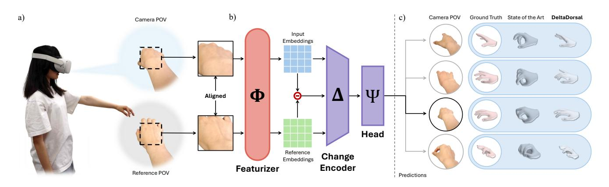

Figure 1: Egocentric hand pose estimation is a challenging problem due to frequent occlusion of the fingers (a). Leveraging recent advances in dense visual featurization, DeltaDorsal enables 3D hand pose estimation using purely visual signals from the dorsum of the hand (b). By comparing visual features from a neutral and current hand pose, DeltaDorsal isolates skin deformation and uses these signals to predict hand posture, outperforming "State of the Art" (HaMeR [\[49\]](#page-14-0)) models that rely on geometric representations of the full hand (c).

## Abstract

The proliferation of XR devices has made egocentric hand pose estimation a vital task, yet this perspective is inherently challenged by frequent finger occlusions. To address this, we propose a novel approach that leverages the rich information in dorsal hand skin deformation, unlocked by recent advances in dense visual featurizers. We introduce a dual-stream delta encoder that learns pose by contrasting features from a dynamic hand with a baseline relaxed position. Our evaluation demonstrates that, using only cropped dorsal images, our method reduces the Mean Per Joint Angle Error (MPJAE) by 18% in self-occluded scenarios (fingers ≥ 50% occluded) compared to state-of-the-art techniques that depend on the whole hand's geometry and large model backbones.

This work is licensed under a Creative Commons Attribution 4.0 [International](https://creativecommons.org/licenses/by/4.0) License. CHI '26, Barcelona, Spain

© 2026 Copyright held by the owner/author(s). ACM ISBN 979-8-4007-2278-3/26/04 <https://doi.org/10.1145/3772318.3790493>

Consequently, our method not only enhances the reliability of downstream tasks like index finger pinch and tap estimation in occluded scenarios but also unlocks new interaction paradigms, such as detecting isometric force for a surface "click" without visible movement while minimizing model size. Our codebase is found at [https://github.com/hilab-open-source/deltadorsal.](https://github.com/hilab-open-source/deltadorsal)

## CCS Concepts

• Computing methodologies → Tracking; • Human-centered computing → Interaction techniques; Mixed / augmented reality.

## Keywords

Sensing; Computer Vision, Hand Pose Estimation, Gestures, On-Body Interaction, AR/VR

#### ACM Reference Format:

William Huang, Siyou Pei, Leyi Zou, Eric J Gonzalez, Ishan Chatterjee, and Yang Zhang. 2026. DeltaDorsal: Enhancing Hand Pose Estimation with Dorsal Features in Egocentric Views. In Proceedings of the 2026 CHI

Conference on Human Factors in Computing Systems (CHI '26), April 13– 17, 2026, Barcelona, Spain. ACM, New York, NY, USA, [16](#page-15-0) pages. [https:](https://doi.org/10.1145/3772318.3790493) [//doi.org/10.1145/3772318.3790493](https://doi.org/10.1145/3772318.3790493)

## 1 Introduction

Hand tracking is a cornerstone of modern human–computer interaction [\[11,](#page-13-0) [63,](#page-14-1) [69\]](#page-14-2), enabling intuitive gesture-based control in Extended Reality (XR), wearables [\[67\]](#page-14-3), and other interactive systems [\[41,](#page-14-4) [50\]](#page-14-5). As these technologies expand, the need for accurate and robust hand pose estimation continues to grow, especially from an egocentric point-of-view. However, a key challenge for egocentric hand pose estimation remains: self-occulusion. From this viewpoint, the palm often partially or fully obscuresthe very fingers being tracked. Our analysis of prominent egocentric hand datasets [\[17,](#page-13-1) [26,](#page-13-2) [32,](#page-14-6) [46\]](#page-14-7) reveals that a finger is fully occluded in nearly a fifth of all scenarios, with partial occlusions occurring even more frequently.

Yet, most existing approaches rely solely on the overall hand silhouette or coarse geometric representations of the hand where pose information is preserved only in features like edges and smoothedout pixel blocks with detailed skin deformation often treated as noise and discarded [\[22,](#page-13-3) [42,](#page-14-8) [43,](#page-14-9) [72\]](#page-15-1). Our findings show that occlusion in egocentric data poses a significant challenge for these stateof-the-art (SOTA) models, affecting both general-purpose models like HaMeR [\[49\]](#page-14-0) and even those specifically designed to address hand-object occlusions, such as HandOccNet [\[47\]](#page-14-10). This limitation prevents free-hand interaction from achieving its potential to replace conventional input methods in spatial computing scenarios that demand robustness in complex, dynamic real-world settings.

To address these shortcomings, we investigate a rich, untapped source of information that remains visible even during occlusion: dorsal skin deformation. Human skin continuously deforms with tendon and muscle activity, especially in the hands [\[9,](#page-13-4) [13,](#page-13-5) [55,](#page-14-11) [68\]](#page-14-12). For example, the skin around the knuckles stretches taut when making a fist, while tendons protrude when extending the fingers. These fine-grained deformations encode valuable cues about hand pose and applied force. Unlike silhouette information, these cues remain observable even when the fingers themselves are occluded. Despite this potential, dorsal signals are rarely used. The limited prior works that do use dorsal deformation mount a camera rigidly to the wrist to have a fixed coordinate relation with relation to the back-of-the-hand, limiting wrist motion and adding an additional sensor mounting point for use with egocentric XR systems [\[66,](#page-14-13) [67\]](#page-14-3).

In this work, we introduce DeltaDorsal, the first end-to-end system to use dorsal skin features for egocentric hand pose estimation. Leveraging recent advances in dense visual featurizers [\[57\]](#page-14-14), our method captures and amplifies subtle dorsal skin deformations relative to a neutral hand pose. By analyzing the feature differences from vision backbones that capture both visual and semantic information, we isolate these deformation signals, filter noise, and make minute dorsal cues accessible without requiring explicit hand localization via wrist-mounted cameras or temporally-bound motion images. Our system demonstrates similar or better performance to compared to SotA models with a smaller model size and more consistent training.

We collected a new dataset of over 170,000 high-resolution frames of dorsal hand data across 17 gestures from 12 participants.

Our proposed system reduces the mean per-joint angle error (MP-JAE) to SOTA models without the need for any fingers in view, mitigates the negative impacts of self-occlusion, and is not meaningfully affected by skin color. To demonstrate the practical utility of our approach, we evaluate its performance on downstream applications like pinch and tap detection. Finally, to illustrate the potential of our skin deformation analysis, we showcase an interaction not possible with conventional egocentric methods: isometric "force click" detection with no discernible hand motion, akin to a trackpad press on surface or pressing fingers together from an already-touching pose.

We present several contributions:

- (1) An analysis of the prevalence and impact of self-occlusion scenarios in common egocentric hand datasets, motivating the use of dorsal features.
- (2) DeltaDorsal, an open-source end-to-end pipeline that transforms dorsal skin imagery into hand pose predictions and click detection without temporal dependencies.
- (3) A 12-participant evaluation of DeltaDorsal's performance versus state-of-the-art baselines, as well as analyses with respect to occlusion, skin tone, image size, and backbone.
- (4) Several exemplary use cases of DeltaDorsal in key hand interactions, including detection of pinching, tapping, and isometric force click.

## 2 Related Work

Hand pose estimation has been widely studied in computer vision and HCI using either external camera setups or on-body/wearable sensors. External, environment-mounted cameras (RGB/RGB-D or multi-view) generally suffer less from self-occlusion but require infrastructure [\[58,](#page-14-15) [69,](#page-14-2) [72\]](#page-15-1). In contrast, wearable cameras (head-, chest-, or wrist-mounted) provide mobility at the cost of frequent self-occlusion in egocentric views [\[21,](#page-13-6) [52\]](#page-14-16). To improve robustness to finger self-occlusion common in wearable viewpoints, we leverage dorsal-hand skin cues (tendon/wrinkle deformation) to infer occluded finger motions. Accordingly, we review methods that explicitly exploit skin appearance or deformation signals [\[66,](#page-14-13) [67\]](#page-14-3). For more comprehensive reviews on external capture systems, please refer to these surveys [\[5,](#page-13-7) [12,](#page-13-8) [15,](#page-13-9) [34\]](#page-14-17).

## 2.1 3D Hand Pose Estimation in Egocentric and Occluded Scenarios

Egocentric cameras (head or chest-mounted) provide a general sensing setup used not only for hand tracking but also for full-body tracking and environment understanding, so hand tracking from these views integrates naturally with broader egocentric pipelines [\[25\]](#page-13-10). Often, researchers and engineers use fast prediction pipelines like MediaPipe for simple gesture recognition [\[69\]](#page-14-2). State-of-theart (SOTA) models like HaMeR [\[49\]](#page-14-0) and FrankMoCap [\[54\]](#page-14-18) are trained primarily using third person data but still demonstrate strong egocentric performance. Compared to third-person views, however, egocentric perspectives are especially affected by heavy occlusion, viewpoint bias, camera distortion, and motion blur from head movements [\[16\]](#page-13-11). To address these challenges, computer vision researchers have assembled large datasets and benchmarks tailored to egocentric hand pose estimation [\[17,](#page-13-1) [21,](#page-13-6) [26,](#page-13-2) [32,](#page-14-6) [46\]](#page-14-7). Existing

approaches attempt to mitigate some of these problems through multi-view camera capture [28, 35] and distortion-aware models [16, 51], however occlusion still remains a key challenge [33].

Several models explicitly seek to address occlusion in hand tracking. HandOccNet exploits the information in occluded regions as a secondary means to enhance image features and improve hand pose estimation [47]. Mueller et al. tackle egocentric hand tracking under occlusion by coupling a two-stage convolutional neural network with depth-aware cropping and normalization [43]. Closer to our work, recent efforts in computer vision have focused specifically on occlusion in egocentric hand pose estimation by building large-scale datasets [17, 32, 46] and models [14, 17, 32, 46, 62, 65] for users interacting with occluding articulated objects, and trajectory forecasting to predict hand pose when entering and exiting the frame of view [29].

Like prior egocentric approaches, our method captures images from an egocentric camera and thus encounters strong self-occlusion. We directly address this problem by explicitly utilizing dorsal skin features, which encode finger position information without the need to visually see the finger. To our knowledge, our system is the first egocentric hand pose estimation model using this approach.

# 2.2 Hand Pose Estimation Leveraging Skin Features

The back of the hand is particularly informative because tendons, muscles, and bones induce visible skin features closely linked to finger motion [44]. Biomechanical evidence further shows regional differences in dorsal skin mechanics [68]. Based on this observation, Sugiura et al. developed a wearable array of photo-reflective sensors that measures dorsal skin deformation to classify hand gestures [60]. Zhao et al. developed a wearable using friction electric technology to sense dorsal deformations and predict hand gestures [71].

Vision-based approaches observing skin features free the dorsum area from on-hand sensors. Opisthenar uses a wrist-worn camera to capture dorsal features for gesture and tap recognition [67]. DorsalNet uses the same camera platform with a hand simulator to capture motion images of the dorsum to predict 3D hand poses [66]. These camera-based methods all require hardware setups on the wrist or arm, making them less usable compared to the more traditional egocentric hand tracking systems.

While prior work shows that skin features can reveal occluded hand pose, there are few systems that sense these features without close or direct contact with the dorsal area itself. Our method instead uses an egocentric (head-mounted) camera for bare-hand tracking, enabling more user freedom and better cross-applicability to existing XR devices.

## 3 Motivating Study: Presence of Self-Occlusion in Egocentric Hand Tracking

We begin our work by analyzing prior egocentric datasets to understand the impact of self-occlusion in egocentric hand tracking. We aim to quantify the conditions under which dorsal features provide a viable alternative to hand sensing in the absence of traditional signals such as hand silhouettes by determining the prevalence and significance of self-occlusion in egocentric POVs.

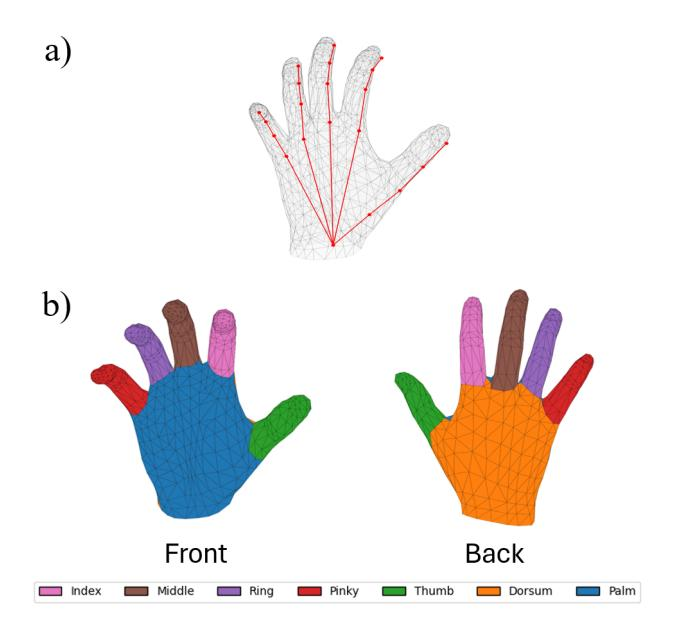

Figure 2: a) Manually defined OpenPose keypoint alignment on the MANO model [8]. Minor deviations from the mesh are caused by MANO's internal definition of a joint position. b) Categorization of MANO mesh faces. Each color represents a separate categorization corresponding to one of index, middle, ring, pinky, thumb, dorsum, and palm.

#### 3.1 Measuring Self-Occlusion

To measure the amount of hand self-occlusion in an image, we fit each pose annotation to a hand mesh using MANO [53], a realistic non-rigid human hand model, to render the hand mesh. Using MANO, we can express any hand mesh  $\Theta$  as a function of the hand pose  $\theta$ , hand shape parameters  $\beta$ , and translation t:  $\Theta = \text{MANO}(\theta, \beta) + t$ . For datasets that only provide 3D OpenPose keypoints  $\hat{J}$ , we match the corresponding keypoints to the generated MANO joints and mesh vertices J. A visualization of our keypoint alignment is shown in Figure 2a. We then fit a hand mesh using MANO with an objective function defined as:

$$\mathcal{L}_{\text{joints}}(\theta, \beta, t) = \|J - \hat{J}\|_{2}^{2} + \|\theta\|_{2}^{2} + \|\beta\|_{2}^{2}$$
 (1)

While this fitting process is not strictly optimal since we did not optimize against the hand silhouette to compute shape parameters, it still provides a sufficient understanding of the general self-occlusion of the hand in each frame. We compute the percent occlusion of each hand mesh through the following two-step process.

Using the hand mesh  $\Theta$ , we project vertices V into the egocentric camera space using the camera extrinsic parameters  $V_{\text{cam}} = RV_{\text{world}} + t$  collected from initial camera calibration. For each face of the MANO model, we compute its normal vector and filter to only faces with a normal vector facing the camera (-z). We then apply Z-buffering [10] using this filtered list of faces. The 3D mesh is projected into the camera's image plane where each mesh face becomes a 2D triangle. We then create an array of depth values, known as a Z-buffer, to track the closest distance to some face at

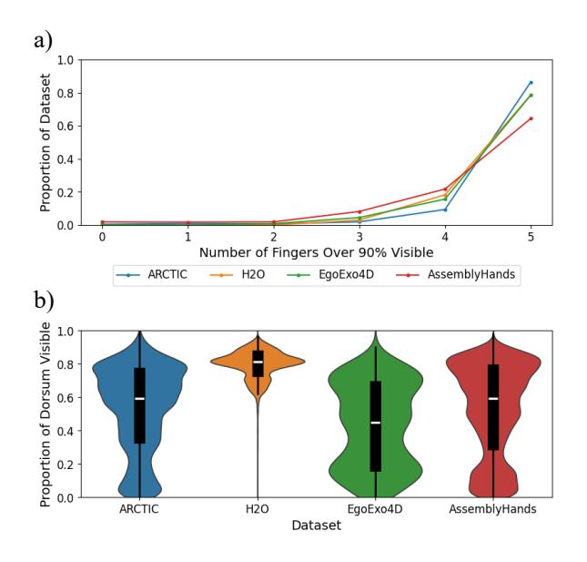

Figure 3: a) Number of fingers with over 90% of surface faces visible across different datasets. b) Distribution of dorsal visibility when atleast one finger is over 90% occluded across different datasets. The internal box represents the 25th to 75th percentile while the white line represents the median.

that pixel. For each pixel, we compute the triangle membership through barycentric coordinate sampling and track the interpolated depth at that point. If the interpolated depth is equal or less than the stored Z-buffer depth, the face is marked as visible; otherwise it is occluded and ignored. We then compute the surface area of each visible face as a measurement of mesh visibility. This measurement only considers visibility in respect to other faces of the hand and the camera view. Thus, this only measures the amount of self-occlusion per frame and does not account for occlusion from manipulating other objects or body parts, which disproportionately affects the fingers and palm.

## 3.2 Occlusion Prevalence in Egocentric Data

Using our occlusion metric, we compute the self occlusion of the fingers for any frame with a fully visible right hand from four egocentric hand pose datasets: ARCTIC [17], H2O [32], EgoExo-4D [26], and AssemblyHands [46]. More information on these datasets can be found in Table 1. Occluded faces are grouped and categorized according to seven different categories: index, middle, ring, pinky, thumb, palm, dorsum to measure the occlusion of different parts of the hand. A visualization of our categorization can be seen in Figure 2b. We note that for the fingers, fully visible is defined as 50% of faces visible and scaled accordingly since we do not separate the top and bottom faces like for the dorsum and palm. We define fully occluded as 10% of surface area visible to account for small errors in Z-buffer rasterization while ensuring that the majority of the finger beyond a small subsection of the proximal phalanx is occluded.

Hand self-occlusion. As shown in Figure 3a, more than 20% of frames across all evaluated datasets exhibit at least one occluded finger, with over 5% containing two or more occluded fingers. These values are a conservative estimate as we do not consider any articulating objects, which are far more likely to occlude the fingers than the dorsum of the hand. These self-occlusion cases often occur because of three primary scenarios: The hand is angled downwards such that the back of the hand occludes the fingers, the hand is angled out such that the index finger occludes the other fingers, or the hand is partially out of frame. Our analysis indicates that there is a sizable proportion of egocentric hand capture data affected by self-occlusion which follows findings from literature. [16].

Hand dorsum visibility. We then analyze how much of the dorsum is visible in these situations by computing the distribution of dorsal face visibility with at least one finger over 90% occluded. We find that for every dataset, the median dorsal visibility is above 40% and up to 80%, indicating that a significant proportion of frames with occluded fingers still have visible dorsal features. Thus, dorsal features offer an alternative rich and stable signal when hand and finger silhouettes are not available.

#### 3.3 Impact of Occlusion on Egocentric Hand Pose Estimators

Following our findings showing that self-occlusion is often present in egocentric views, we analyzed the impact that self-occlusion has on the performance of existing hand pose estimation models. We collected a ground truth dataset of 17 gestures from 12 participants for 170k frames of egocentric hand pose data with hand meshes generated from an accurate motion capture system and evaluate two baseline models on this dataset. More information on our dataset can be found in Section 4. We evaluate the performance of the best performing checkpoint of two state-of-the-art baselines, HaMeR [49], a hand mesh estimator using a fully transformer-based architecture, and HandOccNet [47], an occlusion-robust hand mesh estimator exploiting information in occluded regions, on a completely unseen dataset described in Section 4. We then quantify pose prediction performance using mean per joint angular error (MPJAE) against our motion capture ground truth and plot this error against the mean per finger visibility computed through our occlusion metric described in Section 3. Our results are shown in Figure 4.

We find that for both HaMeR and HandOccNet, there is a statistically significant (p < .0001) negative correlation between finger visibility and error ( $m = -15.84^\circ$ ,  $R^2 = 0.212$  for HaMeR,  $m = -9.11^\circ$ ,  $R^2 = 0.095$  for HandOccNet). This is especially apparent in HaMeR, which has been widely regarded as a standard in pose estimation since its release and has become the backbone of many dataset annotation and hand pose estimation systems [51, 70]. Notably for HandOccNet, we found that the model would often default to outputting a neutral hand position in self-occlusion situations, leading to serious prediction errors most likely due to the model's limited precision in predicting hands occluded behind other objects. Our findings are consistent with our intuition that most existing hand tracking models rely on the general silhouette that lacks the information fidelity to predict pose. Often, their architecture prevents

Table 1: Statistics for the four analyzed egocentric hand pose datasets. "# Frames Analyzed" only counts the number of frames with a right hand within view of the egocentric camera. "# Frames Occluded" denotes the number of frames with at least one finger's surface over 90% occluded.

| Dataset            | # of Subjects | Annotation | Gesture Type         | In the Wild | # Frames Analyzed | # Frames Occluded |
|--------------------|---------------|------------|----------------------|-------------|-------------------|-------------------|
| ARCTIC [17]        | 10            | MANO       | Articulating Objects | Х           | 184,346           | 25,242            |
| H2O [32]           | 4             | MANO       | Articulating Objects | ×           | 26,529            | 5,666             |
| EgoExo4D [26]      | 740           | Keypoints  | Skilled Activities   | ✓           | 8,703             | 1,873             |
| AssemblyHands [46] | 34            | Keypoints  | Assembling Toys      | X           | 394,621           | 140,669           |

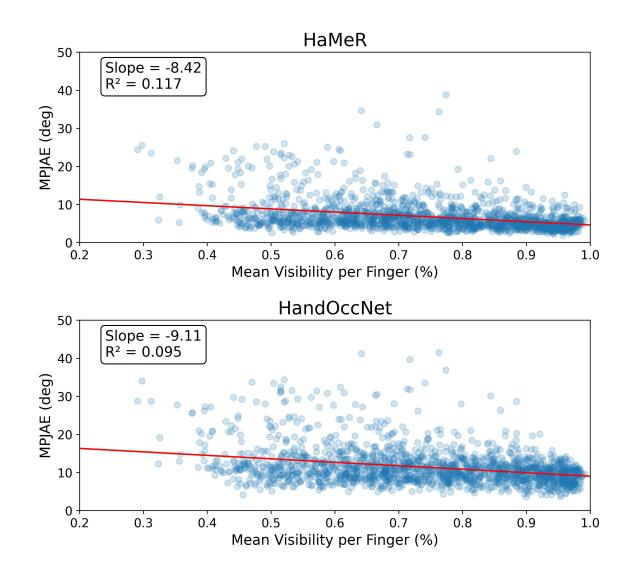

Figure 4: MPJAE compared to average per finger visibility in our unseen dataset. The red line denotes the fitted linear regression for visualized data. Mean finger visibility is defined as the percentage of face surface area that is visible to the camera averaged across all five fingers. The higher the MPJAE, the worse the performance of the model is.

them from using skin features due to the limited token and image size allowed.

#### 3.4 Our Proposal: Investigate Dorsal Features

Given our findings, we choose to investigate dorsal features as a key signal to improve hand pose estimation in egocentric POVs. We lay out our work as follows: we first perform a high-resolution data collection of dorsal features from different hand gestures to capture and analyze dorsal features in detail. Using this dataset, we propose and train a new model that normalizes visual features from the dorsum to a neutral hand pose, similar to how DorsalNet uses motion images [66], to isolate dorsal features even through global motion. We then evaluate our system against baseline hand pose estimation models and across skin tones and image resolutions. Finally, we demonstrate the utility of dorsal features beyond pose estimation by using them in the detection of interaction modalities including pinch, tap, and click.

#### 4 High-Resolution Dorsal Data Collection

Since dorsal and skin deformation are often very small and require a higher resolution than traditional hand pose datasets, we collected our own dataset of 4K images of dorsal features from an egocentric point of view (POV) to mimic natural hand self-occlusion. To reduce prediction inaccuracies and enable the capture of fine-grained gesture motions, we used a Vicon Motion Capture setup with 8 Vero cameras [3] and a custom marker set shown in Figure A.1 to annotate 3D hand poses. Motion capture data was collected in tandem with the image feed from an iPhone 12 Pro Max recording at  $3840 \times 2160$  and 30 FPS to mimic the image quality of a mobile, consumer camera. Camera intrinsics and extrinsics were calibrated through a ChArUco board with markers to identify board corners in motion capture space. The camera was stationary to control for motion blur given our low capture rate and to best isolate dorsal textures. While cameras were stationary, users were allowed to move their hand around the camera frame of view. Examples of the high-resolution dorsal images are shown in Figure 5.

#### 4.1 Participants and Procedure

We recruited 12 participants (6M, 6F) between the ages of 18-29 with Monk Skin Tone Levels [2] ranging from 2-7. More information on our participants can be found in Table A.1. We first collected a 10-second capture of their right hands' dorsal area while in a neutral and relaxed position pose for calibration. Participants were then asked to perform 17 different dynamic gestures and freeform hand poses. Gestures were selected by surveying common XR interactions and gestures that commonly exhibit high levels of selfocclusion in prior data. We acknowledge that this is a limited subset of all possible hand poses. For each gesture, participants started from a relaxed position and performed the specific gesture repeatedly (freeform hand poses had no limitations). We asked users to perform gestures at a normal and controlled speed for all captures. More information on our collected gestures is shown in Figure 5. During the study, participants placed their right arm on an armrest with their hand approximately 20 cm away from the camera with the camera at a 45 degree angle from the hand to mimic an egocentric camera's position. Participants were asked to repeat these gestures for three different hand positions to mimic different dorsal and finger occlusion scenarios: hand pointed straight, hand pointed downwards at a 30 degree angle, and hand turned out at a 30 degree angle for a total of 51 separate trials. Our dataset has comparable diversity of participants and size to previous egocentric hand pose datasets including HO3D [27], FreiHAND [73], EgoHands [6], and

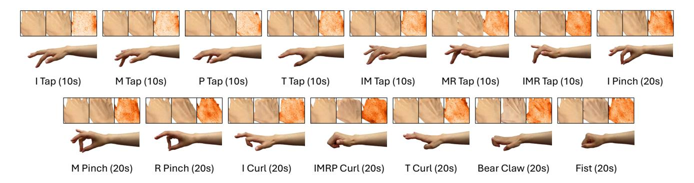

Figure 5: Examples of each static gesture collected in our data collection. Not depicted are the two dynamic gestures: fanning (30s) and freeform (60s). On the top are the following: An aligned image of the reference, the picture of the dorsal features during this gesture, and the cosine similarity mapping for the DINO features generated from the reference and the current image. The color of the similarity map indicates a smaller cosine similarity (darker is more different). (I: index finger, M: middle finger, R: ring finger, P: pinky, T: thumb).

ARCTIC [17] while being the first 4K egocentric dataset. All participants were compensated with \$25 for their time. Our study was approved by our institution's IRB.

#### 4.2 Data Cleaning

During data collection, we found that the motion capture system could mislabel markers in the solving process. Thus, researchers manually evaluated all data, fixed any marker swapping, and removed any poorly predicted frames due to marker occlusion or system error. Researchers then manually aligned motion capture and video streams using a clapper board and transformed all markers from motion capture space into camera space using the calibration extrinsics and intrinsics. We then computed the MANO parameters for each trial.

Since we only evaluate hand poses and not the full mesh, we obtain an initial estimate of the shape parameters for each participants using HaMeR [49] with each participant's neutral hand capture, which shows the entire hand, to mimic a realistic implementation scenario. Using these shape parameters, we associate motion capture marker positions  $\hat{M}$  with a corresponding MANO mesh vertex M. We then fit the MANO model using the following objective function:

$$\mathcal{L}_{\text{markers}}(\theta, t) = \|M - \hat{M}\|_{2}^{2} + \|\theta\|_{2}^{2}$$
 (2)

In total, we collected 172,222 frames of annotated pose data for 17 gestures across 12 participants.

#### 5 Design and Implementation of DeltaDorsal

In this section, we detail the system design and machine learning implementation of DeltaDorsal: our pipeline to extract and leverage visual features from the dorsum of a hand to predict a full hand pose from a monocular egocentric view. Notably, we propose a time-invariant model that only requires a single initialization process for each user.

To represent the hand, we use MANO [53]. Since the dorsum of the hand itself does not tell us any information about the localization or shape of the hand, we set the global orientation, t, to

zero and compute the shape,  $\beta$  from an initial capture of the hand. Thus, our machine learning model only predicts the 15 joint angles that comprise the pose parameter,  $\theta$ , which can be used to resolve a mesh,  $\Theta$ , with a precomputed shape and translation.

#### 5.1 Data Preprocessing

Following Wu et al. [66], we found it difficult to observe subtle dorsal deformations using a singular frame. Rather than using motion images, which rely on temporal features which may disconnect or misalign with use, we compare every user's dorsal images to an image of the dorsum of their hand at a neutral position called a "reference". Using HaMeR [49], we predict the 3D joint positions of the back of the hand and project them into the 2D camera plane using the camera intrinsics and predicted extrinsics. We then align the reference to the captured hand image by a homography estimation using RANSAC [19] on the projected 2D points. Images are cropped to just the dorsum of the hand and resized to 384 × 384 for training. This procedure localizes both the reference and captured image so that both hands occupy the same spatial location for direct pixel-to-pixel comparison. Furthermore, by using just the dorsal features, we limit the amount of inputted data to our machine learning model to lower computational complexity and focus training on dorsal features over the hand silhouette. An example of this data is shown in Figure 6. We note that while we use HaMeR here for simplicity and congruency with later analyses, any 2D or 3D hand pose estimator or segmentor could be used to a similar effect. For training purposes, we add random brightness, contrast, gamma, noise, and gaussian blur to better generalize to different lighting and motion conditions. Augmentations are performed independently for the input and reference images to improve generalizability across different lighting and hand conditions.

#### 5.2 Network Architecture

DeltaDorsal adopts a two-stream architecture built on a transformer backbone with a lightweight convolutional change encoder followed by a regression head. A visualization of this architecture is shown in Figure 6. Using a pretrained DINOv3 Vision Transformer

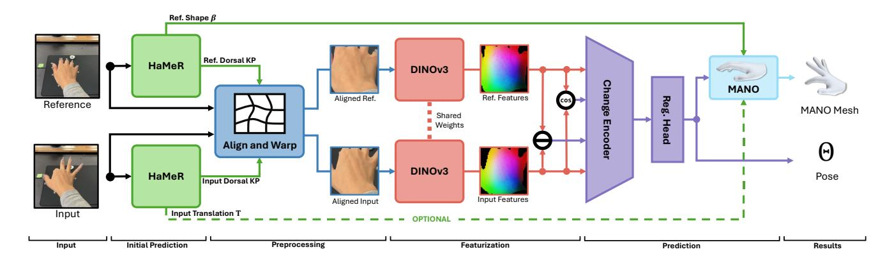

Figure 6: DeltaDorsal's system architecture. Users input a "reference" image of their hand in a neutral position and a picture of the hand in some gesture. An initial hand pose prediction from HaMeR is then used to align both hands so that their dorsal features are spatially localized. Images of dorsal features are then fed into DINOv3 to extract image features. These features, along with the cosine similarity and difference between the "reference" and current image's features, are fed into the change encoder. A regression head then predicts the current hand pose, which can be processed with MANO using a prior shape prediction to generate a hand mesh. Optionally, users can use the initial translation prediction from HaMeR to localize the final mesh in the camera frame.

(ViT) [57] following the "large" design (ViT-L) with the last three blocks unfrozen, we first compute the dense image features for both the reference  $I_0$  and target  $I_t$  using the image of the dorsum of the hand,  $F_0$  and  $F_t$  respectively with dimensions equal to the original image size divided by the patch size ( $16 \times 16$ ). Notably, model weights are shared across each stream to ensure that  $F_0$ and  $F_t$  maintain the same feature space. A change encoder then processes this feature map by fusing the feature delta,  $F_t - F_0$ , cosine similarity per patch,  $cos(F_t, F_0)(x, y)$ ,  $F_t$ , and  $F_0$  and feeding this data through a small convolutional network to generate the encoded features X. Cosine similarity features are visualized in Figure 5. By fusing the original features, feature deltas, and cosine similarities in the change encoder, we allow the model to select between general image features and changes in dorsal features as needed. We settled on a dense featurizer backbone after preliminary experiments with optical flow methods like RAFT [61] and Gunnar-Farneback optical flow [18] had difficulty separating skin deformations from global movements of the hand. Furthermore, traditional feature extractors like ResNet [30] and ConvNeXt [38] failed to generalize to out-of-distribution subjects. We believe this limitation arises because these models are not well-suited to capture the subtle soft-body surface deformations in the back of the hand which often do not demonstrate distinct, localized feature changes. Finally, a regression head applies a small convolutional neck for local refinement, pools spatial features, and passes pooled vectors through a shallow multi-layer perceptron to predict the pose vector  $\beta$  ((15, 3) for 15 axis-angle rotations).

Using our predicted pose parameter  $\theta$  and the shape parameter computed by HaMeR on the reference image  $\beta_0$ , we compute the MANO mesh and predicted 3D joints J shown in Figure 2a. Following the procedures defined in Pavlakos et al. [49], we directly apply a loss on the pose parameter  $\beta$  and encourage consistency in the 3D space by supervising the 3D joint positions  $\hat{J}$ . Our full loss can be formalized as

$$\mathcal{L}_{\beta} = \|J - \hat{J}\|_{1} + \|\theta - \hat{\theta}\|_{2}^{2} \tag{3}$$

## 5.3 Implementation Details

All systems were implemented using PyTorch [48]. We used the AdamW optimizer [39] with a batch size of 96 for our training. During training, we randomly selected a reference frame from the corresponding calibration data capture. Please refer to our codebase and configuration files for specific parameter settings for experiments. All training and evaluations were performed using PyTorch Distributed Data Parallel on a system with an AMD Ryzen Threadripper PRO 3955WX 3.90GHz, four Nvidia RTX A5500s, and 256GB of RAM. Our full codebase can be found at https://github.com/hilab-open-source/deltadorsal.

#### 6 Evaluation

We evaluate DeltaDorsal's 3D hand pose estimation performance against SOTA vision-based hand pose estimation models. The following documents our procedure and results.

#### 6.1 Pose Estimation Performance Study

We first conduct a baseline performance study to evaluate our model and compare performance with existing computer vision methods using the full hand silhouette. For all experiments, we adopt a leave-one-subject-out (LOSO) cross-validation paradigm (≈12,000 test frames per subject), where each participant was held out in turn for testing while remaining participants were used for training, to assess cross-subject generalization and isolate performance gains attributable to dorsal movement representation rather than subject-specific hand features. We adopt the mean per joint angular error (MPJAE) metric to evaluate the performance of our pose prediction. We follow the evaluation protocols of prior 3D hand pose works [27, 49] and report the Procrustes-aligned mean per-joint position

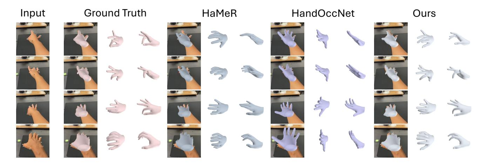

Figure 7: Examples of ground truth and predicted hand mesh from HaMeR, HandOccNet, and our system in self-occluded scenarios. For both baselines, we inputted a full image of the hand while our system only used the cropped dorsal features of the hand.

error (PA-MPJPE) of our system using the initial shape parameter estimated from calibration. This metric measures joint error after global translation, rotation, and scale alignment to evaluates our system's mesh reconstruction performance in realistic application scenarios.

We compare our method with two leading hand-pose estimators, HaMeR [49] and HandOccNet [47]. HaMeR reports state-of-the-art (SotA) or near SotA results across multiple datasets and notably uses a ViT-H backbone (632M parameters), more than twice the size of our ViT-L backbone (300M). HandOccNet is explicitly designed to be occlusion-aware: it first predicts features for occluded regions and then infers pose. To ensure a fair comparison, we fine-tuned both models under the same leave-one-subject-out (LOSO) protocol, freezing the backbone and training the prediction head to convergence. Notably, this differs from our training strategy for DeltaDorsal which unfroze the last three layers of the backbone as well to maintain the strong learned featurization and generalization of the model's pretraining on larger datasets while mitigating convergence and instability issues in our smaller backbone compared to HaMeR (VIT-H). Both models were given the full image of the hand including the fingers compared to just the dorsal crop of DeltaDorsal. In our experiments, HandOccNet proved difficult to fine-tune or train end-to-end and often collapsed. We suspect this reflects an architectural bias toward specific non-self-occlusion scenarios. For completeness, we still report all metrics. Our quantitative metrics are shown in Table 2 and examples of predicted hand meshes are shown in Figure 7 and Figure 1.

Comparing against baselines. When comparing against our two baselines, HaMeR and HandOccNet, we find that our approach leveraging just dorsal features of the hand outperforms both baseline models in pose accuracy (MPJAE: Ours:  $6.41 \pm 0.92^\circ$ , HaMeR:  $6.74 \pm 0.48^\circ$ , HandOccNet:  $11.27 \pm 0.97^\circ$ ) and matches hand mesh pose performance even with a suboptimal shape fit (PA-MPJPE: Ours:  $7.41 \pm 1.01$ mm, HaMeR:  $7.11 \pm 0.47$ mm, HandOccNet:  $14.38 \pm 1.22$ mm) (Table 2). We note that HandOccNet often predicts a neutral hand position during self-occluded scenarios (Figure 7), potentially due

to high amount of self-occlusion and architectural incompability. Notably our system demonstrates stronger performance for the thumb. Since most of our collected data was from an egocentric top-down POV, the thumb was disproportionately occluded and subsequently performed worse in silhouette-based models (Thumb MCP MPJAE: Ours:  $4.77 \pm 0.63^{\circ}$ , HaMeR:  $7.38 \pm 1.66^{\circ}$ , HandOccNet:  $9.11 \pm 2.35^{\circ}$ ). Dorsal skin deformations are induced more evenly across all fingers, enabling our approach to maintain roughly even performance across all fingers.

Performance across occlusion levels. We also evaluate the performance of our baselines and system under different occlusion levels after fine-tuning. As shown in Figure 8, we find that our model has a smaller dropoff in performance compared to both HaMeR and HandOccNet ( $m = -4.59^{\circ}$ ,  $R^2 = 0.048$  for ours,  $m = -8.42^{\circ}$ ,  $R^2 = 0.117$  for HaMeR,  $m = -9.11^{\circ}$ ,  $R^2 = 0.095$  for HandOcc-Net)1. HandOccNet's general performance was not significantly changed after finetuning due to previously mentioned training difficulties. When comparing performance at 50% finger visibility and lower, DeltaDorsal outperforms HaMeR across both MPJAE (Ours:  $7.59 \pm 4.38^{\circ}$ , HaMeR:  $9.24 \pm 5.54^{\circ}$ , percent change: -17.86%) and PA-MPJPE (Ours:  $8.47 \pm 3.84$ mm, HaMeR:  $9.03 \pm 3.65$ mm, percent change: -6.20%). These findings are consistent with our intuition that existing hand pose estimation models rely heavily on finger silhouettes for pose prediction. Examples of this poor performance are shown in Figure 1 and Figure 7, where HaMeR and HandOcc-Net both fail to accurately predict hand pose when the fingers are occluded.

**Performance across skin tones.** Using the predicted poses from all LOSO experiments, we then conduct a one-way analysis of variance (ANOVA) [23] to analyze the effect of skin tone on performance. We find a statistically significant effect ( $p = 4.07 \times 10^{-205}$ ) but small effect size ( $\eta^2 = 0.0055$ ) indicating that skin tone explained less than 1% of the data variance and does not meaningfully affect hand pose prediction accuracy. These results

 $^{1}$ We denote slope as m

Table 2: Average results of leave-one-subject-out experiments across all participants for each finger. Joints are ordered from closest to furthest away from the wrist using the OpenPose keypoint labels (Figure 2a). MAE indicates mean angular error expressed in degrees. (Meanparticipants  $\pm$  SDparticipants).

| Finger  | Joint Metric  | HaMeR [49]      | HandOccNet [47]  | Ours            |
|---------|---------------|-----------------|------------------|-----------------|
|         | MCP MAE (°)   | $7.38 \pm 2.07$ | $10.61 \pm 3.25$ | $6.81 \pm 1.42$ |
| Index   | PIP MAE (°)   | 8.10 ± 1.11     | $16.02 \pm 3.00$ | $8.84 \pm 2.81$ |
|         | DIP MAE (°)   | $8.39 \pm 3.57$ | $10.90 \pm 3.29$ | $6.92 \pm 4.01$ |
|         | MCP MAE (°)   | $7.43 \pm 1.28$ | 11.38 ± 1.77     | $7.69 \pm 1.47$ |
| Middle  | PIP MAE (°)   | $7.09 \pm 1.26$ | $16.08 \pm 4.46$ | $8.32 \pm 2.82$ |
|         | DIP MAE (°)   | $4.28 \pm 0.72$ | $10.71 \pm 2.16$ | $4.47\pm0.97$   |
|         | MCP MAE (°)   | $6.39 \pm 0.91$ | 9.35 ± 1.81      | $6.90 \pm 1.78$ |
| Ring    | PIP MAE (°)   | $6.53 \pm 1.20$ | $14.27 \pm 2.76$ | $7.07 \pm 2.24$ |
|         | DIP MAE (°)   | 4.58 ± 1.70     | $9.42 \pm 2.31$  | $5.16 \pm 2.11$ |
|         | MCP MAE (°)   | 8.42 ± 1.67     | $12.00 \pm 2.24$ | $7.35 \pm 1.30$ |
| Pinky   | PIP MAE (°)   | 6.96 ± 1.11     | $9.76 \pm 3.17$  | $6.28 \pm 2.45$ |
|         | DIP MAE (°)   | $3.82 \pm 1.38$ | $6.58 \pm 1.62$  | $3.62\pm1.30$   |
|         | CMC MAE (°)   | $5.70 \pm 0.73$ | $14.29 \pm 4.34$ | $5.52 \pm 1.61$ |
| Thumb   | MCP MAE (°)   | $7.38 \pm 1.66$ | $9.11 \pm 2.35$  | $4.77 \pm 0.63$ |
|         | IP MAE (°)    | $8.63 \pm 2.64$ | $8.57 \pm 2.17$  | $6.38 \pm 1.59$ |
| Overall | MPJAE (°)     | $6.74 \pm 0.48$ | $11.27 \pm 0.97$ | $6.41 \pm 0.92$ |
| Overall | PA-MPJPE (mm) | $7.11 \pm 0.47$ | $14.38 \pm 1.22$ | $7.41 \pm 1.01$ |

indicate that our approach using dorsal deformations is inclusive across people with varying skin tones.

**Performance across gestures.** When analyzing by gesture type, we find our system matches HaMeR's performance for multiple gestures and outperforms HandOccNet for all gestures, indicating that DeltaDorsal can enable more fine-grained and precise gesture recognition and interaction schemes that leverage partial gestures like small or large taps under occlusive scenarios when the fingers are not visible. When analyzing the performance of our system across different gestures, we find that our system performs worse for "fan" pose reconstruction (PA-MPJPE: Ours:  $8.22 \pm 1.49$ mm, HaMeR: 7.53±1.37mm), and matches performance for "tap", "pinch", and "curl". We believe this can be attributed to the fact that these gestures are often less self-occluded when the camera is pointing downwards as in our experimental setup. This is further supported by strong performance for "fist" and "bear claw" (MPJAE:  $9.94\pm2.95^{\circ}$ and 8.09 ± 2.26° respectively), outperforming HaMeR by over 3 degrees. (Table 3). This can be partially attributed to the large changes in the dorsal feature around the knuckles and tendons during these gestures which are easier for our system to pick up. However, towards the apex of these gestures, we notice that skin deformations are largely contained to dorsal features stretching across the hand. These fine-grained skin feature translations are hard to capture and often missed in our system, which reduces images to  $16 \times 16$  pixel feature patches before encoding.

#### 6.2 Ablation Study

To better understand what DeltaDorsal is using to predict hand pose, we conducted two ablation studies on the input image size and DINOv3 backbone. We follow the evaluation procedures described in Section 6 and test each configuration on three subjects with varying skin tones (P1: Monk skin tone level 5, P5: Monk skin tone level 2, P10: Monk skin tone level 7) to reduce training time.

Image size. We found that our base image input size of 384 × 384 was enough to preserve the clarity of the dorsal area of the hand in the 4K camera capture. By downscaling these images, our system is restricted to more low-frequency features of the hand like large changes in shadows and tendons. Notably, existing pose estimation methods often resize a segmentation of the whole hand to 256 × 256 or even smaller [47, 49, 69], destroying fine skin features. As shown in Table 4, we observe performance drop-offs in pose reconstruction as image size decreases, indicating that fine skin features, such as wrinkles, contribute to the overall performance of the model. Performance for fine movements, such as small taps and pinches, is especially affected due to the fact that they mostly only induce small skin translations. By lowering the image size, we also find significant improvements to inference time, potentially enabling real-time pose estimation through dorsal features. We also note that training at lower image sizes led to more unstable training

Backbone. We also evaluated different backbone sizes and delta stream configurations for DINOv3 to assess how much model capacity is required to capture dorsal features in dense visual embeddings and the usefulness of the proposed delta stream. The different backbone sizes are distillations of DINOv3 which can also be used as a measure of backbone complexity where ViT-S+ can be implemented into small mobile computing systems. When analyzing the full delta-stream network, both MPJAE and PA-MPJPE increased only marginally with much smaller backbones indicating that dorsal deformations can be effectively encoded without highdimensional models (Table 5). At the same time, inference time dropped substantially, from 20.95 ms with ViT-L to 4.54 ms with ViT-S+. These findings suggest that DeltaDorsal can be deployed on mobile devices with minimal performance loss. Furthermore, while the delta stream had little impact on the performance of the ViT-L DINOv3 backbone, the removal of delta features in the pipeline had a significant negative on the performance of smaller backbones.

Table 3: Average results of leave-one-subject-out experiments across all participants for each gestures. (Meanparticipants ± SDparticipants).

| Gesture   | Metric        | HaMeR [49]   | HandOccNet [47] | Ours        |
|-----------|---------------|--------------|-----------------|-------------|
|           | MPJAE (°)     | 5.45 ± 0.66  | 9.46 ± 1.14     | 5.43 ± 0.89 |
| Tap       | PA-MPJPE (mm) | 6.33 ± 0.65  | 12.72 ± 1.56    | 6.73 ± 0.87 |
|           | MPJAE (°)     | 5.90 ± 1.02  | 10.65 ± 0.88    | 5.75 ± 0.98 |
| Pinch     | PA-MPJPE (mm) | 6.33 ± 0.81  | 15.08 ± 1.05    | 6.74 ± 0.98 |
|           | MPJAE (°)     | 7.50 ± 1.12  | 12.24 ± 1.90    | 6.81 ± 1.11 |
| Curl      | PA-MPJPE (mm) | 7.43 ± 0.75  | 14.26 ± 0.98    | 7.45 ± 0.92 |
|           | MPJAE (°)     | 9.91 ± 1.85  | 16.53 ± 2.60    | 8.09 ± 2.26 |
| Bear Claw | PA-MPJPE (mm) | 7.90 ± 0.85  | 16.11 ± 1.74    | 7.36 ± 1.37 |
| Fist      | MPJAE (°)     | 13.60 ± 3.00 | 19.70 ± 1.50    | 9.94 ± 2.95 |
|           | PA-MPJPE (mm) | 11.53 ± 2.41 | 17.13 ± 1.14    | 9.83 ± 2.49 |
| Fan       | MPJAE (°)     | 6.51 ± 1.08  | 10.26 ± 1.85    | 6.58 ± 1.16 |
|           | PA-MPJPE (mm) | 7.53 ± 1.37  | 14.47 ± 2.74    | 8.22 ± 1.49 |
| Free      | MPJAE (°)     | 7.86 ± 1.14  | 12.38 ± 1.48    | 8.16 ± 1.33 |
|           | PA-MPJPE (mm) | 8.69 ± 1.52  | 16.16 ± 1.87    | 9.98 ± 1.72 |

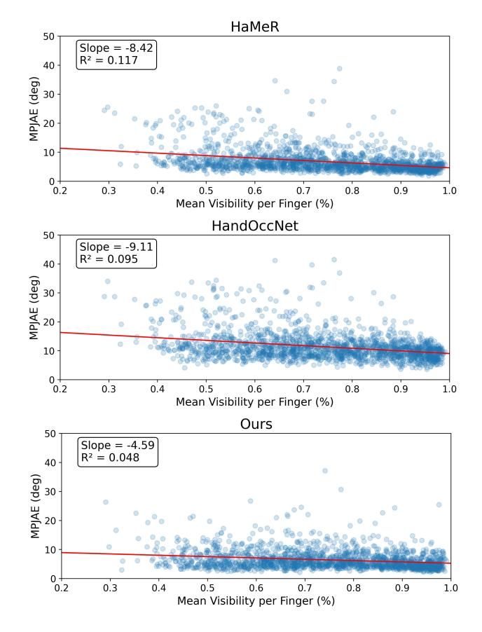

Figure 8: MPJAE compared to average per finger visibility in fine-tuned models. The red line denotes the fitted linear regression for visualized data. Mean finger visibility is defined as the percentage of face surface area that is visible to the camera averaged across all five fingers. The higher the MPJAE, the worse the performance of the model is.

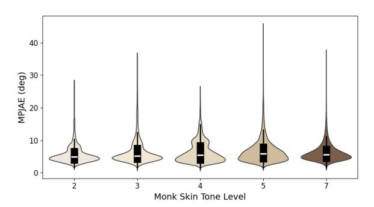

Figure 9: Distribution of MPJAE compared to Monk skin tone level. Violin plots are colored by their corresponding skin tone.

Table 4: Average performance of DeltaDorsal across different image sizes as input. Values are averaged across three different participants of varying skin tones (P1, P5, P10). 384 × 384 is the default setting of DeltaDorsal. Inference time was measured on a single NVidia RTX A5500. (Meanparticipants ± SDparticipants).

| Image Size | MPJAE (°)   | PA-MPJPE (mm) | Inference Time (ms) |
|------------|-------------|---------------|---------------------|
| 128 × 128  | 7.57 ± 7.82 | 9.04 ± 7.56   | 5.20 ± 0.33         |
| 256 × 256  | 7.00 ± 7.34 | 7.80 ± 6.95   | 9.61 ± 0.26         |
| 384 × 384  | 6.80 ± 7.16 | 7.93 ± 6.89   | 20.95 ± 0.21        |

We attribute this to the fact that as features become simpler at lower backbones, the delta features become more useful to specifically isolate dorsal changes. This hypothesis is further supported as model collapse or nonconvergence was nearly unavoidable for the ViT-B and ViT-S+ backbones. Our results indicate that delta features can be a useful paradigm for future small mobile computing systems which can only deploy small ViT models due to hardware constraints.

Table 5: Average performance of DeltaDorsal across different delta stream DINOv3 backbones. Values are averaged across three different participants of varying skin tones (P1, P5, P10). ViT-L is the default setting of DeltaDorsal. Inference time was measured on a single Nvidia RTX A5500. (Meanparticipants ± SDparticipants).

| Backbone | Parameters | Delta Stream | MPJAE (°)     | PA-MPJPE (mm) | Inference Time (ms) |
|----------|------------|--------------|---------------|---------------|---------------------|
| ViT-S+   | 29M        | ✗            | 24.31 ± 29.45 | 19.00 ± 15.51 | 3.97                |
|          |            | ✓            | 7.13 ± 7.45   | 8.28 ± 6.98   | 4.54                |
| ViT-B    | 86M        | ✗            | 7.06 ± 7.43   | 8.30 ± 7.02   | 7.54                |
|          |            | ✓            | 6.98 ± 7.37   | 8.15 ± 7.16   | 7.97                |
| ViT-L    | 300M       | ✗            | 6.79 ± 7.29   | 7.86 ± 6.93   | 20.33               |
|          |            | ✓            | 6.80 ± 7.16   | 7.93 ± 6.89   | 20.95               |

Table 6: Results of self-occluded tap application experiments across all 12 LOSO experiments. RMSE refers to each joint's X-axis root mean squared angular error.

| Metric          | HaMeR [49] | Ours  |
|-----------------|------------|-------|
| Index RMSE (°)  | 31.15      | 26.23 |
| Middle RMSE (°) | 26.02      | 16.07 |
| Pinky RMSE (°)  | 11.29      | 15.89 |

## 7 Sensing Tap, Pinch, and Click

We follow common HCI techniques to analyze how DeltaDorsal can improve gesture accuracy in different self-occluded scenarios. For all subsequent analyses using pose, we follow the same procedures as described in Section [6](#page-7-0) but report values across all testing sets for simplicity. We focus on HaMeR as a baseline, as HandOccNet showed limited effectiveness in our setting. Finally, we analyze the cross-applicability of dorsal deformations by using our approach to detect isometric "force clicks" with no discernible hand motion.

## 7.1 Self-Occluded Tap Detection

We first focus on taps and use the common heuristic of X-axis Euler rotation (rotation axis perpendicular to the finger and palm normal) of the metacarpal joint as a measurement of tap completion, which can be used as a continuous value for fine-grained control or a binary "tap" / "no tap" through a simple threshold. We analyze only taps where the finger is over 50% occluded to measure partial self-occlusion performance in HaMeR. We do not evaluate the ring finger due to participant discomfort in the data collection process. When evaluating across our collected tap data, we find that DeltaDorsal significantly reduces the angular RMSE of both the index and middle finger. We attribute this difference to the fact that when tapping the index and middle finger, the entire dorsal region tends to stretch across the knuckle more amplifying our signal. This is further supported as DeltaDorsal performs worse on pinky tap detection (+4.60°) which we attribute to the fact that the pinky induces a far smaller dorsal skin change when tapped. Thus, DeltaDorsal demonstrates better capabilities for fine-grain control in small gestures like taps when the fingers are not totally visible and dorsal deformations are easily isolated like in the index finger, with more limited applications in the pinky which appears robust for coarse event detection but not continuous precision control. We believe that this can generalize to other interactions like surface taps by reducing angular error in microgesture scenarios and even

Table 7: Results of self-occluded pinch application experiments across all 12 LOSO experiments. Dist. RMSE refers to the fingertip-to-thumb distance root mean squared error.

| Metric                 | HaMeR [49] | Ours  |
|------------------------|------------|-------|
| Index Dist. RMSE (mm)  | 25.46      | 16.81 |
| Middle Dist. RMSE (mm) | 21.23      | 26.33 |
| Ring Dist. RMSE (mm)   | 20.08      | 23.17 |

non-occluded cases by using the dorsal region as another prior to predict depth.

## 7.2 Self-Occluded Pinch Detection

Following our approach in Section [7.1,](#page-10-1) we use the common heuristic of finger tip to thumb tip distance as a measurement of pinch completion, which can be used as a continuous value for fine-grained control or binary classification, and analyze at least 50% occluded pinch scenarios. When comparing against HaMeR on our collected pinch data (Table [7\)](#page-10-2), we find that DeltaDorsal significantly outperforms HaMeR in index pinches (Dist. RMSE: −8.65mm) but performs worse for both middle and ring finger pinches (Dist. RMSE: +5.10mm and +3.09mm respectively). We believe this is caused by how people generally pinch, where middle finger and ring finger pinches often induce small dorsal region changes as the thumb moves towards the finger. This phenomenon is reduced in the index finger which we found moves more during pinching.

## 7.3 Isometric Click Detection

Dorsal skin deformations are also induced by the hand when exerting a force, even in static positions. During our data collection process, we also collected 30 second trials of force data from 4 static in-air gestures (index finger pinch, middle finger pinch, ring finger pinch, fist clench) and two surface gestures (surface index finger tap with all fingers out, surface index finger tap with one finger out) from 11 participants (P2-P12) using a force-sensing resistor (FSR) synchronized with the camera capture using the serial output from an Arduino. Gestures are shown in Figure [10.](#page-11-0) We normalized all FSR readings by the max force exerted in the trial to control for a participant's hand strength and defined a click as a force reading peak above 20% of the trial's max force reading. In total, we collected 41,894 frames of data.

We then trained a simplified version of DeltaDorsal using only the delta features ( − 0, cos(, 0) (,)) from a totally frozen DINOv3 featurizer as input into a classification head to analyze the

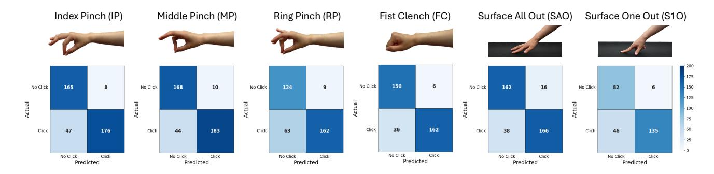

Figure 10: The six static gestures for force data collection and confusion matrices for each gesture type. Values are reported per click rather than per frame following common HCI systems.

cross-applicability of our feature difference approach in different interaction applications. Our model wastrained under cross entropy loss. We trained three models under an 80/10/10 data split due to our limited data size and report the model with the best performing validation metrics. While our model predicts click per frame, we follow HCI conventions and report all metrics per click where each click is labeled through majority vote to better present how systems like ours are often implemented. Predictions are reduced to a binary classification per click as detecting the specific gesture is trivial through pose estimation as discussed in Section [6.](#page-7-0) More information on our model can be found in our codebase.

Results. Figure [10](#page-11-0) shows the confusion matrix with the heatmap of all 6 gestures. Accuracy across our entire testing set was 0.85 with a weighted precision of 0.86, weighted recall of 0.85, and weighted F1-score of 0.85. We found noticeably more false negatives than positives. We believe this is partially caused by small changes in the overall hand position, which can stretch the skin more taut and obscure the small dorsal deformations induced by clicks.

Our overall accuracy across all in-air click interactions was 0.85 with the best performing gesture being fist clench (FC) (0.88) aligning with intuition that FC would induce the most dorsal change given the soft palm and amount of force a user can apply. Of the pinch gestures, middle pinch (MP) performed the best with an accuracy of 0.87 while ring pinch (RP) performed the worst with an accuracy of 0.80. We attribute this performance decrease to how unnatural RP is for users to do, causing their hand to tense up more and obscuring small dorsal deformations in the process.

Our two surface clicks performed similarly with an overall accuracy of 0.84. Notably, Surface all out (SAO) noticeably outperformed surface one out (S1O) (0.86 and 0.81 respectively). Similarly to the RP, since the user's fingers are pulled in for S1O, dorsal skin is pulled more taut which dampens the dorsal deformations caused by clicks. Furthermore, we see that in SAO, the tendons under the skin are more relaxed, inducing a larger change when clicking compared to S1O.

Our results indicate that our approach using purely dorsal changes can generalize beyond pose, enabling a new dimension of XR interactions that can fuse with traditional pose-based gestures. We believe that dorsal changes should play a key role in future click and static interaction detection systems, similar to how they fuse

with the original image features in our pose estimation architecture (Figure [6\)](#page-6-0).

## 8 Discussion

We discuss key implications of our findings, limitations, and opportunities for future work, specifically through existing egocentric systems.

Addressing self-occlusion. Through our motivating study in Section [3,](#page-2-1) we confirm the impact of self-occlusion on pose estimation performance demonstrated in prior works [\[33,](#page-14-21) [47\]](#page-14-10). Our analysis shows that over 20% of egocentric camera captures are affected by self-occlusion, which can increase pose estimation angular error by over 15 degrees in SOTA models (Figure [8\)](#page-9-0). This severely limits existing systems, forcing users to keep their fingers in view of the egocentric camera to detect a specific gesture. By utilizing the more visible dorsal area, we are able to mitigate these effects and enable a more expansive interaction area without the need for new sensors beyond an egocentric camera. Future work should continue to focus on methods to address the impacts of selfocclusion, fusing in temporal pose features and semantic gestural prediction to create a more seamless interaction experience.

Enabling fine-grained control of interactions. As shown in Section [3,](#page-2-1) current SOTA vision-based pose estimation systems are still unreliable in everyday egocentric video capture, especially when it comes to small and precise movements and gestures. This can be partially attributed to a lack of depth sensing, making it difficult to discern the precise angle of a finger. Through our evaluations and applications, DeltaDorsal demonstrated improved capabilities for capturing small shifts in gestures, enabling new interactions like static clicks, partial pinch, and partial tap that were previously not recognizable in self-occluded scenarios. Furthermore, we believe our system can also enable new micro-gestures, which have already demonstrated their utility in prior HCI research [\[31,](#page-13-25) [37,](#page-14-33) [40,](#page-14-34) [56\]](#page-14-35), without the need for new sensors or more invasive apparatuses. Further work is needed to expand our dataset to microgestures that may be fully visible in the camera, but are difficult for existing pose estimation models to detect. We note that our technical approach to capturing dense skin features is still relatively simple as we only use the pretrained DINOv3 model weights. Prior work has demonstrated that the DINO architecture can be significantly improved when pretraining on domain-specific data over a fine-tune [\[57\]](#page-14-14), potentially enabling the use of smaller architectures and better accuracy. Thus future work should also focus on computational techniques to best capture fine-grain skin features.

Generalizability. While our system outperformed SOTA baselines when tested on our lab dataset, more work is needed to understand how our approach can generalize to in-the-wild scenarios. Our LOSO experiments and skin tone study results indicate that leveraging skin deformations can generalize to out-of-distribution subjects and serve as a reliable data source even without model personalization or fine-tuning. Future work should aim to conduct a study with a larger population with a wider range of skin, skin age, hair characteristics, lighting conditions, and blemishes to better understand how the utility of dorsal features can change depending on the population and setting at hand.

Secondly, we acknowledge that our approach leveraging purely dorsal features for pose estimation is only applicable for a portion of in-the-wild scenarios where the dorsum of the hand is visible. Since our analysis was on a constrained dataset, more work is needed to analyze the generalizability of DeltaDorsal in real-time and unconstrained scenarios. We believe our approach integrating more general pose estimation models presents a blueprint for how future systems should be integrated, leveraging the best possible signal—hand silhouette or dorsal skin—when available. In such situations, trivial estimations like hand orientation can serve as powerful confidence scores to dictate how useful a signal is.

**Deployability.** We found through our ablation tests (Table 5) that small lightweight backbones like ViT-S+ could reasonably provide usable performance for far less compute and shorter inference time. Future work should continue to investigate this idea, offloading detail capture to high-resolution sensors which can then be processed faster and more efficiently on wearable devices like lightweight AR glasses and more which previously could not support accurate single-camera hand tracking.

We also note that DeltaDorsal requires a high-resolution camera feed to maximize performance and capture dorsal features during motion blur induced by fast movements of the hand and head, requiring power and processing. However, high quality egocentric head-worn cameras are already starting to be integrated into headsets [1, 4, 59]. We acknowledge that using this hardware for hand tracking will likely increase power draw and computational complexity. Nonetheless, we believe DeltaDorsal can still make a tangible impact in existing systems given that it enables the utilization of the large amounts of monocular egocentric data are currently readily available.

DeltaDorsal is also a far smaller model than HaMeR with similar performance across all scenarios, self-occluded or not, allowing for deployment onto more hardware constrained devices that may not be able to to support and run a ViT-H based backbone.

Finally, we note that our approach can still be applied to low resolution images for low-cost monocular sensing systems as demonstrated in our ablation tests on both image size (Table 4) and backbone size (Table 5). The camera can also be mounted closer to the hand (e.g., on the chest) to improve the resolution of dorsal features without changing camera quality.

**Leveraging high-frequency features.** While previous pose estimation methods were limited to low-resolution images of hands due to computational or architectural constraints, recent advances

in dense featurization in computer vision have now enabled us to integrate finer features that we previously could not capture and use. DeltaDorsal demonstrates this very idea by using purely skin deformations, a high frequency signal, which can match SOTA performance without ever seeing the fingers. Our approach follows the findings of recent works in vision transformers which show that by lowering the patch size and analyzing more of the finegrained features in an image, overall model performance improves [7, 36, 45, 64]. Thus, we believe that future works should continue to integrate fine-grained signals to enhance existing models, like in the case of DeltaDorsal, and enable new interactions. In the meantime, more work is needed to identify how new sensors should adapt to capture this new frontier of signal. For instance, head-mounted cameras must capture at a higher resolution and refresh rate to properly capture dorsal features or integrate polarization cameras to isolate skin wrinkles.

Beyond hand pose estimation. DeltaDorsal uses changes in dorsal skin induced by the complex tendon activations and tension in the skin to predict pose. These same features can extend beyond hand sensing, enabling grasp and shape detection in held objects as demonstrated in Zhai et al. [68]. Beyond just grasp, the same features that were used for isometric click detection can also be used to sense the hardness of held objects, enabling both hand and object detection. Dorsal skin has also historically been used in medical sensing, serving as a strong signal for aging [20] and dehydration [24], as well as general tendon usage. By analyzing specifically dorsal activation, we can also build models of biomechanical activation which can enable generic wellness and hand fatigue tracking in long-form egocentric use cases.

#### 9 Conclusion

In this paper, we introduce DeltaDorsal, a deep learning system for 3D pose estimation from egocentric perspectives by detecting deformations in the dorsum of the hand. Our system is the first to leverage dorsal features atemporally without any physical localization, allowing for more flexible camera positions and robust systems that can easily integrate with existing 3D pose estimation models without the need to see full hand silhouettes.

We first demonstrate that over 20% of all egocentric videos demonstrate significant amounts of hand self-occlusion which can substantially reduce the performance of existing SOTA pose estimation models (HaMeR:  $m=-8.42^\circ$ ). We then collect a dataset of high-resolution hand captures from an egocentric perspective to evaluate our approach. Our results show that DeltaDorsal outperforms existing SOTA baselines using purely dorsal features with a mean per joint angular error of 6.41°. Our system is generalizable, with results showing DeltaDorsal is less affected by self-occlusion ( $m=-4.59^\circ$ ) than SOTA baselines and skin-tone agnostic ( $\eta^2=0.0055$ ). We then demonstrate how DeltaDorsal enhances the usability of XR interactions by improving pose prediction and recognition for two key gestures: pinch and tap. Finally, we show that our approach isolating skin deformations is applicable across non-pose-based gestures like in-air and surface clicks (accuracy: 0.85 and 0.84 respectively).

While we believe DeltaDorsal is only a step towards a more embodied and seamless interaction experience in XR, we hope our

method and results provide insights into a new approach to sensing human signals through dense features previously ignored.

## References

- [1] [n. d.]. Apple Vision Pro - Technical Specifications. <https://www.apple.com/apple>vision-pro/specs/.
- [2] [n. d.]. Skin Tone Research @ Google AI. [https://skintone.google/](https://skintone.google).
- [3] [n. d.]. Vicon Vero | Advanced Super Wide Motion Capture Camera.
- [4] 2022. Pico 4 Review - VRX by VR Expert.
- [5] Ammar Ahmad, Cyrille Migniot, and Albert Dipanda. 2019. Hand pose estimation and tracking in real and virtual interaction: A review. Image and Vision Computing 89 (Sept. 2019), 35–49. [doi:10.1016/j.imavis.2019.06.003](https://doi.org/10.1016/j.imavis.2019.06.003)
- [6] Sven Bambach, Stefan Lee, David J. Crandall, and Chen Yu. 2015. Lending A Hand: Detecting Hands and Recognizing Activities in Complex Egocentric Interactions. In The IEEE International Conference on Computer Vision (ICCV).
- [7] Lucas Beyer, Pavel Izmailov, Alexander Kolesnikov, Mathilde Caron, Simon Kornblith, Xiaohua Zhai, Matthias Minderer, Michael Tschannen, Ibrahim Alabdulmohsin, and Filip Pavetic. 2023. FlexiViT: One Model for All Patch Sizes. [doi:10.48550/arXiv.2212.08013](https://doi.org/10.48550/arXiv.2212.08013) arXiv[:2212.08013](https://arxiv.org/abs/2212.08013) [cs]
- [8] Zhe Cao, Gines Hidalgo, Tomas Simon, Shih-En Wei, and Yaser Sheikh. 2019. OpenPose: Realtime Multi-Person 2D Pose Estimation Using Part Affinity Fields. [doi:10.48550/arXiv.1812.08008](https://doi.org/10.48550/arXiv.1812.08008) arXiv[:1812.08008](https://arxiv.org/abs/1812.08008) [cs]
- [9] Paolo Caravaggi, Giulia Rogati, Alberto Leardini, Maurizio Ortolani, Mariachiara Barbieri, Chiara Spasiano, Stefano Durante, Alessandra B. Matias, Ulisses Taddei, and Isabel C. N. Sacco. 2021. Accuracy and Correlation between Skin-Marker Based and Radiographic Measurements of Medial Longitudinal Arch Deformation. Journal of Biomechanics 128 (Nov. 2021), 110711. [doi:10.1016/j.jbiomech.2021.](https://doi.org/10.1016/j.jbiomech.2021.110711) [110711](https://doi.org/10.1016/j.jbiomech.2021.110711)
- [10] Edwin Catmull. 1978. A Hidden-Surface Algorithm with Anti-Aliasing. In Proceedings of the 5th Annual Conference on Computer Graphics and Interactive Techniques (SIGGRAPH '78). Association for Computing Machinery, New York, NY, USA, 6–11. [doi:10.1145/800248.807360](https://doi.org/10.1145/800248.807360)
- [11] Bharatesh Chakravarthi, Prabhu Prasad B. M, and Pavan Kumar B. N. 2023. A Comprehensive Review of Leap Motion Controller-based Hand Gesture Datasets. In 2023 International Conference on Next Generation Electronics (NEleX). 1–7. [doi:10.1109/NEleX59773.2023.10421030](https://doi.org/10.1109/NEleX59773.2023.10421030) arXiv[:2311.04373](https://arxiv.org/abs/2311.04373) [cs]
- [12] Theocharis Chatzis, Andreas Stergioulas, Dimitrios Konstantinidis, Kosmas Dimitropoulos, and Petros Daras. 2020. A Comprehensive Study on Deep Learning-Based 3D Hand Pose Estimation Methods. Applied Sciences 10, 19 (Sept. 2020), 6850. [doi:10.3390/app10196850](https://doi.org/10.3390/app10196850)
- [13] Bin Chen, Katia Genovese, and Bing Pan. 2020. In Vivo Panoramic Human Skin Shape and Deformation Measurement Using Mirror-Assisted Multi-View Digital Image Correlation. Journal of the Mechanical Behavior of Biomedical Materials 110 (Oct. 2020), 103936. [doi:10.1016/j.jmbbm.2020.103936](https://doi.org/10.1016/j.jmbbm.2020.103936)
- [14] Tze Ho Elden Tse, Franziska Mueller, Zhengyang Shen, Danhang Tang, Thabo Beeler, Mingsong Dou, Yinda Zhang, Sasa Petrovic, Hyung Jin Chang, Jonathan Taylor, and Bardia Doosti. 2023. Spectral Graphormer: Spectral Graph-based Transformer for Egocentric Two-Hand Reconstruction Using Multi-View Color Images. In 2023 IEEE/CVF International Conference on Computer Vision (ICCV). IEEE, Paris, France, 14620–14631. [doi:10.1109/ICCV51070.2023.01348](https://doi.org/10.1109/ICCV51070.2023.01348)
- [15] Ali Erol, George Bebis, Mircea Nicolescu, Richard D. Boyle, and Xander Twombly. 2007. Vision-based hand pose estimation: A review. Computer Vision and Image Understanding 108, 1–2 (Oct. 2007), 52–73. [doi:10.1016/j.cviu.2006.10.012](https://doi.org/10.1016/j.cviu.2006.10.012)
- [16] Zicong Fan, Takehiko Ohkawa, Linlin Yang, Nie Lin, Zhishan Zhou, Shihao Zhou, Jiajun Liang, Zhong Gao, Xuanyang Zhang, Xue Zhang, Fei Li, Zheng Liu, Feng Lu, Karim Abou Zeid, Bastian Leibe, Jeongwan On, Seungryul Baek, Aditya Prakash, Saurabh Gupta, Kun He, Yoichi Sato, Otmar Hilliges, Hyung Jin Chang, and Angela Yao. 2024. Benchmarks and Challenges in Pose Estimation for Egocentric Hand Interactions with Objects. [doi:10.48550/arXiv.2403.16428](https://doi.org/10.48550/arXiv.2403.16428) arXiv[:2403.16428](https://arxiv.org/abs/2403.16428) [cs]
- [17] Zicong Fan, Omid Taheri, Dimitrios Tzionas, Muhammed Kocabas, Manuel Kaufmann, Michael J. Black, and Otmar Hilliges. 2023. ARCTIC: A Dataset for Dexterous Bimanual Hand-Object Manipulation. [doi:10.48550/arXiv.2204.13662](https://doi.org/10.48550/arXiv.2204.13662) arXiv[:2204.13662](https://arxiv.org/abs/2204.13662) [cs]
- [18] Gunnar Farnebäck. 2003. Two-Frame Motion Estimation Based on Polynomial Expansion. In Image Analysis, Josef Bigun and Tomas Gustavsson (Eds.). Springer, Berlin, Heidelberg, 363–370. [doi:10.1007/3-540-45103-X\\_50](https://doi.org/10.1007/3-540-45103-X_50)
- [19] Martin A. Fischler and Robert C. Bolles. 1981. Random Sample Consensus: A Paradigm for Model Fitting with Applications to Image Analysis and Automated Cartography. Commun. ACM 24, 6 (June 1981), 381–395. [doi:10.1145/358669.](https://doi.org/10.1145/358669.358692) [358692](https://doi.org/10.1145/358669.358692)
- [20] Qian Gao, Li-Wen Hu, Yang Wang, Wen-Ying Xu, Nan-Ning Ouyang, Guo-Qing Dong, Song-Tian Shi, and Yang Liu. 2011. Skin Texture Parameters of the Dorsal Hand in Evaluating Skin Aging in China. Skin Research and Technology 17, 4 (2011), 420–426. [doi:10.1111/j.1600-0846.2011.00513.x](https://doi.org/10.1111/j.1600-0846.2011.00513.x)

- [21] Guillermo Garcia-Hernando, Shanxin Yuan, Seungryul Baek, and Tae-Kyun Kim. 2018. First-Person Hand Action Benchmark with RGB-D Videos and 3D Hand Pose Annotations. In 2018 IEEE/CVF Conference on Computer Vision and Pattern Recognition. IEEE. [doi:10.1109/cvpr.2018.00050](https://doi.org/10.1109/cvpr.2018.00050)
- [22] Liuhao Ge, Zhou Ren, Yuncheng Li, Zehao Xue, Yingying Wang, Jianfei Cai, and Junsong Yuan. 2019. 3D Hand Shape and Pose Estimation from a Single RGB Image. [doi:10.48550/arXiv.1903.00812](https://doi.org/10.48550/arXiv.1903.00812) arXiv[:1903.00812](https://arxiv.org/abs/1903.00812) [cs]
- [23] Jonathan Gillard. 2020. One-Way Analysis of Variance (ANOVA). 91–101. [doi:10.](https://doi.org/10.1007/978-3-030-39561-2_6) [1007/978-3-030-39561-2\\_6](https://doi.org/10.1007/978-3-030-39561-2_6)
- [24] Meri T. Goehring, Joni Farran, Courtney Ingles-Laughlin, Sarah Benedista-Seelman, and Betsy Williams. 2022. Measures of Skin Turgor in Humans: A Systematic Review of the Literature. Wound Management & Prevention 68, 4 (April 2022), 14–24. [doi:10.25270/wmp.2022.4.1424](https://doi.org/10.25270/wmp.2022.4.1424)
- [25] Kristen Grauman, Andrew Westbury, Eugene Byrne, Vincent Cartillier, Zachary Chavis, Antonino Furnari, Rohit Girdhar, Jackson Hamburger, Hao Jiang, Devansh Kukreja, Miao Liu, Xingyu Liu, Miguel Martin, Tushar Nagarajan, Ilija Radosavovic, Santhosh Kumar Ramakrishnan, Fiona Ryan, Jayant Sharma, Michael Wray, Mengmeng Xu, Eric Zhongcong Xu, Chen Zhao, Siddhant Bansal, Dhruv Batra, Sean Crane, Tien Do, Morrie Doulaty, Akshay Erapalli, Christoph Feichtenhofer, Adriano Fragomeni, Qichen Fu, Abrham Gebreselasie, Cristina Gonzalez ´, James Hillis, Xuhua Huang, Yifei Huang, Wenqi Jia, Weslie Khoo, Jachym Kol ´ a´ˇr, Satwik Kottur, Anurag Kumar, Federico Landini, Chao Li, Yanghao Li, Zhenqiang Li, Karttikeya Mangalam, Raghava Modhugu, Jonathan Munro, Tullie Murrell, Takumi Nishiyasu, Will Price, Paola Ruiz Puentes, Merey Ramazanova, Leda Sari, Kiran Somasundaram, Audrey Southerland, Yusuke Sugano, Ruijie Tao, Minh Vo, Yuchen Wang, Xindi Wu, Takuma Yagi, Ziwei Zhao, Yunyi Zhu, Pablo Arbelaez, David Crandall, Dima Damen, Giovanni Maria Farinella, Christian Fuegen, Bernard Ghanem, Vamsi Krishna Ithapu, C. V. Jawahar, Hanbyul Joo, Kris Kitani, Haizhou Li, Richard Newcombe, Aude Oliva, Hyun Soo Park, James M. Rehg, Yoichi Sato, Jianbo Shi, Mike Zheng Shou, Antonio Torralba, Lorenzo Torresani, Mingfei Yan, and Jitendra Malik. 2024. Ego4D: Around the World in 3, 000 Hours of Egocentric Video. IEEE Transactions on Pattern Analysis and Machine Intelligence (2024), 1–32. [doi:10.1109/tpami.2024.3381075](https://doi.org/10.1109/tpami.2024.3381075)
- [26] Kristen Grauman, Andrew Westbury, Lorenzo Torresani, Kris Kitani, Jitendra Malik, Triantafyllos Afouras, Kumar Ashutosh, Vijay Baiyya, Siddhant Bansal, Bikram Boote, Eugene Byrne, Zach Chavis, Joya Chen, Feng Cheng, Fu-Jen Chu, Sean Crane, Avijit Dasgupta, Jing Dong, Maria Escobar, Cristhian Forigua, Abrham Gebreselasie, Sanjay Haresh, Jing Huang, Md Mohaiminul Islam, Suyog Jain, Rawal Khirodkar, Devansh Kukreja, Kevin J. Liang, Jia-Wei Liu, Sagnik Majumder, Yongsen Mao, Miguel Martin, Effrosyni Mavroudi, Tushar Nagarajan, Francesco Ragusa, Santhosh Kumar Ramakrishnan, Luigi Seminara, Arjun Somayazulu, Yale Song, Shan Su, Zihui Xue, Edward Zhang, Jinxu Zhang, Angela Castillo, Changan Chen, Xinzhu Fu, Ryosuke Furuta, Cristina Gonzalez, Prince Gupta, Jiabo Hu, Yifei Huang, Yiming Huang, Weslie Khoo, Anush Kumar, Robert Kuo, Sach Lakhavani, Miao Liu, Mi Luo, Zhengyi Luo, Brighid Meredith, Austin Miller, Oluwatumininu Oguntola, Xiaqing Pan, Penny Peng, Shraman Pramanick, Merey Ramazanova, Fiona Ryan, Wei Shan, Kiran Somasundaram, Chenan Song, Audrey Southerland, Masatoshi Tateno, Huiyu Wang, Yuchen Wang, Takuma Yagi, Mingfei Yan, Xitong Yang, Zecheng Yu, Shengxin Cindy Zha, Chen Zhao, Ziwei Zhao, Zhifan Zhu, Jeff Zhuo, Pablo Arbelaez, Gedas Bertasius, David Crandall, Dima Damen, Jakob Engel, Giovanni Maria Farinella, Antonino Furnari, Bernard Ghanem, Judy Hoffman, C. V. Jawahar, Richard Newcombe, Hyun Soo Park, James M. Rehg, Yoichi Sato, Manolis Savva, Jianbo Shi, Mike Zheng Shou, and Michael Wray. 2024. Ego-Exo4D: Understanding Skilled Human Activity from First- and Third-Person Perspectives. [doi:10.48550/arXiv.2311.18259](https://doi.org/10.48550/arXiv.2311.18259) arXiv[:2311.18259](https://arxiv.org/abs/2311.18259) [cs]
- [27] Shreyas Hampali, Mahdi Rad, Markus Oberweger, and Vincent Lepetit. 2020. HOnnotate: A Method for 3D Annotation of Hand and Object Poses. [doi:10.](https://doi.org/10.48550/arXiv.1907.01481) [48550/arXiv.1907.01481](https://doi.org/10.48550/arXiv.1907.01481) arXiv[:1907.01481](https://arxiv.org/abs/1907.01481) [cs]
- [28] Shangchen Han, Beibei Liu, Randi Cabezas, Christopher D. Twigg, Peizhao Zhang, Jeff Petkau, Tsz-Ho Yu, Chun-Jung Tai, Muzaffer Akbay, Zheng Wang, Asaf Nitzan, Gang Dong, Yuting Ye, Lingling Tao, Chengde Wan, and Robert Wang. 2020. MEgATrack: Monochrome Egocentric Articulated Hand-Tracking for Virtual Reality. ACM Trans. Graph. 39, 4 (Aug. 2020), 87:87:1–87:87:13. [doi:10.1145/](https://doi.org/10.1145/3386569.3392452) [3386569.3392452](https://doi.org/10.1145/3386569.3392452)
- [29] Masashi Hatano, Zhifan Zhu, Hideo Saito, and Dima Damen. 2025. The Invisible EgoHand: 3D Hand Forecasting through EgoBody Pose Estimation. [doi:10.48550/](https://doi.org/10.48550/arXiv.2504.08654) [arXiv.2504.08654](https://doi.org/10.48550/arXiv.2504.08654) arXiv[:2504.08654](https://arxiv.org/abs/2504.08654) [cs]
- [30] Kaiming He, Xiangyu Zhang, Shaoqing Ren, and Jian Sun. 2015. Deep Residual Learning for Image Recognition. [doi:10.48550/arXiv.1512.03385](https://doi.org/10.48550/arXiv.1512.03385) arXiv[:1512.03385](https://arxiv.org/abs/1512.03385) [cs]
- [31] Kenrick Kin, Chengde Wan, Ken Koh, Andrei Marin, Necati Cihan Camgöz, Yubo Zhang, Yujun Cai, Fedor Kovalev, Moshe Ben-Zacharia, Shannon Hoople, Marcos Nunes-Ueno, Mariel Sanchez-Rodriguez, Ayush Bhargava, Robert Wang, Eric Sauser, and Shugao Ma. 2024. STMG: A Machine Learning Microgesture Recognition System for Supporting Thumb-Based VR/AR Input. In Proceedings of the 2024 CHI Conference on Human Factors in Computing Systems (CHI '24). Association for Computing Machinery, New York, NY, USA, 1–15. [doi:10.1145/](https://doi.org/10.1145/3613904.3642702)

- [3613904.3642702](https://doi.org/10.1145/3613904.3642702)
- [32] Taein Kwon, Bugra Tekin, Jan Stuhmer, Federica Bogo, and Marc Pollefeys. 2021. H2O: Two Hands Manipulating Objects for First Person Interaction Recognition. In 2021 IEEE/CVF International Conference on Computer Vision (ICCV). IEEE, 10118–10128. [doi:10.1109/iccv48922.2021.00998](https://doi.org/10.1109/iccv48922.2021.00998)
- [33] Kailin Li, Lixin Yang, Haoyu Zhen, Zenan Lin, Xinyu Zhan, Licheng Zhong, Jian Xu, Kejian Wu, and Cewu Lu. 2023. CHORD: Category-level Hand-held Object Reconstruction via Shape Deformation. [doi:10.48550/arXiv.2308.10574](https://doi.org/10.48550/arXiv.2308.10574) arXiv[:2308.10574](https://arxiv.org/abs/2308.10574) [cs]
- [34] Rui Li, Zhenyu Liu, and Jianrong Tan. 2019. A survey on 3D hand pose estimation: Cameras, methods, and datasets. Pattern Recognition 93 (Sept. 2019), 251–272. [doi:10.1016/j.patcog.2019.04.026](https://doi.org/10.1016/j.patcog.2019.04.026)
- [35] Ruicong Liu, Takehiko Ohkawa, Mingfang Zhang, and Yoichi Sato. 2024. Singleto-Dual-View Adaptation for Egocentric 3D Hand Pose Estimation. [doi:10.48550/](https://doi.org/10.48550/arXiv.2403.04381) [arXiv.2403.04381](https://doi.org/10.48550/arXiv.2403.04381) arXiv[:2403.04381](https://arxiv.org/abs/2403.04381) [cs]
- [36] Wenzhuo Liu, Fei Zhu, Shijie Ma, and Cheng-Lin Liu. 2024. MSPE: Multi-Scale Patch Embedding Prompts Vision Transformers to Any Resolution. [doi:10.48550/](https://doi.org/10.48550/arXiv.2405.18240) [arXiv.2405.18240](https://doi.org/10.48550/arXiv.2405.18240) arXiv[:2405.18240](https://arxiv.org/abs/2405.18240) [cs]
- [37] Yi Liu, Hongying Meng, Mohammad Rafiq Swash, Yona Falinie A. Gaus, and Rui Qin. 2018. Holoscopic 3D Micro-Gesture Database for Wearable Device Interaction. In 2018 13th IEEE International Conference on Automatic Face & Gesture Recognition (FG 2018). 802–807. [doi:10.1109/FG.2018.00129](https://doi.org/10.1109/FG.2018.00129)
- [38] Zhuang Liu, Hanzi Mao, Chao-Yuan Wu, Christoph Feichtenhofer, Trevor Darrell, and Saining Xie. 2022. A ConvNet for the 2020s. [doi:10.48550/arXiv.2201.03545](https://doi.org/10.48550/arXiv.2201.03545) arXiv[:2201.03545](https://arxiv.org/abs/2201.03545) [cs]
- [39] Ilya Loshchilov and Frank Hutter. 2019. Decoupled Weight Decay Regularization. [doi:10.48550/arXiv.1711.05101](https://doi.org/10.48550/arXiv.1711.05101) arXiv[:1711.05101](https://arxiv.org/abs/1711.05101) [cs]
- [40] Yu Lu, Dian Ding, Ran Wang, and Guangtao Xue. 2024. HCMG: Human-Capacitance Based Micro Gesture for VR/AR. In Companion of the 2024 on ACM International Joint Conference on Pervasive and Ubiquitous Computing (Ubi-Comp '24). Association for Computing Machinery, New York, NY, USA, 766–770. [doi:10.1145/3675094.3678386](https://doi.org/10.1145/3675094.3678386)
- [41] Vimal Mollyn and Chris Harrison. 2024. EgoTouch: On-Body Touch Input Using AR/VR Headset Cameras. In Proceedings of the 37th Annual ACM Symposium on User Interface Software and Technology (UIST '24). Association for Computing Machinery, New York, NY, USA, 1–11. [doi:10.1145/3654777.3676455](https://doi.org/10.1145/3654777.3676455)
- [42] Franziska Mueller, Micah Davis, Florian Bernard, Oleksandr Sotnychenko, Mickeal Verschoor, Miguel A. Otaduy, Dan Casas, and Christian Theobalt. 2019. Real-Time Pose and Shape Reconstruction of Two Interacting Hands With a Single Depth Camera. ACM Transactions on Graphics 38, 4 (Aug. 2019), 1–13. [doi:10.1145/3306346.3322958](https://doi.org/10.1145/3306346.3322958) arXiv[:2106.08059](https://arxiv.org/abs/2106.08059) [cs]
- [43] Franziska Mueller, Dushyant Mehta, Oleksandr Sotnychenko, Srinath Sridhar, Dan Casas, and Christian Theobalt. 2017. Real-Time Hand Tracking Under Occlusion from an Egocentric RGB-D Sensor. In 2017 IEEE International Conference on Computer Vision Workshops (ICCVW). IEEE, 1284–1293. [doi:10.1109/iccvw.](https://doi.org/10.1109/iccvw.2017.82) [2017.82](https://doi.org/10.1109/iccvw.2017.82)
- [44] Siti Hana Nasir, Olga Troynikov, and Chris Watson. 2015. Skin Deformation Behavior during Hand Movements and their Impact on Functional Sports Glove Design. Procedia Engineering 112 (2015), 92–97. [doi:10.1016/j.proeng.2015.07.181](https://doi.org/10.1016/j.proeng.2015.07.181)
- [45] Duy-Kien Nguyen, Mahmoud Assran, Unnat Jain, Martin R. Oswald, Cees G. M. Snoek, and Xinlei Chen. 2024. An Image Is Worth More Than 16x16 Patches: Exploring Transformers on Individual Pixels. [doi:10.48550/arXiv.2406.09415](https://doi.org/10.48550/arXiv.2406.09415) arXiv[:2406.09415](https://arxiv.org/abs/2406.09415) [cs]
- [46] Takehiko Ohkawa, Kun He, Fadime Sener, Tomas Hodan, Luan Tran, and Cem Keskin. 2023. AssemblyHands: Towards Egocentric Activity Understanding via 3D Hand Pose Estimation. In 2023 IEEE/CVF Conference on Computer Vision and Pattern Recognition (CVPR). IEEE, 12999–13008. [doi:10.1109/cvpr52729.2023.01249](https://doi.org/10.1109/cvpr52729.2023.01249)
- [47] JoonKyu Park, Yeonguk Oh, Gyeongsik Moon, Hongsuk Choi, and Kyoung Mu Lee. 2022. HandOccNet: Occlusion-Robust 3D Hand Mesh Estimation Network. [doi:10.48550/arXiv.2203.14564](https://doi.org/10.48550/arXiv.2203.14564) arXiv[:2203.14564](https://arxiv.org/abs/2203.14564) [cs]
- [48] Adam Paszke, Sam Gross, Francisco Massa, Adam Lerer, James Bradbury, Gregory Chanan, Trevor Killeen, Zeming Lin, Natalia Gimelshein, Luca Antiga, Alban Desmaison, Andreas Köpf, Edward Yang, Zach DeVito, Martin Raison, Alykhan Tejani, Sasank Chilamkurthy, Benoit Steiner, Lu Fang, Junjie Bai, and Soumith Chintala. 2019. PyTorch: An Imperative Style, High-Performance Deep Learning Library. [doi:10.48550/arXiv.1912.01703](https://doi.org/10.48550/arXiv.1912.01703) arXiv[:1912.01703](https://arxiv.org/abs/1912.01703) [cs]
- [49] Georgios Pavlakos, Dandan Shan, Ilija Radosavovic, Angjoo Kanazawa, David Fouhey, and Jitendra Malik. 2023. Reconstructing Hands in 3D with Transformers. [doi:10.48550/arXiv.2312.05251](https://doi.org/10.48550/arXiv.2312.05251) arXiv[:2312.05251](https://arxiv.org/abs/2312.05251) [cs]
- [50] Siyou Pei, Alexander Chen, Jaewook Lee, and Yang Zhang. 2022. Hand Interfaces: Using Hands to Imitate Objects in AR/VR for Expressive Interactions. In Proceedings of the 2022 CHI Conference on Human Factors in Computing Systems (CHI '22). Association for Computing Machinery, New York, NY, USA, 1–16. [doi:10.1145/3491102.3501898](https://doi.org/10.1145/3491102.3501898)
- [51] Aditya Prakash, Ruisen Tu, Matthew Chang, and Saurabh Gupta. 2024. 3D Hand Pose Estimation in Everyday Egocentric Images. [doi:10.48550/arXiv.2312.06583](https://doi.org/10.48550/arXiv.2312.06583) arXiv[:2312.06583](https://arxiv.org/abs/2312.06583) [cs]

- [52] Grégory Rogez, James S Supancic, and Deva Ramanan. 2015. First-person pose recognition using egocentric workspaces. In Proceedings of the IEEE conference on computer vision and pattern recognition. 4325–4333.
- [53] Javier Romero, Dimitrios Tzionas, and Michael J. Black. 2017. Embodied Hands: Modeling and Capturing Hands and Bodies Together. ACM Transactions on Graphics, (Proc. SIGGRAPH Asia) 36, 6 (Nov. 2017).
- [54] Yu Rong, Takaaki Shiratori, and Hanbyul Joo. 2020. FrankMocap: Fast Monocular 3D Hand and Body Motion Capture by Regression and Integration. [doi:10.48550/](https://doi.org/10.48550/arXiv.2008.08324) [arXiv.2008.08324](https://doi.org/10.48550/arXiv.2008.08324) arXiv[:2008.08324](https://arxiv.org/abs/2008.08324) [cs]
- [55] Mia Rupani, Luke D. Cleland, and Hannes P. Saal. 2025. Local Postural Changes Elicit Extensive and Diverse Skin Stretch around Joints, on the Trunk and the Face. Journal of The Royal Society Interface 22, 223 (Feb. 2025), 20240794. [doi:10.](https://doi.org/10.1098/rsif.2024.0794) [1098/rsif.2024.0794](https://doi.org/10.1098/rsif.2024.0794)
- [56] Yu Sang, Laixi Shi, and Yimin Liu. 2018. Micro Hand Gesture Recognition System Using Ultrasonic Active Sensing. IEEE Access 6 (2018), 49339–49347. [doi:10.1109/ACCESS.2018.2868268](https://doi.org/10.1109/ACCESS.2018.2868268)
- [57] Oriane Siméoni, Huy V. Vo, Maximilian Seitzer, Federico Baldassarre, Maxime Oquab, Cijo Jose, Vasil Khalidov, Marc Szafraniec, Seungeun Yi, Michaël Ramamonjisoa, Francisco Massa, Daniel Haziza, Luca Wehrstedt, Jianyuan Wang, Timothée Darcet, Théo Moutakanni, Leonel Sentana, Claire Roberts, Andrea Vedaldi, Jamie Tolan, John Brandt, Camille Couprie, Julien Mairal, Hervé Jégou, Patrick Labatut, and Piotr Bojanowski. 2025. DINOv3. [doi:10.48550/arXiv.2508.10104](https://doi.org/10.48550/arXiv.2508.10104) arXiv[:2508.10104](https://arxiv.org/abs/2508.10104) [cs]
- [58] Tomas Simon, Hanbyul Joo, Iain Matthews, and Yaser Sheikh. 2017. Hand Keypoint Detection in Single Images Using Multiview Bootstrapping. In 2017 IEEE Conference on Computer Vision and Pattern Recognition (CVPR). IEEE. [doi:10.1109/cvpr.2017.494](https://doi.org/10.1109/cvpr.2017.494)
- [59] RAY-BAN STORE. [n. d.]. Discover Ray-Ban | Meta AI Glasses: Specs & Features | Ray-Ban® US. <https://www.ray-ban.com/usa/discover-ray-ban-meta-ai>glasses/clp.
- [60] Yuta Sugiura, Fumihiko Nakamura, Wataru Kawai, Takashi Kikuchi, and Maki Sugimoto. 2017. Behind the palm: Hand gesture recognition through measuring skin deformation on back of hand by using optical sensors. In 2017 56th Annual Conference of the Society of Instrument and Control Engineers of Japan (SICE). IEEE. [doi:10.23919/sice.2017.8105457](https://doi.org/10.23919/sice.2017.8105457)
- [61] Zachary Teed and Jia Deng. 2020. RAFT: Recurrent All-Pairs Field Transforms for Optical Flow. [doi:10.48550/arXiv.2003.12039](https://doi.org/10.48550/arXiv.2003.12039) arXiv[:2003.12039](https://arxiv.org/abs/2003.12039) [cs]
- [62] Tze Ho Elden Tse, Kwang In Kim, Ales Leonardis, and Hyung Jin Chang. 2022. Collaborative Learning for Hand and Object Reconstruction with Attentionguided Graph Convolution. In 2022 IEEE/CVF Conference on Computer Vision and Pattern Recognition (CVPR). IEEE, New Orleans, LA, USA, 1654–1664. [doi:10.](https://doi.org/10.1109/CVPR52688.2022.00171) [1109/CVPR52688.2022.00171](https://doi.org/10.1109/CVPR52688.2022.00171)
- [63] Dorin Ungureanu, Federica Bogo, Silvano Galliani, Pooja Sama, Xin Duan, Casey Meekhof, Jan Stühmer, Thomas J. Cashman, Bugra Tekin, Johannes L. Schönberger, Pawel Olszta, and Marc Pollefeys. 2020. HoloLens 2 Research Mode as a Tool for Computer Vision Research. [doi:10.48550/arXiv.2008.11239](https://doi.org/10.48550/arXiv.2008.11239) arXiv[:2008.11239](https://arxiv.org/abs/2008.11239) [cs]
- [64] Feng Wang, Yaodong Yu, Guoyizhe Wei, Wei Shao, Yuyin Zhou, Alan Yuille, and Cihang Xie. 2025. Scaling Laws in Patchification: An Image Is Worth 50,176 Tokens And More. [doi:10.48550/arXiv.2502.03738](https://doi.org/10.48550/arXiv.2502.03738) arXiv[:2502.03738](https://arxiv.org/abs/2502.03738) [cs]
- [65] Yinqiao Wang, Hao Xu, Pheng-Ann Heng, and Chi-Wing Fu. 2025. UniHOPE: A Unified Approach for Hand-Only and Hand-Object Pose Estimation. [doi:10.](https://doi.org/10.48550/arXiv.2503.13303) [48550/arXiv.2503.13303](https://doi.org/10.48550/arXiv.2503.13303) arXiv[:2503.13303](https://arxiv.org/abs/2503.13303) [cs]
- [66] Erwin Wu, Ye Yuan, Hui-Shyong Yeo, Aaron Quigley, Hideki Koike, and Kris M. Kitani. 2020. Back-Hand-Pose: 3D Hand Pose Estimation for a Wrist-worn Camera via Dorsum Deformation Network. In Proceedings of the 33rd Annual ACM Symposium on User Interface Software and Technology (UIST '20). Association for Computing Machinery, New York, NY, USA, 1147–1160. [doi:10.1145/3379337.](https://doi.org/10.1145/3379337.3415897) [3415897](https://doi.org/10.1145/3379337.3415897)
- [67] Hui-Shyong Yeo, Erwin Wu, Juyoung Lee, Aaron Quigley, and Hideki Koike. 2019. Opisthenar: Hand Poses and Finger Tapping Recognition by Observing Back of Hand Using Embedded Wrist Camera. In Proceedings of the 32nd Annual ACM Symposium on User Interface Software and Technology (UIST '19). Association for Computing Machinery, New York, NY, USA, 963–971. [doi:10.1145/3332165.](https://doi.org/10.1145/3332165.3347867) [3347867](https://doi.org/10.1145/3332165.3347867)
- [68] Yanru Zhai, Shaoguo Wu, Qinyue Hu, Wenjing Zhou, Yue Shen, Xuefeng Yan, and Yan Ma. 2023. Influence of Grasping Postures on Skin Deformation of Hand. Scientific reports 13 (Dec. 2023), 21416. [doi:10.1038/s41598-023-48658-5](https://doi.org/10.1038/s41598-023-48658-5)
- [69] Fan Zhang, Valentin Bazarevsky, Andrey Vakunov, Andrei Tkachenka, George Sung, Chuo-Ling Chang, and Matthias Grundmann. 2020. MediaPipe Hands: On-device Real-time Hand Tracking. [doi:10.48550/ARXIV.2006.10214](https://doi.org/10.48550/ARXIV.2006.10214)
- [70] Yiming Zhao, Taein Kwon, Paul Streli, Marc Pollefeys, and Christian Holz. 2024. EgoPressure: A Dataset for Hand Pressure and Pose Estimation in Egocentric Vision. [doi:10.48550/arXiv.2409.02224](https://doi.org/10.48550/arXiv.2409.02224) arXiv[:2409.02224](https://arxiv.org/abs/2409.02224) [cs]
- [71] Zijing Zhao, Yu Qiu, Shanling Ji, Yaxin Yang, Chao Yang, Jingwen Mo, and Jianxiong Zhu. 2024. Machine Learning-Assisted Wearable Sensing for High-Sensitivity Gesture Recognition. Sensors and Actuators A: Physical 365 (Jan. 2024), 114877. [doi:10.1016/j.sna.2023.114877](https://doi.org/10.1016/j.sna.2023.114877)

- [72] Christian Zimmermann and Thomas Brox. 2017. Learning to Estimate 3D Hand Pose from Single RGB Images. In 2017 IEEE International Conference on Computer Vision (ICCV). IEEE, 4913–4921. [doi:10.1109/iccv.2017.525](https://doi.org/10.1109/iccv.2017.525)
- [73] Christian Zimmermann, Duygu Ceylan, Jimei Yang, Bryan Russel, Max Argus, and Thomas Brox. 2019. FreiHAND: A Dataset for Markerless Capture of Hand Pose and Shape from Single RGB Images. In IEEE International Conference on Computer Vision (ICCV). <"https://lmb.informatik.uni-freiburg.de/projects/freihand/">

## A Appendix

Table A.1: Demographics and hand information of 12 participants (P1-P12) in the data collection. Monk level indicates the participants Monk Skin Color Level from a scale of 1-10. Circumference Length is the ratio of hand circumference to length where higher is a wider hand while lower is a longer hand. Hairiness indicates the participant's self-reported hand hairiness on a scale from 1-5 where 1 is no hair and 5 is extremely hairy.

| ID  | Age | Gender | Monk Level | Circumference Length | Hairiness |
|-----|-----|--------|------------|----------------------|-----------|
| P1  | 23  | M      | 5          | 1.05                 | 2         |
| P2  | 23  | F      | 4          | 0.94                 | 1         |
| P3  | 20  | F      | 5          | 1.06                 | 1         |
| P4  | 26  | F      | 3          | 1.12                 | 1         |
| P5  | 29  | F      | 2          | 1.00                 | 1         |
| P6  | 23  | F      | 3          | 1.13                 | 1         |
| P7  | 24  | F      | 5          | 1.03                 | 1         |
| P8  | 25  | M      | 7          | 1.03                 | 2         |
| P9  | 18  | M      | 5          | 1.14                 | 3         |
| P10 | 26  | M      | 7          | 0.97                 | 4         |
| P11 | 23  | M      | 4          | 1.09                 | 1         |
| P12 | 20  | M      | 7          | 1.05                 | 1         |

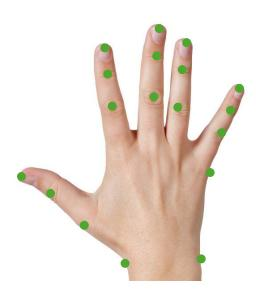

Figure A.1: Our custom marker definition for motion capture during data collection.