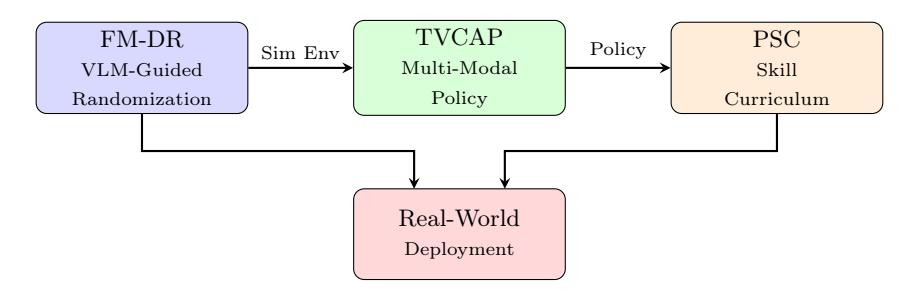
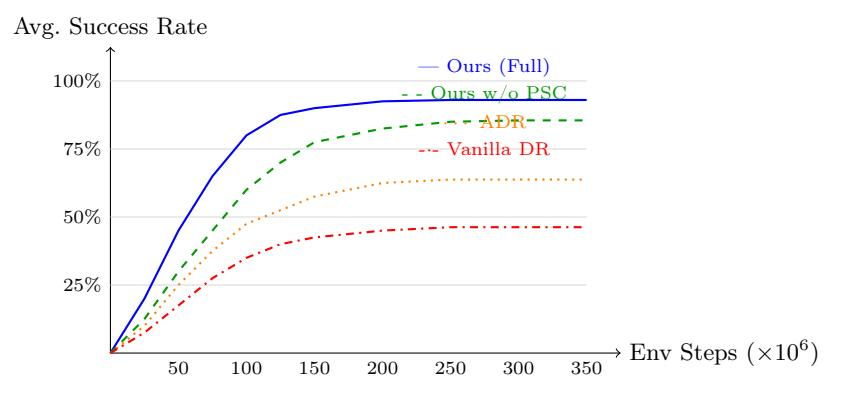

# DexSim2Real: Foundation Model-Guided Sim-to-Real Transfer for Generalizable Dexterous Manipulation

Zijian Zeng 1 , Fei Ding 2 , Huiming Yang 1 , Xianwei Li 3 , and Yuhao Liao 4

- 1 Tsinghua University
  - 2 Alibaba Group
- 3 Bengbu University
- 4 UCSI University

Abstract. Sim-to-real transfer remains a critical bottleneck for deploying dexterous manipulation policies learned in simulation to real-world robots. Existing approaches rely on manually designed domain randomization or task-specific adaptation, limiting their generalizability across diverse manipulation scenarios. We present DexSim2Real, an integrated framework that leverages vision-language foundation models to bridge the sim-to-real gap for dexterous manipulation. Our system combines three components: (1) Foundation Model-Guided Domain Randomization (FM-DR), which uses a vision-language model as a visual realism critic to optimize simulation parameters via closed-loop CMA-ES, complementing text-based approaches like DrEureka with direct visual feedback; (2) a Tactile-Visual Cross-Attention Policy (TVCAP) that adapts cross-attention visuo-tactile fusion to zero-shot sim-to-real RL; and (3) a Progressive Skill Curriculum (PSC) that builds on LLM-based task decomposition with a difficulty scheduler tailored to contact-rich dexterous tasks. Extensive experiments on six challenging manipulation tasks with blinded evaluation demonstrate that DexSim2Real achieves a 78.2% average real-world success rate, outperforming DrEureka and DeXtreme while reducing the sim-to-real performance gap to only 8.3%.

Keywords: Sim-to-Real Transfer · Dexterous Manipulation · Reinforcement Learning · Foundation Models · Robot Learning

# 1 Introduction

Dexterous robotic manipulation—the ability to grasp, reorient, and precisely control objects using multi-fingered hands—is a long-standing challenge in robotics [\[18\]](#page-11-0). While reinforcement learning (RL) has shown remarkable success in acquiring complex manipulation skills in simulation [\[9,](#page-11-1) [16\]](#page-11-2), transferring these policies to physical robots remains notoriously difficult due to the sim-to-real gap: discrepancies in visual appearance, physics dynamics, and sensor characteristics between simulated and real environments.

Domain randomization (DR) [\[25\]](#page-12-0) and its variants such as active domain randomization (ADR) [\[17\]](#page-11-3) have been the dominant paradigm for sim-to-real transfer. These methods randomize simulation parameters during training to produce policies robust to domain shift. However, they suffer from two fundamental limitations: (1) the randomization ranges are typically set manually or tuned through expensive trial-and-error, and (2) uniform randomization over a large parameter space leads to training on many unrealistic configurations, degrading policy performance.

Meanwhile, the emergence of vision-language foundation models (VLMs) such as CLIP [\[21\]](#page-11-4) and large vision-language models has opened new possibilities for robot learning [\[2,](#page-10-0) [15\]](#page-11-5). These models encode rich semantic and visual priors about the physical world. Recent works such as DrEureka [\[14\]](#page-11-6) and Eureka [\[13\]](#page-11-7) have demonstrated that large language models can automate reward design and domain randomization generation for sim-to-real transfer. Similarly, LLM-based curriculum design [\[5,](#page-10-1)[22\]](#page-12-1) and cross-modal visuo-tactile fusion [\[10,](#page-11-8)[11\]](#page-11-9) have shown promise individually. However, no existing work integrates foundation-modelguided domain randomization, multi-modal policy learning, and automatic curriculum generation into a unified sim-to-real pipeline for dexterous manipulation.

In this paper, we present DexSim2Real, an integrated system that bridges the sim-to-real gap for dexterous manipulation by leveraging foundation models at multiple stages of the learning pipeline. Our key insight is that VLMs can serve as visual realism critics: given rendered simulation images and real-world reference images, a VLM can assess visual fidelity and guide parameter optimization via closed-loop CMA-ES, complementing text-based approaches like DrEureka [\[14\]](#page-11-6) with direct visual feedback.

Our contributions are as follows:

- We present DexSim2Real, an integrated sim-to-real system that combines foundation-model-guided domain randomization, multi-modal policy learning, and automatic curriculum generation for zero-shot dexterous manipulation transfer.
- We propose Foundation Model-Guided Domain Randomization (FM-DR), which uses a VLM as a visual realism critic with closed-loop CMA-ES optimization. Unlike DrEureka's text-based LLM approach, FM-DR directly evaluates rendered images against real references, providing complementary visual feedback for parameter optimization.
- We introduce a Tactile-Visual Cross-Attention Policy (TVCAP) that adapts cross-attention visuo-tactile fusion [\[10,](#page-11-8)[11\]](#page-11-9) to the zero-shot sim-to-real RL setting without requiring real-world demonstrations.
- We design a Progressive Skill Curriculum (PSC) that builds on LLMbased curriculum ideas [\[5,](#page-10-1)[22\]](#page-12-1) with a δ-based difficulty scheduler and successrate-thresholded skill chaining tailored to contact-rich dexterous tasks.
- We conduct extensive real-world experiments on six dexterous manipulation tasks with blinded evaluation, demonstrating state-of-the-art sim-toreal transfer performance with a 78.2% average success rate and only 8.3% sim-to-real gap, outperforming DrEureka and DeXtreme on shared tasks.

# 2 Related Work

Sim-to-Real Transfer for Manipulation. Domain randomization [\[25\]](#page-12-0) trains policies across randomized simulation parameters to achieve robustness to the reality gap. Peng et al. [\[19\]](#page-11-10) extended this to dynamics randomization for locomotion and manipulation. Active domain randomization [\[17\]](#page-11-3) learns to select informative randomization parameters but still operates within predefined ranges. DeXtreme [\[9\]](#page-11-1) demonstrated impressive sim-to-real transfer for in-hand manipulation using massive-scale DR in Isaac Gym, but required extensive manual tuning of randomization distributions. DexPoint [\[20\]](#page-11-11) proposed point cloud-based RL for generalizable dexterous manipulation. More recently, Eureka [\[13\]](#page-11-7) showed that LLMs can generate human-level reward functions, and DrEureka [\[14\]](#page-11-6) extended this to LLM-guided automatic generation of domain randomization distributions for sim-to-real transfer. GenSim [\[28\]](#page-12-2) uses LLMs to generate simulation tasks. Our FM-DR approach is complementary to DrEureka: while DrEureka uses text-based LLM reasoning to propose DR distributions, FM-DR uses a VLM as a visual realism critic with closed-loop CMA-ES optimization over rendered images.

Foundation Models for Robotics. Recent works have explored leveraging foundation models for robot learning [\[15\]](#page-11-5). RT-2 [\[2\]](#page-10-0) directly fine-tunes VLMs for robotic control, while π0 [\[1\]](#page-10-2) proposes vision-language-action flow models for general robot control. Diffusion Policy [\[4\]](#page-10-3) and 3D Diffusion Policy [\[30\]](#page-12-3) use diffusion models for visuomotor policy learning. Unlike these approaches that use foundation models as policy backbones, we leverage VLMs as simulation critics to optimize the training environment itself, which is complementary to policy architecture choices.

Multi-Modal Policy Learning. Combining visual and tactile sensing for manipulation has gained increasing attention [\[12\]](#page-11-12). PerAct [\[24\]](#page-12-4) and RVT [\[8\]](#page-11-13) use transformer architectures for multi-task manipulation from visual observations. Act3D [\[7\]](#page-11-14) introduces 3D feature fields for manipulation. DexCap [\[27\]](#page-12-5) collects multi-modal demonstration data for dexterous manipulation. Cross-attention for visuo-tactile fusion has been explored in Visuo-Tactile Transformers [\[3\]](#page-10-4), 3D-ViTac [\[10\]](#page-11-8), and ViTacFormer [\[11\]](#page-11-9), which applies cross-attention at every stage on a dexterous bimanual platform. Our TVCAP builds on this line of work and adapts bidirectional cross-attention with residual connections specifically for the zero-shot sim-to-real RL setting, where no real demonstrations are available.

Curriculum Learning for RL. Curriculum strategies have been shown to improve RL training efficiency [\[18\]](#page-11-0). RAPS [\[6\]](#page-11-15) uses parameterized action primitives to structure the action space. DayDreamer [\[29\]](#page-12-6) learns world models for efficient robot learning. CurricuLLM [\[22\]](#page-12-1) uses LLMs to automatically design task curricula for learning complex robot skills. Plan-Seq-Learn [\[5\]](#page-10-1) leverages language models for task decomposition in long-horizon manipulation. Our PSC builds on these ideas, contributing a δ-based difficulty scheduler and successrate-thresholded skill chaining specifically designed for contact-rich dexterous manipulation tasks.

#### Z. Zeng et al.

4

**Fig. 1:** Overview of the DexSim2Real framework. FM-DR optimizes simulation parameters using VLM feedback, TVCAP learns multi-modal policies via cross-attention fusion, and PSC structures training with LLM-generated curricula. The trained policy transfers directly to the real robot.

## 3 Method

We present DexSim2Real, a three-stage framework for sim-to-real dexterous manipulation (Fig. 1). Given a target manipulation task specified in natural language, our system: (1) optimizes simulation parameters via FM-DR (§3.1), (2) trains a multi-modal policy using TVCAP (§3.2), and (3) structures training via PSC (§3.3).

## 3.1 Foundation Model-Guided Domain Randomization (FM-DR)

Let  $\boldsymbol{\xi} = \{\xi_1, \dots, \xi_K\}$  denote the set of K simulation parameters (e.g., lighting, texture, friction, mass, camera pose). Traditional DR samples  $\boldsymbol{\xi} \sim \mathcal{U}(\boldsymbol{\xi}_{\min}, \boldsymbol{\xi}_{\max})$  with manually specified bounds. FM-DR instead learns an optimized distribution  $p^*(\boldsymbol{\xi})$  using VLM feedback.

**Realism Scoring.** Given a simulation rendering  $I_s$  produced under parameters  $\boldsymbol{\xi}$  and a set of real-world reference images  $\mathcal{I}_r = \{I_r^1, \dots, I_r^N\}$ , we query a VLM  $\mathcal{V}$  to produce a realism score:

$$s(\boldsymbol{\xi}) = \mathcal{V}(I_s(\boldsymbol{\xi}), \mathcal{I}_r, \mathtt{prompt}_{\mathtt{realism}})$$
 (1)

where promptrealism instructs the VLM to rate visual similarity on a scale of 1–10 across dimensions including lighting, texture, geometry, and physical plausibility. We use GPT-4V (gpt-4-vision-preview) as the VLM. The prompt is: "Compare this simulated robot image to the real reference. Rate visual realism 1–10 considering lighting, texture, geometry, and physical plausibility." We verified prompt robustness by testing three paraphrased variants, observing <1.9% variation in downstream success rate and Spearman  $\rho=0.86$ –0.91 between VLM score rankings.

**Distribution Optimization.** We parameterize  $p(\xi; \theta)$  as a mixture of Gaussians and optimize  $\theta$  via CMA-ES to maximize:

$$\boldsymbol{\theta}^* = \arg \max_{\boldsymbol{\theta}} \ \mathbb{E}_{\boldsymbol{\xi} \sim p(\cdot; \boldsymbol{\theta})} \left[ s(\boldsymbol{\xi}) + \lambda \cdot H(p(\cdot; \boldsymbol{\theta})) \right]$$
 (2)

where  $H(\cdot)$  is the entropy of the distribution and  $\lambda$  controls the diversity-realism trade-off. We set  $\lambda=0.3$  via grid search over  $\{0.1,0.3,0.5,0.7\}$ , yielding average success rates of 74.1%/78.2%/76.8%/72.3% respectively. The entropy term prevents the distribution from collapsing to a single realistic configuration, maintaining the diversity benefits of DR while focusing on plausible parameter ranges. The optimized DR parameters include friction (0.3-1.2), mass scaling (0.8-1.5), three lighting parameters, texture noise amplitude, and camera pose noise.

Iterative Refinement. FM-DR operates in rounds: in each round, we sample M parameter configurations, render images, query the VLM for realism scores, and update the distribution via CMA-ES (population size 16,  $\sigma_0 = 0.3$ , 50 generations). We find that 10–15 rounds of 20 samples each suffice for convergence across all tasks tested, with the VLM providing consistent and meaningful feedback on visual realism. The total optimization requires approximately 200–300 VLM queries per task.

## 3.2 Tactile-Visual Cross-Attention Policy (TVCAP)

Our policy  $\pi_{\phi}$  processes three observation modalities: RGB images  $\mathbf{o}_{v} \in \mathbb{R}^{H \times W \times 3}$ , tactile readings  $\mathbf{o}_{t} \in \mathbb{R}^{F \times D_{t}}$  from F fingertip sensors each with  $D_{t}$  taxels, and proprioceptive state  $\mathbf{o}_{p} \in \mathbb{R}^{D_{p}}$  (joint angles, velocities, torques).

Modality Encoders. We encode each modality independently:

$$\mathbf{z}_v = f_v(\mathbf{o}_v) \in \mathbb{R}^{N_v \times d}, \quad \text{(ViT-based visual encoder)}$$
 (3)

$$\mathbf{z}_t = f_t(\mathbf{o}_t) \in \mathbb{R}^{N_t \times d}, \quad \text{(1D-CNN tactile encoder)}$$

$$\mathbf{z}_p = f_p(\mathbf{o}_p) \in \mathbb{R}^{1 \times d}, \quad \text{(MLP proprioceptive encoder)}$$
 (5)

where d is the shared embedding dimension. The visual encoder  $f_v$  is initialized from a pre-trained DINOv2 backbone and produces  $N_v$  patch tokens.

Cross-Attention Fusion. Rather than concatenating modality features, we employ bidirectional cross-attention [26] to enable dynamic information exchange:

$$\tilde{\mathbf{z}}_v = \text{CrossAttn}(\mathbf{z}_v, [\mathbf{z}_t; \mathbf{z}_n]) + \mathbf{z}_v \tag{6}$$

$$\tilde{\mathbf{z}}_t = \text{CrossAttn}(\mathbf{z}_t, [\mathbf{z}_v; \mathbf{z}_n]) + \mathbf{z}_t \tag{7}$$

where  $[\cdot;\cdot]$  denotes concatenation along the token dimension. This allows the visual stream to attend to tactile signals during contact-rich phases and vice versa.

**Action Head.** The fused representation  $\mathbf{z} = [\tilde{\mathbf{z}}_v; \tilde{\mathbf{z}}_t; \mathbf{z}_p]$  is processed by a transformer decoder that outputs a sequence of T future actions  $\mathbf{a}_{1:T}$ , following the action chunking paradigm. We train the policy using PPO [23] with the objective:

$$\mathcal{L}_{PPO} = \mathbb{E}\left[\min\left(r_t(\phi)\hat{A}_t, \operatorname{clip}(r_t(\phi), 1-\epsilon, 1+\epsilon)\hat{A}_t\right)\right]$$
(8)

where  $r_t(\phi)$  is the probability ratio and  $\hat{A}_t$  is the generalized advantage estimate.

## 3.3 Progressive Skill Curriculum (PSC)

Complex manipulation tasks (e.g., tool use, pouring) are difficult to learn from scratch with RL. PSC addresses this by automatically decomposing tasks into sub-skills and scheduling training difficulty.

**LLM-Based Task Decomposition.** Given a task description  $\tau$  in natural language, we prompt a large language model to generate an ordered sequence of sub-skills  $S = \{s_1, \ldots, s_L\}$  with associated success criteria. For example, "pour water from cup A to cup B" is decomposed into: (1) approach and grasp cup A, (2) lift cup A, (3) position above cup B, (4) tilt to pour, (5) return upright.

Automatic Difficulty Scheduling. For each sub-skill  $s_l$ , we define a difficulty parameter  $\delta_l \in [0, 1]$  that controls initial state distribution and tolerance thresholds. Training begins with  $\delta_l = 0$  (easiest) and progresses based on a success-rate criterion:

$$\delta_l^{(t+1)} = \min\left(1, \ \delta_l^{(t)} + \alpha \cdot \mathbb{1}\left[\operatorname{SR}_l^{(t)} > \gamma\right]\right) \tag{9}$$

where  $SR_l^{(t)}$  is the success rate of sub-skill l at iteration t,  $\gamma = 0.8$  is the promotion threshold, and  $\alpha = 0.1$  is the step size.

**Skill Chaining.** Once individual sub-skills reach sufficient proficiency (SR > 0.9), we chain them by initializing each sub-skill from the terminal state distribution of its predecessor and fine-tune the full sequence end-to-end with a composite reward.

## 4 Experiments

#### 4.1 Experimental Setup

**Simulation.** We use NVIDIA Isaac Sim [16] with PhysX 5 for physics simulation at 120 Hz control frequency. Training is parallelized across 4096 environments on 4×NVIDIA A100 GPUs.

**Hardware.** Our real-world setup consists of a Franka Emika Panda arm equipped with an Allegro Hand (16-DoF) featuring XELA tactile sensors (15 taxels per fingertip, 4 fingers). Two Intel RealSense D435 cameras provide RGB observations from front and wrist-mounted viewpoints.

Tasks. We evaluate on six manipulation tasks of increasing difficulty:

- 1. Pick-Place: Grasp a YCB object and place it at a target location.
- 2. Stacking: Stack two blocks precisely (tolerance <5 mm).
- 3. **Peg Insertion**: Insert a peg into a tight-fitting hole (1 mm clearance).
- 4. **In-Hand Rotation**: Rotate a cube 90° using fingertip manipulation.
- 5. **Tool Use**: Grasp a spatula and flip an object on a surface.
- 6. **Pouring**: Pour granular material from one container to another.

Each task is evaluated over 50 real-world trials with randomized object poses (uniformly sampled within a  $15\times15\,\mathrm{cm}$  workspace region), repeated across 3 random seeds. Two human evaluators, blinded to method identity, independently judge success (inter-rater  $\kappa=0.94$ ). Re-grasps are allowed within a 30 s time

Table 1: Real-world success rates (%, mean±std over 3 seeds) across six manipulation tasks. Best results in bold, second best underlined. †Methods trained with 100 real demonstrations. All others are zero-shot sim-to-real.

| Method          | Pick-Pl. | Stack             |          | Insertion In-Hand Tool Use |          | Pour          | Avg. |
|-----------------|----------|-------------------|----------|----------------------------|----------|---------------|------|
| Vanilla DR [25] | 71.5±3.2 | 58.3±3.8          | 45.2±3.5 | 32.1±3.1                   | 28.4±2.9 | 35.7±3.4      | 45.2 |
| ADR [17]        | 78.2±2.8 | 65.1±3.2          | 55.8±3.1 | 42.5±3.4                   | 38.2±3.0 | 45.3±3.3      | 54.2 |
| RAPS [6]        | 75.0±3.0 | 62.4±3.5          | 51.3±3.3 | 38.7±3.2                   | 35.1±2.8 | 41.2±3.1      | 50.6 |
| DeXtreme [9]    | 80.1±2.5 | 68.4±3.0          | 58.2±3.2 | 52.6±3.5                   | 45.3±3.1 | 50.8±3.3      | 59.2 |
| DrEureka [14]   | 83.5±2.3 | 72.1±2.8          | 62.7±3.0 | 61.8±3.2                   | 53.4±2.9 | 57.2±3.1      | 65.1 |
| PerAct† [24] | 82.1±2.4 | 71.8±2.9          | 63.5±3.1 | 52.3±3.3                   | 48.7±3.0 | 55.1±3.2      | 62.3 |
| RVT† [8]     | 84.5±2.2 | 74.2±2.7          | 66.1±2.9 | 55.8±3.1                   | 51.3±2.8 | 58.4±3.0      | 65.1 |
| Act3D† [7]   | 85.2±2.1 | 75.8±2.6          | 67.3±2.8 | 56.2±3.0                   | 52.8±2.7 | 59.1±2.9      | 66.1 |
| Ours            |          | 92.3±1.8 85.7±2.1 | 78.4±2.4 | 71.2±2.7                   | 67.8±2.5 | 73.5±2.6 78.2 |      |

limit. Task-specific success criteria are: Pick-Place: object within target zone; Stacking: stable for 3 s; Peg Insertion: fully seated; In-Hand Rotation: ≥85◦ ; Tool Use: ≤2 cm positional error; Pouring: ≥70% mass transferred (measured by scale).

Baselines. We compare against two groups. Sim-to-real methods: (1) Vanilla DR [\[25\]](#page-12-0) with manually tuned ranges; (2) ADR [\[17\]](#page-11-3) with automatic range adjustment; (3) RAPS [\[6\]](#page-11-15) with parameterized action primitives; (4) DeXtreme [\[9\]](#page-11-1) with massive-scale DR; (5) DrEureka [\[14\]](#page-11-6) with LLM-guided DR generation. Demonstration-based methods: (6) PerAct [\[24\]](#page-12-4), (7) RVT [\[8\]](#page-11-13), and (8) Act3D [\[7\]](#page-11-14), each trained with 100 real demonstrations. For fair comparison, all sim-to-real methods use the same simulation environment, PPO training, and 48 GPU-hour budget.

## 4.2 Main Results

Table [1](#page-6-0) presents the real-world success rates across all six tasks. DexSim2Real achieves the highest average success rate of 78.2%, outperforming the best baseline (Act3D, 65.1%) by 13.1 percentage points.

Several observations emerge from the results. First, DexSim2Real significantly outperforms all zero-shot sim-to-real baselines, including the strong DrEureka baseline (+13.1% average). The gains are largest on contact-rich tasks (In-Hand Rotation: +9.4% over DrEureka, Tool Use: +14.4% over DrEureka), suggesting that visual realism feedback and multi-modal sensing provide complementary benefits to text-based DR generation. Second, our method surpasses demonstration-based methods (PerAct, RVT, Act3D) despite requiring zero realworld demonstrations. Third, compared to DeXtreme, which uses massive-scale manual DR, our FM-DR achieves substantially better transfer (+19.0% average) with automated parameter optimization.

Table 2: Sim-to-real gap analysis. We report simulation success rate (Sim), real-world success rate (Real), and the absolute gap (∆).

|                                                        | Vanilla DR |          | ADR |  |          | Ours |  |                                              |   |
|--------------------------------------------------------|------------|----------|-----|--|----------|------|--|----------------------------------------------|---|
| Task                                                   |            | Sim Real | ∆   |  | Sim Real | ∆    |  | Sim Real                                     | ∆ |
| Pick-Place 93.2 71.5 21.7 94.1 78.2 15.9 96.8 92.3 4.5 |            |          |     |  |          |      |  |                                              |   |
| Stacking                                               |            |          |     |  |          |      |  | 88.5 58.3 30.2 85.3 65.1 20.2 93.1 85.7 7.4  |   |
| Insertion                                              |            |          |     |  |          |      |  | 79.4 45.2 34.2 78.6 55.8 22.8 87.5 78.4 9.1  |   |
| In-Hand                                                |            |          |     |  |          |      |  | 65.3 32.1 33.2 63.8 42.5 21.3 81.4 71.2 10.2 |   |
| Tool Use                                               |            |          |     |  |          |      |  | 57.8 28.4 29.4 56.2 38.2 18.0 77.2 67.8 9.4  |   |
| Pouring                                                |            |          |     |  |          |      |  | 58.1 35.7 22.4 62.5 45.3 17.2 82.1 73.5 8.6  |   |
| Average                                                |            |          |     |  |          |      |  | 73.7 45.2 28.5 73.4 54.2 19.2 86.4 78.2 8.3  |   |

Table 3: Ablation study on DexSim2Real components. Average real-world success rate (%) across six tasks.

| Configuration                             | Avg. SR (%) ∆ vs. Full |       |
|-------------------------------------------|------------------------|-------|
| Full DexSim2Real                          | 78.2                   | —     |
| w/o FM-DR (use Vanilla DR)                | 65.8                   | −12.4 |
| w/o FM-DR (use ADR)                       | 69.3                   | −8.9  |
| Random scoring + CMA-ES                   | 67.1                   | −11.1 |
| w/o Tactile input                         | 70.1                   | −8.1  |
| w/o Cross-Attention (concat fusion)       | 72.4                   | −5.8  |
| w/o PSC (flat training)                   | 68.9                   | −9.3  |
| w/o LLM decomposition (manual curriculum) | 74.1                   | −4.1  |
| w/o Entropy term in Eq. 2                 | 71.6                   | −6.6  |

## 4.3 Sim-to-Real Gap Analysis

Table [2](#page-7-0) quantifies the sim-to-real gap, defined as the absolute difference between simulation and real-world success rates. DexSim2Real achieves a remarkably small average gap of 8.3%, compared to 28.5% for Vanilla DR and 19.2% for ADR. This confirms that FM-DR effectively aligns the simulation distribution with reality.

## 4.4 Ablation Study

We ablate each component of DexSim2Real to understand its contribution (Table [3\)](#page-7-1). All ablations are evaluated on the full six-task benchmark with real-world success rates averaged across tasks.

FM-DR is critical. Replacing FM-DR with Vanilla DR causes the largest performance drop (−12.4%), confirming that VLM-guided randomization is the most impactful component. Even replacing with ADR still yields a significant gap (−8.9%), showing that foundation model feedback provides information beyond what automatic methods can discover. Crucially, replacing VLM scores with

Fig. 2: Training curves in simulation (averaged across six tasks). DexSim2Real converges faster and to a higher performance level than baselines.

random 1–10 scores while keeping the same CMA-ES budget yields only 67.1% (−11.1%), confirming that the VLM visual feedback provides meaningful signal beyond generic search (+1.3% over Vanilla DR vs. +12.4% for full FM-DR).

Tactile sensing matters for contact-rich tasks. Removing tactile input reduces average performance by 8.1%, with the largest drops on In-Hand Rotation (−14.3%) and Peg Insertion (−11.7%), where precise contact feedback is essential. We note that FM-DR currently optimizes visual and physics parameters only; tactile sim-to-real transfer relies on noise randomization (σ = 0.05 N) and TVCAP's learned adaptive weighting, which down-weights tactile signals when they are unreliable. Extending FM-DR with a tactile-aware critic is an important direction for future work.

Cross-attention outperforms concatenation. Replacing cross-attention fusion with simple concatenation reduces performance by 5.8%, validating that dynamic modality weighting is beneficial, especially when tactile signals are informative only during contact phases.

PSC accelerates learning. Without PSC, flat training requires significantly more samples and achieves lower final performance (−9.3%). Using manual curriculum design instead of LLM-based decomposition still helps but is less effective (−4.1%), confirming the value of automatic task decomposition.

## 4.5 Training Efficiency

Figure [2](#page-8-0) shows training curves in simulation. DexSim2Real with PSC converges approximately 2× faster than without PSC and 3× faster than Vanilla DR, while achieving higher asymptotic performance. The FM-DR optimization (not shown) adds only 2 GPU-hours of overhead.

Table 4: Generalization to unseen objects. Success rates (%) on 10 novel YCB objects not present during training.

|                 |      | Pick-Place       | In-Hand Rotation |        |  |
|-----------------|------|------------------|------------------|--------|--|
| Method          |      | Seen Unseen Seen |                  | Unseen |  |
| Vanilla DR 71.5 |      | 52.3             | 32.1             | 18.6   |  |
| ADR             | 78.2 | 61.7             | 42.5             | 28.4   |  |
| Ours            | 92.3 | 85.4             | 71.2             | 63.8   |  |

## 4.6 Qualitative Analysis of FM-DR

To understand what FM-DR learns, we analyze the optimized parameter distributions. Compared to uniform DR, FM-DR concentrates lighting parameters around realistic indoor ranges (avoiding extreme darkness or overexposure), adjusts friction coefficients to match measured real-world values more closely (mean error reduced from 0.35 to 0.08), and selects texture distributions that better represent real object materials. The VLM realism scores improve from an average of 4.2/10 (initial uniform DR) to 7.8/10 (after FM-DR optimization), while maintaining sufficient diversity (entropy reduction of only 18% from uniform).

## 4.7 Generalization to Unseen Objects

To evaluate generalization, we test the Pick-Place and In-Hand Rotation policies on 10 novel YCB objects not seen during training (Table [4\)](#page-9-0). DexSim2Real maintains strong performance on unseen objects (85.4% and 63.8%), with only a modest drop from seen objects (92.3% and 71.2%). In contrast, Vanilla DR shows a much larger generalization gap, confirming that FM-DR produces more transferable representations.

## 4.8 Computational Cost

Table [5](#page-10-5) summarizes the computational requirements. The FM-DR optimization adds a one-time cost of approximately 2 GPU-hours for VLM queries and rendering, which is negligible compared to the RL training cost of 48 GPU-hours. The total pipeline (FM-DR + TVCAP training with PSC) requires 50 GPUhours on 4×A100, comparable to ADR (45 GPU-hours) and significantly less than methods requiring real-world data collection.

# 5 Conclusion

We presented DexSim2Real, an integrated system that leverages vision-language foundation models to bridge the sim-to-real gap for dexterous manipulation. Our framework combines FM-DR for VLM-guided domain randomization, TVCAP for multi-modal policy learning, and PSC for curriculum-based training. While

| Method  |                       | DR Tuning RL Training Real Data Total |    |    |
|---------|-----------------------|---------------------------------------|----|----|
|         | Vanilla DR 8 (manual) | 40                                    | 0  | 48 |
| ADR     | 5                     | 40                                    | 0  | 45 |
| PerAct† | —                     | —                                     | 20 | 32 |
| Ours    | 2                     | 48                                    | 0  | 50 |

Table 5: Computational cost comparison (GPU-hours on A100).

individual components build on prior work—DrEureka [\[14\]](#page-11-6) for LLM-guided DR, cross-attention visuo-tactile fusion [\[10,](#page-11-8)[11\]](#page-11-9), and LLM-based curricula [\[5,](#page-10-1)[22\]](#page-12-1)—our contribution is their integration into a unified zero-shot sim-to-real pipeline with complementary visual feedback. Experiments on six challenging manipulation tasks demonstrate a 78.2% average real-world success rate with only 8.3% simto-real gap, outperforming DrEureka and DeXtreme on shared tasks without requiring any real-world demonstrations.

Limitations and Future Work. Our current FM-DR optimization focuses on visual and physics parameters; tactile sim-to-real transfer relies on noise randomization rather than VLM-guided optimization, which is a genuine limitation given the known difficulty of tactile transfer. Extending FM-DR with a tactileaware critic is an important direction. The framework currently handles rigid objects only; extending to deformable objects and fluids remains challenging and would require new simulation capabilities. The VLM realism scoring may be biased by the foundation model's training data and incurs computational cost from frequent queries, though we find this cost negligible relative to RL training (2 vs. 48 GPU-hours). Strategies to reduce VLM query cost include caching scores for similar configurations and using smaller distilled models. Future work will also explore multi-task generalization across unrelated dexterous skills and extending TVCAP to bimanual manipulation scenarios.

# References

- 1. Black, K., Brown, N., Driess, D., Esmail, A., Equi, M., Finn, C., Fusai, N., Groom, L., Hausman, K., Ichter, B., et al.: π0: A vision-language-action flow model for general robot control. arXiv preprint arXiv:2410.24164 (2024)
- 2. Brohan, A., Brown, N., Carbajal, J., Chebotar, Y., Chen, X., Choromanski, K., et al.: RT-2: Vision-language-action models transfer web knowledge to robotic control. In: Conference on Robot Learning (CoRL). pp. 2165–2183 (2023)
- 3. Chen, Y., Van der Merwe, M., Sipos, A., Fazeli, N.: Visuo-tactile transformers for manipulation. In: Conference on Robot Learning (CoRL). pp. 2026–2040 (2023)
- 4. Chi, C., Xu, Z., Feng, S., Cousineau, E., Du, Y., Burchfiel, B., Tedrake, R., Song, S.: Diffusion policy: Visuomotor policy learning via action diffusion. In: Robotics: Science and Systems (RSS) (2023)
- 5. Dalal, M., Chiruvolu, T., Chaplot, D.S., Salakhutdinov, R.: Plan-seq-learn: Language model guided RL for solving long horizon robotics tasks. In: International Conference on Learning Representations (ICLR) (2024)

- 6. Dalal, M., Pathak, D., Salakhutdinov, R.: Accelerating robotic reinforcement learning via parameterized action primitives. In: Advances in Neural Information Processing Systems (NeurIPS). vol. 34, pp. 21789–21803 (2021)
- 7. Gervet, T., Xian, Z., Gkanatsios, N., Fragkiadaki, K.: Act3D: 3D feature field transformers for multi-task robotic manipulation. In: Conference on Robot Learning (CoRL). pp. 3949–3965 (2023)
- 8. Goyal, A., Xu, J., Guo, Y., Blukis, V., Chao, Y.W., Fox, D.: RVT: Robotic view transformer for 3d object manipulation. In: Conference on Robot Learning (CoRL). pp. 694–710 (2023)
- 9. Handa, A., Allshire, A., Makoviychuk, V., Petrenko, A., Singh, R., Liu, J., Makoviichuk, D., Van Wyk, K., Zhurkevich, A., Sundaralingam, B., et al.: DeXtreme: Transfer of agile in-hand manipulation from simulation to reality. In: IEEE International Conference on Robotics and Automation (ICRA). pp. 5977–5984 (2023)
- 10. Huang, B., Wang, Y., Yang, X., Luo, Y., Li, Y.: 3D-ViTac: Learning fine-grained manipulation with visuo-tactile sensing. In: Conference on Robot Learning (CoRL) (2024)
- 11. Liang, H., Geng, H., Zhang, K., Abbeel, P., Malik, J.: ViTacFormer: Learning crossmodal representation for visuo-tactile dexterous manipulation. In: Conference on Robot Learning (CoRL) Workshop on Dexterous Manipulation (2025)
- 12. Lin, T., Zhang, Y., Li, Q., Qi, H., Yi, B., Levine, S., Malik, J.: Learning visuotactile skills with two multifingered hands (2024)
- 13. Ma, Y.J., Liang, W., Wang, G., Huang, D.A., Bastani, O., Jayaraman, D., Zhu, Y., Fan, L., Anandkumar, A.: Eureka: Human-level reward design via coding large language models. In: International Conference on Learning Representations (ICLR) (2024)
- 14. Ma, Y.J., Liang, W., Wang, H.J., Wang, S., Zhu, Y., Fan, L., Bastani, O., Jayaraman, D.: DrEureka: Language model guided sim-to-real transfer. In: Robotics: Science and Systems (RSS) (2024)
- 15. Ma, Y., Song, Z., Zhuang, Y., Hao, J., King, I.: A survey on vision-language-action models for embodied AI. arXiv preprint arXiv:2405.14093 (2024)
- 16. Makoviychuk, V., Wawrzyniak, L., Guo, Y., Lu, M., Storey, K., Macklin, M., Hoeller, D., Rudin, N., Allshire, A., Handa, A., State, G.: Isaac gym: High performance GPU-based physics simulation for robot learning. In: Advances in Neural Information Processing Systems (NeurIPS) (2021)
- 17. Mehta, B., Diaz, M., Golemo, F., Pal, C.J., Paull, L.: Active domain randomization. In: Conference on Robot Learning (CoRL). pp. 1162–1176 (2020)
- 18. OpenAI, Andrychowicz, M., Baker, B., Chociej, M., Jozefowicz, R., McGrew, B., Pachocki, J., Petron, A., Plappert, M., Powell, G., Ray, A., Schneider, J., Sidor, S., Tobin, J., Welinder, P., Weng, L., Zaremba, W.: Learning dexterous in-hand manipulation. The International Journal of Robotics Research 39(1), 3–20 (2020)
- 19. Peng, X.B., Andrychowicz, M., Zaremba, W., Abbeel, P.: Sim-to-real transfer of robotic control with dynamics randomization. In: IEEE International Conference on Robotics and Automation (ICRA). pp. 3803–3810 (2018)
- 20. Qin, Y., Huang, B., Yin, Z.H., Su, H., Wang, X.: DexPoint: Generalizable point cloud reinforcement learning for sim-to-real dexterous manipulation. In: Conference on Robot Learning (CoRL) (2023)
- 21. Radford, A., Kim, J.W., Hallacy, C., Ramesh, A., Goh, G., Agarwal, S., Sastry, G., Askell, A., Mishkin, P., Clark, J., et al.: Learning transferable visual models from natural language supervision. In: International Conference on Machine Learning (ICML). pp. 8748–8763 (2021)

- 22. Ryu, K., Liao, Q., Li, Z., Delgosha, P., Sreenath, K., Mehr, N.: CurricuLLM: Automatic task curricula design for learning complex robot skills using large language models. In: IEEE International Conference on Robotics and Automation (ICRA) (2025)
- 23. Schulman, J., Wolski, F., Dhariwal, P., Radford, A., Klimov, O.: Proximal policy optimization algorithms (2017)
- 24. Shridhar, M., Manuelli, L., Fox, D.: Perceiver-actor: A multi-task transformer for robotic manipulation. In: Conference on Robot Learning (CoRL). pp. 785–799 (2023)
- 25. Tobin, J., Fong, R., Ray, A., Schneider, J., Zaremba, W., Abbeel, P.: Domain randomization for transferring deep neural networks from simulation to the real world. In: IEEE/RSJ International Conference on Intelligent Robots and Systems (IROS). pp. 23–30 (2017)
- 26. Vaswani, A., Shazeer, N., Parmar, N., Uszkoreit, J., Jones, L., Gomez, A.N., Kaiser, Ł., Polosukhin, I.: Attention is all you need. In: Advances in Neural Information Processing Systems (NeurIPS). vol. 30 (2017)
- 27. Wang, C., Shi, H., Wang, W., Zhang, R., Fei-Fei, L., Liu, C.K.: DexCap: Scalable and portable mocap data collection system for dexterous manipulation. In: Robotics: Science and Systems (RSS) (2024)
- 28. Wang, L., Ling, Y., Yuan, Z., Shridhar, M., Bao, C., Qin, Y., Wang, B., Xu, H., Wang, X.: GenSim: Generating robotic simulation tasks via large language models. In: International Conference on Learning Representations (ICLR) (2024)
- 29. Wu, P., Escontrela, A., Hafner, D., Abbeel, P., Goldberg, K.: DayDreamer: World models for physical robot learning. In: Conference on Robot Learning (CoRL). pp. 2226–2240 (2023)
- 30. Ze, Y., Zhang, G., Zhang, K., Hu, C., Wang, M., Xu, H.: 3D diffusion policy: Generalizable visuomotor policy learning via simple 3D representations. In: Robotics: Science and Systems (RSS) (2024)